<p align="center">
  <picture>
    <source media="(prefers-color-scheme: dark)" srcset="./docs/assets/logo-dark.svg">
    <source media="(prefers-color-scheme: light)" srcset="./docs/assets/logo-light.svg">
    
  </picture>
</p>

[](https://www.nuget.org/packages/photo-cli/) [](https://github.com/photo-cli/photo-cli/actions/workflows/stable.yml) [](https://sonarcloud.io/summary/new_code?id=photo-cli_photo-cli) [](https://www.nuget.org/packages/photo-cli/#versions-body-tab) [](https://github.com/photo-cli/photo-cli/actions/workflows/preview.yml) [](https://github.com/photo-cli/photo-cli/blob/main/LICENSE)

[](https://photocli.com) [](https://sonarcloud.io/summary/new_code?id=photo-cli_photo-cli) [](https://sonarcloud.io/summary/new_code?id=photo-cli_photo-cli) [](https://sonarcloud.io/summary/new_code?id=photo-cli_photo-cli) [](https://sonarcloud.io/summary/new_code?id=photo-cli_photo-cli) [](https://sonarcloud.io/summary/new_code?id=photo-cli_photo-cli) [](https://github.com/photo-cli/photo-cli/actions/workflows/CI.yml)

`photo-cli` is [CLI](https://en.wikipedia.org/wiki/Command-line_interface) tool (works on Linux & macOS & Windows) that extracts when and where ([reverse geocode](https://en.wikipedia.org/wiki/Reverse_geocoding)) your photographs are taken, copy into a new organized folder (not modifying source folder) with various [folder](#folder-append-type---a---folder-append-) & [file naming](#naming-style---s---naming-style-) strategies or export all data into [CSV](https://en.wikipedia.org/wiki/Comma-separated_values) (can view on Microsoft Excel, Libre/OpenOffice Calc, Apple Numbers, Google Sheets) files. With this exported CSV file you can [navigate your photo locations on Google Maps & Earth with your custom label and pin style](#3-navigate-your-photo-locations-on-google-maps--earth).

## Contents

- [Features Explained With An Example](#features-explained-with-examples)
- [Installation](#installation)
- [How It's Done?](#how-its-done)
- [Supported Photo Types](#supported-photo-types)
- [Processing Companion Files](#processing-companion-files)
- [Address Building & Reverse Geocoding](#address-building--reverse-geocoding)
- [Usages](#usages)
- [Commands](#commands--verbs)
- [Command Line Options/Arguments](#command-line-options--arguments)
- [Settings](#settings)
- [Exit Codes](#exit-codes)
- [Roadmap](#roadmap)
- [Contributing](#contributing)
- [Code of Conduct](#code-of-conduct)
- [Changelog - Release History](#changelog---release-history)
- [Attribution](#attribution)
- [License](#license)
- [Uninstallation](#uninstallation)
- [Credits](#credits)

## Features Explained With Examples

There is three main feature that can be explained better with examples.

1. [Copy into a new organized folder example with `photo-cli copy` command](#1-copy-into-a-new-organized-folder-example-with-photo-cli-copy-command)
2. [Archive & index into local SQLite incrementally in a specific folder with `photo-cli archive` command](#2-archive--index-into-local-sqlite-incrementally-in-a-specific-folder-with-photo-cli-archive-command)
3. [Export all extracted information into a CSV Report With `photo-cli info` Command](#3-export-all-extracted-information-into-a-csv-report-with-photo-cli-info-command)
4. [Navigate Your Photo Locations on Google Maps & Earth](#4-navigate-your-photo-locations-on-google-maps--earth)

### 1. Copy Into a New Organized Folder Example With `photo-cli copy` Command

#### Folder & File Hierarchy Before -> After

<table>
<tr>
    <th>Original Folder Hierarchy</th>
    <th>After <b><i>photo-cli</i></b></th>
</tr>
<tr>
<td>
<pre>
├── DSC_5727.jpg
├── GOPR6742.jpg
├── Italy album
│   ├── DJI_01732.jpg
│   ├── DJI_01733.jpg
│   ├── DSC00001.JPG
│   ├── DSC03467.jpg
│   ├── DSC_1769.JPG
│   ├── DSC_1770.JPG
│   ├── DSC_1770_(same).jpg
│   ├── DSC_1771.JPG
│   ├── GOPR7496.jpg
│   ├── GOPR7497.jpg
│   ├── IMG_0747.JPG
│   └── IMG_2371.jpg
└── Spain Journey
    ├── DSC_1807.jpg
    ├── DSC_1808.jpg
    └── IMG_5397.jpg

2 directories, 17 files
</pre>
</td>
<td>
<pre>
├── 2005.08.13_09.47.23-Kenya.jpg
├── 2005.12.14-2008.10.22-Italy album
│   ├── 2005.12.14_14.39.47-Italia-Firenze-Quartiere 1.jpg
│   ├── 2008.10.22_16.28.39-Italia-Arezzo.jpg
│   ├── 2008.10.22_16.29.49-Italia-Arezzo.jpg
│   ├── 2008.10.22_16.38.20-Italia-Arezzo.jpg
│   ├── 2008.10.22_16.43.21-Italia-Arezzo.jpg
│   ├── 2008.10.22_16.44.01-Italia-Arezzo.jpg
│   ├── 2008.10.22_16.46.53-Italia-Arezzo.jpg
│   ├── 2008.10.22_16.52.15-Italia-Arezzo.jpg
│   ├── 2008.10.22_16.55.37-Italia-Arezzo.jpg
│   ├── 2008.10.22_17.00.07-Italia-Arezzo-1.jpg
│   └── 2008.10.22_17.00.07-Italia-Arezzo-2.jpg
├── 2012.06.22_19.52.31-United Kingdom-Ascot-Sunninghill and Ascot.jpg
├── 2015.04.10-2015.04.10-Spain Journey
│   ├── 2015.04.10_20.12.23-España-Madrid-1.jpg
│   └── 2015.04.10_20.12.23-España-Madrid-2.jpg
├── Italy album
│   └── no-address
│       └── IMG_2371.jpg
├── photo-cli-report.csv
└── Spain Journey
    └── no-address-and-no-photo-taken-date
        └── IMG_5397.jpg

6 directories, 18 files
</pre>
</td>
</tr>
</table>

#### What Happened? / How It Is Processed?

There are lots of [transformation options](#usages) and [customization settings](#listing-all-settings), this is just a one of them. This transformation is done by running only the following single command;

Command with explicit argument names & values
```
photo-cli copy --process-type SubFoldersPreserveFolderHierarchy --naming-style DateTimeWithSecondsAddress --number-style PaddingZeroCharacter --folder-append DayRange --folder-append-location Prefix --reverse-geocode OpenStreetMapFoundation --openstreetmap-properties country city town suburb --output photo-cli-test --no-coordinate InSubFolder --no-taken-date InSubFolder --verify
```

Same command with shorter alias of all argument names & values
```
photo-cli copy -f 2 -s 8 -n 2 -a 4 -p 1 -e 2 -r country city town suburb -o photo-cli-test -c 3 -t 3 -v
```

Console/terminal output (as progress may take time, for each operation completion status shown with progress)
```
Searching photos: finished. 17 photos found.
Parsing photo exif information: finished.
This OpenStreetMapFoundation provider is using rate limit of 1 seconds between each request
Reverse Geocoding: finished.
Directory grouping: finished.
Processing target folder: finished.
Verified all photo files copied successfully by comparing file hashes from original photo files.
All files SHA1 hashes written into file: sha1.lst. You may verify yourself with `sha1sum --check sha1.lst` tool in Linux/macOS.
Writing csv report: finished.
- 17 photos copied.
- 4 directories created.
- 15 photos has taken date and coordinate.
- 1 photos has taken date but no coordinate.
- 1 photos has no taken date and coordinate.
```

#### Step By Step `photo-cli copy` Process

1. Gather all photo paths in the source folder within subfolders.
2. Extract EXIF data of each photograph's taken date and coordinate.
3. As [the file name strategy](#naming-style---s---naming-style-) is selected as `DateTimeWithSecondsAddress` and it contains the address, by using [third-party reverse geocode provider](#address-building--reverse-geocoding) we are building the address with `OpenStreetMap` by using [given administrative levels](#4-building-your-own-address-with-selected-properties) as `city town suburb` for each photograph.
4. As [the folder process type](#folder-process-type---f---process-type-) is selected as `SubFoldersPreserveFolderHierarchy` folder and file hierarchy at the new output folder will be the same.
5. As [the folder append type](#folder-append-type---a---folder-append-) is selected as `DayRange` and [folder append location](#folder-append-location-type---p---folder-append-location-) is `Prefix`, folder names on output folder will be created with same name prefixed with a earliest and latest photograph taken date. For example: `2005.12.14-2008.10.22-Italy album` (original folder name is `Italy album`)
6. As [the file name strategy](#naming-style---s---naming-style-) is selected as `DateTimeWithSecondsAddress` each photograph file name would be copied as photo taken date unified with the address which is built from third party reverse geocode provider by photograph's coordinate. For example: `2012.06.22_19.52.31-United Kingdom-Ascot-Sunninghill and Ascot.jpg` (original file name is `GOPR6742.jpg`)
7. As [no photograph taken date action](#no-photograph-taken-date-action-for-copy-command----t---no-taken-date-) is selected as `InSubFolder` and [no coordinate action](#no-coordinate-action-for-copy-command----c---no-coordinate-) is selected as `InSubFolder`, photographs with no related EXIF data copied into a sub folder by obeying original folder hierarchy. For example: `/Italy album/no-address/IMG_2371.jpg` and `/Spain Journey/no-address-and-no-photo-taken-date/IMG_5397.jpg`
8. As [verify](#verify---v---verify) is added, it is verifying that all photo files copied successfully by comparing file hashes. By adding this, it guarantees that there won't be any corrupted photos that is caused by disk operation failures.
9. To verify and see all information in one place, `photo-cli-report.csv` report will be created on the output file. Can be examined in [Markdown table](#contents-of-photo-cli-reportcsv-file-in-markdown-table-report-of-copy-command) or [CSV file](#contents-of-photo-cli-reportcsv-file-in-raw-text-format-report-of-copy-command).

#### Contents of `photo-cli-report.csv` File in Markdown Table (report of `copy` command)

<details>
  <summary>Click to expand</summary>

|PhotoPath                                  |PhotoNewPath                                                                                       |PhotoDateTaken     |ReverseGeocodeFormatted                   |Latitude            |Longitude          |PhotoTakenYear|PhotoTakenMonth|PhotoTakenDay|PhotoTakenHour|PhotoTakenMinute|PhotoTakenSeconds|Address1      |Address2|Address3             |Address4|Address5|Address6|Address7|Address8|
|-------------------------------------------|---------------------------------------------------------------------------------------------------|-------------------|------------------------------------------|--------------------|-------------------|--------------|---------------|-------------|--------------|----------------|-----------------|--------------|--------|---------------------|--------|--------|--------|--------|--------|
|/TestImages/DSC_5727.jpg                   |photo-cli-test/2005.08.13_09.47.23-Kenya.jpg                                                       |08/13/2005 09:47:23|Kenya                                     |-0.37129999999999996|36.056416666666664 |2005          |8              |13           |9             |47              |23               |Kenya         |        |                     |        |        |        |        |        |
|/TestImages/GOPR6742.jpg                   |photo-cli-test/2012.06.22_19.52.31-United Kingdom-Ascot-Sunninghill and Ascot.jpg                  |06/22/2012 19:52:31|United Kingdom-Ascot-Sunninghill and Ascot|51.424838333333334  |-0.6735616666666666|2012          |6              |22           |19            |52              |31               |United Kingdom|Ascot   |Sunninghill and Ascot|        |        |        |        |        |
|/TestImages/Italy album/DSC03467.jpg       |photo-cli-test/2005.12.14-2008.10.22-Italy album/2005.12.14_14.39.47-Italia-Firenze-Quartiere 1.jpg|12/14/2005 14:39:47|Italia-Firenze-Quartiere 1                |43.78559443333333   |11.234619433333334 |2005          |12             |14           |14            |39              |47               |Italia        |Firenze |Quartiere 1          |        |        |        |        |        |
|/TestImages/Italy album/GOPR7497.jpg       |photo-cli-test/2005.12.14-2008.10.22-Italy album/2008.10.22_16.28.39-Italia-Arezzo.jpg             |10/22/2008 16:28:39|Italia-Arezzo                             |43.46744833333334   |11.885126666663888 |2008          |10             |22           |16            |28              |39               |Italia        |Arezzo  |                     |        |        |        |        |        |
|/TestImages/Italy album/DJI_01732.jpg      |photo-cli-test/2005.12.14-2008.10.22-Italy album/2008.10.22_16.29.49-Italia-Arezzo.jpg             |10/22/2008 16:29:49|Italia-Arezzo                             |43.46715666666389   |11.885394999997223 |2008          |10             |22           |16            |29              |49               |Italia        |Arezzo  |                     |        |        |        |        |        |
|/TestImages/Italy album/GOPR7496.jpg       |photo-cli-test/2005.12.14-2008.10.22-Italy album/2008.10.22_16.38.20-Italia-Arezzo.jpg             |10/22/2008 16:38:20|Italia-Arezzo                             |43.467081666663894  |11.884538333330555 |2008          |10             |22           |16            |38              |20               |Italia        |Arezzo  |                     |        |        |        |        |        |
|/TestImages/Italy album/DJI_01733.jpg      |photo-cli-test/2005.12.14-2008.10.22-Italy album/2008.10.22_16.43.21-Italia-Arezzo.jpg             |10/22/2008 16:43:21|Italia-Arezzo                             |43.468365           |11.881634999972222 |2008          |10             |22           |16            |43              |21               |Italia        |Arezzo  |                     |        |        |        |        |        |
|/TestImages/Italy album/DSC00001.JPG       |photo-cli-test/2005.12.14-2008.10.22-Italy album/2008.10.22_16.44.01-Italia-Arezzo.jpg             |10/22/2008 16:44:01|Italia-Arezzo                             |43.46844166666667   |11.881515          |2008          |10             |22           |16            |44              |1                |Italia        |Arezzo  |                     |        |        |        |        |        |
|/TestImages/Italy album/IMG_0747.JPG       |photo-cli-test/2005.12.14-2008.10.22-Italy album/2008.10.22_16.46.53-Italia-Arezzo.jpg             |10/22/2008 16:46:53|Italia-Arezzo                             |43.468243333330555  |11.880171666638889 |2008          |10             |22           |16            |46              |53               |Italia        |Arezzo  |                     |        |        |        |        |        |
|/TestImages/Italy album/DSC_1771.JPG       |photo-cli-test/2005.12.14-2008.10.22-Italy album/2008.10.22_16.52.15-Italia-Arezzo.jpg             |10/22/2008 16:52:15|Italia-Arezzo                             |43.46725499999722   |11.879213333333334 |2008          |10             |22           |16            |52              |15               |Italia        |Arezzo  |                     |        |        |        |        |        |
|/TestImages/Italy album/DSC_1769.JPG       |photo-cli-test/2005.12.14-2008.10.22-Italy album/2008.10.22_16.55.37-Italia-Arezzo.jpg             |10/22/2008 16:55:37|Italia-Arezzo                             |43.46601166663889   |11.87911166663889  |2008          |10             |22           |16            |55              |37               |Italia        |Arezzo  |                     |        |        |        |        |        |
|/TestImages/Italy album/DSC_1770.JPG       |photo-cli-test/2005.12.14-2008.10.22-Italy album/2008.10.22_17.00.07-Italia-Arezzo-1.jpg           |10/22/2008 17:00:07|Italia-Arezzo                             |43.464455           |11.881478333333334 |2008          |10             |22           |17            |0               |7                |Italia        |Arezzo  |                     |        |        |        |        |        |
|/TestImages/Italy album/DSC_1770_(same).jpg|photo-cli-test/2005.12.14-2008.10.22-Italy album/2008.10.22_17.00.07-Italia-Arezzo-2.jpg           |10/22/2008 17:00:07|Italia-Arezzo                             |43.464455           |11.881478333333334 |2008          |10             |22           |17            |0               |7                |Italia        |Arezzo  |                     |        |        |        |        |        |
|/TestImages/Italy album/IMG_2371.jpg       |photo-cli-test/Italy album/no-address/IMG_2371.jpg                                                 |07/16/2008 11:33:20|                                          |                    |                   |2008          |7              |16           |11            |33              |20               |              |        |                     |        |        |        |        |        |
|/TestImages/Spain Journey/DSC_1807.jpg     |photo-cli-test/2015.04.10-2015.04.10-Spain Journey/2015.04.10_20.12.23-España-Madrid-1.jpg         |04/10/2015 20:12:23|España-Madrid                             |40.44697222222222   |-3.724752777777778 |2015          |4              |10           |20            |12              |23               |España        |Madrid  |                     |        |        |        |        |        |
|/TestImages/Spain Journey/DSC_1808.jpg     |photo-cli-test/2015.04.10-2015.04.10-Spain Journey/2015.04.10_20.12.23-España-Madrid-2.jpg         |04/10/2015 20:12:23|España-Madrid                             |40.44697222222222   |-3.724752777777778 |2015          |4              |10           |20            |12              |23               |España        |Madrid  |                     |        |        |        |        |        |
|/TestImages/Spain Journey/IMG_5397.jpg     |photo-cli-test/Spain Journey/no-address-and-no-photo-taken-date/IMG_5397.jpg                       |                   |                                          |                    |                   |              |               |             |              |                |                 |              |        |                     |        |        |        |        |        |

</details>

#### Contents of `photo-cli-report.csv` File in Raw Text Format (report of `copy` command)

<details>
  <summary>Click to expand</summary>

```csv
PhotoPath,PhotoNewPath,PhotoDateTaken,ReverseGeocodeFormatted,Latitude,Longitude,PhotoTakenYear,PhotoTakenMonth,PhotoTakenDay,PhotoTakenHour,PhotoTakenMinute,PhotoTakenSeconds,Address1,Address2,Address3,Address4,Address5,Address6,Address7,Address8
/TestImages/DSC_5727.jpg,photo-cli-test/2005.08.13_09.47.23-Kenya.jpg,08/13/2005 09:47:23,Kenya,-0.37129999999999996,36.056416666666664,2005,8,13,9,47,23,Kenya,,,,,,,
/TestImages/GOPR6742.jpg,photo-cli-test/2012.06.22_19.52.31-United Kingdom-Ascot-Sunninghill and Ascot.jpg,06/22/2012 19:52:31,United Kingdom-Ascot-Sunninghill and Ascot,51.424838333333334,-0.6735616666666666,2012,6,22,19,52,31,United Kingdom,Ascot,Sunninghill and Ascot,,,,,
/TestImages/Italy album/DSC03467.jpg,photo-cli-test/2005.12.14-2008.10.22-Italy album/2005.12.14_14.39.47-Italia-Firenze-Quartiere 1.jpg,12/14/2005 14:39:47,Italia-Firenze-Quartiere 1,43.78559443333333,11.234619433333334,2005,12,14,14,39,47,Italia,Firenze,Quartiere 1,,,,,
/TestImages/Italy album/GOPR7497.jpg,photo-cli-test/2005.12.14-2008.10.22-Italy album/2008.10.22_16.28.39-Italia-Arezzo.jpg,10/22/2008 16:28:39,Italia-Arezzo,43.46744833333334,11.885126666663888,2008,10,22,16,28,39,Italia,Arezzo,,,,,,
/TestImages/Italy album/DJI_01732.jpg,photo-cli-test/2005.12.14-2008.10.22-Italy album/2008.10.22_16.29.49-Italia-Arezzo.jpg,10/22/2008 16:29:49,Italia-Arezzo,43.46715666666389,11.885394999997223,2008,10,22,16,29,49,Italia,Arezzo,,,,,,
/TestImages/Italy album/GOPR7496.jpg,photo-cli-test/2005.12.14-2008.10.22-Italy album/2008.10.22_16.38.20-Italia-Arezzo.jpg,10/22/2008 16:38:20,Italia-Arezzo,43.467081666663894,11.884538333330555,2008,10,22,16,38,20,Italia,Arezzo,,,,,,
/TestImages/Italy album/DJI_01733.jpg,photo-cli-test/2005.12.14-2008.10.22-Italy album/2008.10.22_16.43.21-Italia-Arezzo.jpg,10/22/2008 16:43:21,Italia-Arezzo,43.468365,11.881634999972222,2008,10,22,16,43,21,Italia,Arezzo,,,,,,
/TestImages/Italy album/DSC00001.JPG,photo-cli-test/2005.12.14-2008.10.22-Italy album/2008.10.22_16.44.01-Italia-Arezzo.jpg,10/22/2008 16:44:01,Italia-Arezzo,43.46844166666667,11.881515,2008,10,22,16,44,1,Italia,Arezzo,,,,,,
/TestImages/Italy album/IMG_0747.JPG,photo-cli-test/2005.12.14-2008.10.22-Italy album/2008.10.22_16.46.53-Italia-Arezzo.jpg,10/22/2008 16:46:53,Italia-Arezzo,43.468243333330555,11.880171666638889,2008,10,22,16,46,53,Italia,Arezzo,,,,,,
/TestImages/Italy album/DSC_1771.JPG,photo-cli-test/2005.12.14-2008.10.22-Italy album/2008.10.22_16.52.15-Italia-Arezzo.jpg,10/22/2008 16:52:15,Italia-Arezzo,43.46725499999722,11.879213333333334,2008,10,22,16,52,15,Italia,Arezzo,,,,,,
/TestImages/Italy album/DSC_1769.JPG,photo-cli-test/2005.12.14-2008.10.22-Italy album/2008.10.22_16.55.37-Italia-Arezzo.jpg,10/22/2008 16:55:37,Italia-Arezzo,43.46601166663889,11.87911166663889,2008,10,22,16,55,37,Italia,Arezzo,,,,,,
/TestImages/Italy album/DSC_1770.JPG,photo-cli-test/2005.12.14-2008.10.22-Italy album/2008.10.22_17.00.07-Italia-Arezzo-1.jpg,10/22/2008 17:00:07,Italia-Arezzo,43.464455,11.881478333333334,2008,10,22,17,0,7,Italia,Arezzo,,,,,,
/TestImages/Italy album/DSC_1770_(same).jpg,photo-cli-test/2005.12.14-2008.10.22-Italy album/2008.10.22_17.00.07-Italia-Arezzo-2.jpg,10/22/2008 17:00:07,Italia-Arezzo,43.464455,11.881478333333334,2008,10,22,17,0,7,Italia,Arezzo,,,,,,
/TestImages/Italy album/IMG_2371.jpg,photo-cli-test/Italy album/no-address/IMG_2371.jpg,07/16/2008 11:33:20,,,,2008,7,16,11,33,20,,,,,,,,
/TestImages/Spain Journey/DSC_1807.jpg,photo-cli-test/2015.04.10-2015.04.10-Spain Journey/2015.04.10_20.12.23-España-Madrid-1.jpg,04/10/2015 20:12:23,España-Madrid,40.44697222222222,-3.724752777777778,2015,4,10,20,12,23,España,Madrid,,,,,,
/TestImages/Spain Journey/DSC_1808.jpg,photo-cli-test/2015.04.10-2015.04.10-Spain Journey/2015.04.10_20.12.23-España-Madrid-2.jpg,04/10/2015 20:12:23,España-Madrid,40.44697222222222,-3.724752777777778,2015,4,10,20,12,23,España,Madrid,,,,,,
/TestImages/Spain Journey/IMG_5397.jpg,photo-cli-test/Spain Journey/no-address-and-no-photo-taken-date/IMG_5397.jpg,,,,,,,,,,,,,,,,,,
```

</details>

### 2. Archive & index into local SQLite incrementally in a specific folder with `photo-cli archive` command

#### Folder & File Hierarchy Before -> After

<table>
<tr>
    <th>Original Folder Hierarchy</th>
    <th>After <b><i>photo-cli</i></b></th>
</tr>
<tr>
<td>
<pre>
├── DSC_5727.jpg
├── GOPR6742.jpg
├── Italy album
│   ├── DJI_01732.jpg
│   ├── DJI_01733.jpg
│   ├── DSC00001.JPG
│   ├── DSC03467.jpg
│   ├── DSC_1769.JPG
│   ├── DSC_1770.JPG
│   ├── DSC_1770_(same).jpg
│   ├── DSC_1771.JPG
│   ├── GOPR7496.jpg
│   ├── GOPR7497.jpg
│   ├── IMG_0747.JPG
│   └── IMG_2371.jpg
└── Spain Journey
    ├── DSC_1807.jpg
    ├── DSC_1808.jpg
    └── IMG_5397.jpg

2 directories, 17 files
</pre>
</td>
<td>
<pre>
├── 2005
│   ├── 08
│   │   └── 13
│   │       └── 2005.08.13_09.47.23-5842c73cfdc5f347551bb6016e00c71bb1393169.jpg
│   └── 12
│       └── 14
│           └── 2005.12.14_14.39.47-03cb14d5c68beed97cbe73164de9771d537fcd96.jpg
├── 2008
│   ├── 07
│   │   └── 16
│   │       └── 2008.07.16_11.33.20-90d835861e1aa3c829e3ab28a7f01ec3a090f664.jpg
│   └── 10
│       └── 22
│           ├── 2008.10.22_16.28.39-5d66eec547469a1817bda4abe35c801359b2bb55.jpg
│           ├── 2008.10.22_16.29.49-629b0b141634d6c0906e49af448bec8d755ba32c.jpg
│           ├── 2008.10.22_16.38.20-620d23336a12ab54f9f0190fe93960a4dba2df59.jpg
│           ├── 2008.10.22_16.43.21-3b0a3215b4f66d7ff4804dd223f192c21aee71bc.jpg
│           ├── 2008.10.22_16.44.01-d470205a1d331a9d3765b3762b7c954bb8efc6ea.jpg
│           ├── 2008.10.22_16.46.53-f670f2bb6c54898894b06b083185b05086bd4e6e.jpg
│           ├── 2008.10.22_16.52.15-6b89a245809031ecc47789cdeaa332545330fc39.jpg
│           ├── 2008.10.22_16.55.37-dd42edcde2433a7df4a3d67bf61944a20884da89.jpg
│           └── 2008.10.22_17.00.07-a0ab699f5f99fce8ff49163e87c7590c2c9a66eb.jpg
├── 2012
│   └── 06
│       └── 22
│           └── 2012.06.22_19.52.31-bb649a18b3e7bb3df3701587a13f833749091817.jpg
├── 2015
│   └── 04
│       └── 10
│           ├── 2015.04.10_20.12.23-3907fc960f2873f40c8f35643dd444e0468be131.jpg
│           └── 2015.04.10_20.12.23-9f4e6d352ec172e1059571250655e376769080fe.jpg
├── no-photo-taken-date
│   └── cf756397cc3ca81b2650c8801fd64e172504015a.jpg
└── photo-cli.sqlite3

17 directories, 17 files
</pre>
</td>
</tr>
</table>

#### What Happened? / How It Is Processed?

This archive process is done by running only the following single command;

```
photo-cli archive --output archive-folder --reverse-geocode OpenStreetMapFoundation --openstreetmap-properties country city town suburb
```

Same command with shorter alias of all argument names & values

```
photo-cli archive -o archive-folder -e 2 -r country city town suburb
```

Console/terminal output (as progress may take time, for each operation completion status shown with progress)
```
Searching photos: finished. 17 photo(s) found.
warn: PhotoCli.Services.Implementations.ExifParserService[0]
      No coordinate found on `Gps` directory for /Users/ac/dev/src/photo-cli/photo-cli/docs/test-photographs/Spain Journey/IMG_5397.jpg
warn: PhotoCli.Services.Implementations.ExifParserService[0]
      No coordinate found on `Gps` directory for /Users/ac/dev/src/photo-cli/photo-cli/docs/test-photographs/Italy album/IMG_2371.jpg
Parsing photo exif information: finished.
This OpenStreetMapFoundation provider is using rate limit of 1 second(s) between each request
Reverse Geocoding: finished.
Directory grouping: started.
Directory grouping: finished.
warn: PhotoCli.Services.Implementations.DuplicatePhotoRemoveService[0]
      Photo is skipped due to same photo has already been archived. Same photo paths: /Users/ac/dev/src/photo-cli/photo-cli/docs/test-photographs/Italy album/DSC_1770.JPG, /Users/ac/dev/src/photo-cli/photo-cli/docs/test-photographs/Italy album/DSC_1770_(same).jpg
Processing target folder: finished.
Verified all photo files copied successfully by comparing file hashes from original photo files.
- 16 photo(s) existed on the output.
- 1 photo(s) are skipped, they have the same photo.
- 15 photo(s) has taken date and coordinate.
- 1 photo(s) has taken date but no coordinate.
- 1 photo(s) has no taken date and coordinate.
```

#### Step By Step `photo-cli archive` Process

1. Gather all photo paths in the source folder within subfolders.
2. Extract EXIF data of each photograph's taken date and coordinate.
3. As [third-party reverse geocode](#address-building--reverse-geocoding) is selected, we are building address with `OpenStreetMap` by using [given administrative levels](#4-building-your-own-address-with-selected-properties) as `city town suburb` for each photograph.
4. On the output folder, photos will be placed on folder hierarchy by it's photo taken date's `/[year]/[month]/[day]`. For example: `/2008/07/16/`.
5. Photo file names will be formatted as `yyyy.MM.dd_HH.mm.ss-{sha1-hash-of-file}.{extension}`. For example: `2008.07.16_11.33.20-90d835861e1aa3c829e3ab28a7f01ec3a090f664.jpg`. Input file name is: `IMG_2371.jpg`.
6. Input folder has duplicate photos with different names `DSC_1770.JPG`, `DSC_1770_(same).JPG`. We are only archiving one of them by comparing file hashes to output `2008/10/22/2008.10.22_17.00.07-a0ab699f5f99fce8ff49163e87c7590c2c9a66eb.jpg` and logs warning on the console with a message `Photo is skipped due to same photo has already been archived. Same photo paths: /Users/ac/dev/src/photo-cli/photo-cli/docs/test-photographs/Italy album/DSC_1770.JPG, /Users/ac/dev/src/photo-cli/photo-cli/docs/test-photographs/Italy album/DSC_1770_(same).jpg`.
7. The photo that don't have any photo taken date `Spain Journey/IMG_5397.jpg`, copied into `no-photo-taken-date` folder with only a sha1-hash `cf756397cc3ca81b2650c8801fd64e172504015a.jpg`.
8. After copying all photos, we are verifying that all photo files copied successfully by comparing file hashes. It guarantees that there won't be any corrupted photos that is caused by disk operation failures.
9. All photo taken dates, address information is saved on local SQLite database on the output folder's top most folder `photo-cli.sqlite3`. It's an extra feature for technical persons who has technical knowledge about databases who wants to query for personal purposes.

##### Contents of `photo-cli.sqlite3` SQLite Database in Markdown Table (output of `archive` command)

| Id   | Path                                                                         | CreatedAt                  | DateTaken           | ReverseGeocodeFormatted                    | Latitude             | Longitude           | Year | Month | Day  | Hour | Minute | Seconds | Address1       | Address2   | Address3              | Address4 | Address5 | Address6 | Address7 | Address8 | Sha1Hash                                 |
|------|------------------------------------------------------------------------------|----------------------------|---------------------|--------------------------------------------|----------------------|---------------------|------|-------|------|------|--------|---------|----------------|------------|-----------------------|----------|----------|----------|----------|----------|------------------------------------------|
| 1    | 2012/06/22/2012.06.22\_19.52.31-bb649a18b3e7bb3df3701587a13f833749091817.jpg | 2023-11-17 00:44:18.942182 | 2012-06-22 19:52:31 | United Kingdom-Ascot-Sunninghill and Ascot | 51.424838333333334   | -0.6735616666666666 | 2012 | 6     | 22   | 19   | 52     | 31      | United Kingdom | Ascot      | Sunninghill and Ascot | null     | null     | null     | null     | null     | bb649a18b3e7bb3df3701587a13f833749091817 |
| 2    | 2005/08/13/2005.08.13\_09.47.23-5842c73cfdc5f347551bb6016e00c71bb1393169.jpg | 2023-11-17 00:44:18.942391 | 2005-08-13 09:47:23 | Kenya-Barut ward                           | -0.37129999999999996 | 36.056416666666664  | 2005 | 8     | 13   | 9    | 47     | 23      | Kenya          | Barut ward | null                  | null     | null     | null     | null     | null     | 5842c73cfdc5f347551bb6016e00c71bb1393169 |
| 3    | no-photo-taken-date/cf756397cc3ca81b2650c8801fd64e172504015a.jpg             | 2023-11-17 00:44:18.942393 | null                | null                                       | null                 | null                | null | null  | null | null | null   | null    | null           | null       | null                  | null     | null     | null     | null     | null     | cf756397cc3ca81b2650c8801fd64e172504015a |
| 4    | 2015/04/10/2015.04.10\_20.12.23-9f4e6d352ec172e1059571250655e376769080fe.jpg | 2023-11-17 00:44:18.942394 | 2015-04-10 20:12:23 | España-Madrid                              | 40.44697222222222    | -3.724752777777778  | 2015 | 4     | 10   | 20   | 12     | 23      | España         | Madrid     | null                  | null     | null     | null     | null     | null     | 9f4e6d352ec172e1059571250655e376769080fe |
| 5    | 2015/04/10/2015.04.10\_20.12.23-3907fc960f2873f40c8f35643dd444e0468be131.jpg | 2023-11-17 00:44:18.942395 | 2015-04-10 20:12:23 | España-Madrid                              | 40.44697222222222    | -3.724752777777778  | 2015 | 4     | 10   | 20   | 12     | 23      | España         | Madrid     | null                  | null     | null     | null     | null     | null     | 3907fc960f2873f40c8f35643dd444e0468be131 |
| 6    | 2008/07/16/2008.07.16\_11.33.20-90d835861e1aa3c829e3ab28a7f01ec3a090f664.jpg | 2023-11-17 00:44:18.942396 | 2008-07-16 11:33:20 | null                                       | null                 | null                | 2008 | 7     | 16   | 11   | 33     | 20      | null           | null       | null                  | null     | null     | null     | null     | null     | 90d835861e1aa3c829e3ab28a7f01ec3a090f664 |
| 7    | 2008/10/22/2008.10.22\_16.44.01-d470205a1d331a9d3765b3762b7c954bb8efc6ea.jpg | 2023-11-17 00:44:18.942398 | 2008-10-22 16:44:01 | Italia-Arezzo                              | 43.46844166666667    | 11.881515           | 2008 | 10    | 22   | 16   | 44     | 1       | Italia         | Arezzo     | null                  | null     | null     | null     | null     | null     | d470205a1d331a9d3765b3762b7c954bb8efc6ea |
| 8    | 2008/10/22/2008.10.22\_17.00.07-a0ab699f5f99fce8ff49163e87c7590c2c9a66eb.jpg | 2023-11-17 00:44:18.942401 | 2008-10-22 17:00:07 | Italia-Arezzo                              | 43.464455            | 11.881478333333334  | 2008 | 10    | 22   | 17   | 0      | 7       | Italia         | Arezzo     | null                  | null     | null     | null     | null     | null     | a0ab699f5f99fce8ff49163e87c7590c2c9a66eb |
| 9    | 2008/10/22/2008.10.22\_16.52.15-6b89a245809031ecc47789cdeaa332545330fc39.jpg | 2023-11-17 00:44:18.942401 | 2008-10-22 16:52:15 | Italia-Arezzo                              | 43.46725499999722    | 11.879213333333334  | 2008 | 10    | 22   | 16   | 52     | 15      | Italia         | Arezzo     | null                  | null     | null     | null     | null     | null     | 6b89a245809031ecc47789cdeaa332545330fc39 |
| 10   | 2008/10/22/2008.10.22\_16.55.37-dd42edcde2433a7df4a3d67bf61944a20884da89.jpg | 2023-11-17 00:44:18.942402 | 2008-10-22 16:55:37 | Italia-Arezzo                              | 43.46601166663889    | 11.87911166663889   | 2008 | 10    | 22   | 16   | 55     | 37      | Italia         | Arezzo     | null                  | null     | null     | null     | null     | null     | dd42edcde2433a7df4a3d67bf61944a20884da89 |
| 11   | 2008/10/22/2008.10.22\_16.43.21-3b0a3215b4f66d7ff4804dd223f192c21aee71bc.jpg | 2023-11-17 00:44:18.942403 | 2008-10-22 16:43:21 | Italia-Arezzo                              | 43.468365            | 11.881634999972222  | 2008 | 10    | 22   | 16   | 43     | 21      | Italia         | Arezzo     | null                  | null     | null     | null     | null     | null     | 3b0a3215b4f66d7ff4804dd223f192c21aee71bc |
| 12   | 2008/10/22/2008.10.22\_16.29.49-629b0b141634d6c0906e49af448bec8d755ba32c.jpg | 2023-11-17 00:44:18.942403 | 2008-10-22 16:29:49 | Italia-Arezzo                              | 43.46715666666389    | 11.885394999997223  | 2008 | 10    | 22   | 16   | 29     | 49      | Italia         | Arezzo     | null                  | null     | null     | null     | null     | null     | 629b0b141634d6c0906e49af448bec8d755ba32c |
| 13   | 2008/10/22/2008.10.22\_16.38.20-620d23336a12ab54f9f0190fe93960a4dba2df59.jpg | 2023-11-17 00:44:18.942404 | 2008-10-22 16:38:20 | Italia-Arezzo                              | 43.467081666663894   | 11.884538333330555  | 2008 | 10    | 22   | 16   | 38     | 20      | Italia         | Arezzo     | null                  | null     | null     | null     | null     | null     | 620d23336a12ab54f9f0190fe93960a4dba2df59 |
| 14   | 2008/10/22/2008.10.22\_16.28.39-5d66eec547469a1817bda4abe35c801359b2bb55.jpg | 2023-11-17 00:44:18.942405 | 2008-10-22 16:28:39 | Italia-Arezzo                              | 43.46744833333334    | 11.885126666663888  | 2008 | 10    | 22   | 16   | 28     | 39      | Italia         | Arezzo     | null                  | null     | null     | null     | null     | null     | 5d66eec547469a1817bda4abe35c801359b2bb55 |
| 15   | 2008/10/22/2008.10.22\_16.46.53-f670f2bb6c54898894b06b083185b05086bd4e6e.jpg | 2023-11-17 00:44:18.942406 | 2008-10-22 16:46:53 | Italia-Arezzo                              | 43.468243333330555   | 11.880171666638889  | 2008 | 10    | 22   | 16   | 46     | 53      | Italia         | Arezzo     | null                  | null     | null     | null     | null     | null     | f670f2bb6c54898894b06b083185b05086bd4e6e |
| 16   | 2005/12/14/2005.12.14\_14.39.47-03cb14d5c68beed97cbe73164de9771d537fcd96.jpg | 2023-11-17 00:44:18.942407 | 2005-12-14 14:39:47 | Italia-Firenze-Quartiere 1                 | 43.78559443333333    | 11.234619433333334  | 2005 | 12    | 14   | 14   | 39     | 47      | Italia         | Firenze    | Quartiere 1           | null     | null     | null     | null     | null     | 03cb14d5c68beed97cbe73164de9771d537fcd96 |

### 3. Export all extracted information into a CSV Report With `photo-cli info` Command

#### Contents of photo-info.csv File in Markdown Table (output of `info` command)

<details>
  <summary>Click to expand</summary>

|PhotoPath                                  |PhotoNewPath|PhotoDateTaken     |ReverseGeocodeFormatted                   |Latitude            |Longitude          |PhotoTakenYear|PhotoTakenMonth|PhotoTakenDay|PhotoTakenHour|PhotoTakenMinute|PhotoTakenSeconds|Address1      |Address2|Address3             |Address4|Address5|Address6|Address7|Address8|
|-------------------------------------------|------------|-------------------|------------------------------------------|--------------------|-------------------|--------------|---------------|-------------|--------------|----------------|-----------------|--------------|--------|---------------------|--------|--------|--------|--------|--------|
|/TestImages/DSC_5727.jpg                   |            |08/13/2005 09:47:23|Kenya                                     |-0.37129999999999996|36.056416666666664 |2005          |8              |13           |9             |47              |23               |Kenya         |        |                     |        |        |        |        |        |
|/TestImages/GOPR6742.jpg                   |            |06/22/2012 19:52:31|United Kingdom-Ascot-Sunninghill and Ascot|51.424838333333334  |-0.6735616666666666|2012          |6              |22           |19            |52              |31               |United Kingdom|Ascot   |Sunninghill and Ascot|        |        |        |        |        |
|/TestImages/Italy album/DSC_1770.JPG       |            |10/22/2008 17:00:07|Italia-Arezzo                             |43.464455           |11.881478333333334 |2008          |10             |22           |17            |0               |7                |Italia        |Arezzo  |                     |        |        |        |        |        |
|/TestImages/Italy album/DSC_1771.JPG       |            |10/22/2008 16:52:15|Italia-Arezzo                             |43.46725499999722   |11.879213333333334 |2008          |10             |22           |16            |52              |15               |Italia        |Arezzo  |                     |        |        |        |        |        |
|/TestImages/Italy album/IMG_0747.JPG       |            |10/22/2008 16:46:53|Italia-Arezzo                             |43.468243333330555  |11.880171666638889 |2008          |10             |22           |16            |46              |53               |Italia        |Arezzo  |                     |        |        |        |        |        |
|/TestImages/Italy album/IMG_2371.jpg       |            |07/16/2008 11:33:20|                                          |                    |                   |2008          |7              |16           |11            |33              |20               |              |        |                     |        |        |        |        |        |
|/TestImages/Italy album/DSC_1770_(same).jpg|            |10/22/2008 17:00:07|Italia-Arezzo                             |43.464455           |11.881478333333334 |2008          |10             |22           |17            |0               |7                |Italia        |Arezzo  |                     |        |        |        |        |        |
|/TestImages/Italy album/DJI_01733.jpg      |            |10/22/2008 16:43:21|Italia-Arezzo                             |43.468365           |11.881634999972222 |2008          |10             |22           |16            |43              |21               |Italia        |Arezzo  |                     |        |        |        |        |        |
|/TestImages/Italy album/DSC00001.JPG       |            |10/22/2008 16:44:01|Italia-Arezzo                             |43.46844166666667   |11.881515          |2008          |10             |22           |16            |44              |1                |Italia        |Arezzo  |                     |        |        |        |        |        |
|/TestImages/Italy album/DSC_1769.JPG       |            |10/22/2008 16:55:37|Italia-Arezzo                             |43.46601166663889   |11.87911166663889  |2008          |10             |22           |16            |55              |37               |Italia        |Arezzo  |                     |        |        |        |        |        |
|/TestImages/Italy album/GOPR7497.jpg       |            |10/22/2008 16:28:39|Italia-Arezzo                             |43.46744833333334   |11.885126666663888 |2008          |10             |22           |16            |28              |39               |Italia        |Arezzo  |                     |        |        |        |        |        |
|/TestImages/Italy album/DSC03467.jpg       |            |12/14/2005 14:39:47|Italia-Firenze-Quartiere 1                |43.78559443333333   |11.234619433333334 |2005          |12             |14           |14            |39              |47               |Italia        |Firenze |Quartiere 1          |        |        |        |        |        |
|/TestImages/Italy album/GOPR7496.jpg       |            |10/22/2008 16:38:20|Italia-Arezzo                             |43.467081666663894  |11.884538333330555 |2008          |10             |22           |16            |38              |20               |Italia        |Arezzo  |                     |        |        |        |        |        |
|/TestImages/Italy album/DJI_01732.jpg      |            |10/22/2008 16:29:49|Italia-Arezzo                             |43.46715666666389   |11.885394999997223 |2008          |10             |22           |16            |29              |49               |Italia        |Arezzo  |                     |        |        |        |        |        |
|/TestImages/Spain Journey/DSC_1807.jpg     |            |04/10/2015 20:12:23|España-Madrid                             |40.44697222222222   |-3.724752777777778 |2015          |4              |10           |20            |12              |23               |España        |Madrid  |                     |        |        |        |        |        |
|/TestImages/Spain Journey/DSC_1808.jpg     |            |04/10/2015 20:12:23|España-Madrid                             |40.44697222222222   |-3.724752777777778 |2015          |4              |10           |20            |12              |23               |España        |Madrid  |                     |        |        |        |        |        |
|/TestImages/Spain Journey/IMG_5397.jpg     |            |                   |                                          |                    |                   |              |               |             |              |                |                 |              |        |                     |        |        |        |        |        |

</details>

#### Contents of `photo-info.csv` File in Raw Text Format (report of `info` command)

<details>
  <summary>Click to expand</summary>

```csv
PhotoPath,PhotoNewPath,PhotoDateTaken,ReverseGeocodeFormatted,Latitude,Longitude,PhotoTakenYear,PhotoTakenMonth,PhotoTakenDay,PhotoTakenHour,PhotoTakenMinute,PhotoTakenSeconds,Address1,Address2,Address3,Address4,Address5,Address6,Address7,Address8
/TestImages/DSC_5727.jpg,,08/13/2005 09:47:23,Kenya,-0.37129999999999996,36.056416666666664,2005,8,13,9,47,23,Kenya,,,,,,,
/TestImages/GOPR6742.jpg,,06/22/2012 19:52:31,United Kingdom-Ascot-Sunninghill and Ascot,51.424838333333334,-0.6735616666666666,2012,6,22,19,52,31,United Kingdom,Ascot,Sunninghill and Ascot,,,,,
/TestImages/Italy album/DSC_1770.JPG,,10/22/2008 17:00:07,Italia-Arezzo,43.464455,11.881478333333334,2008,10,22,17,0,7,Italia,Arezzo,,,,,,
/TestImages/Italy album/DSC_1771.JPG,,10/22/2008 16:52:15,Italia-Arezzo,43.46725499999722,11.879213333333334,2008,10,22,16,52,15,Italia,Arezzo,,,,,,
/TestImages/Italy album/IMG_0747.JPG,,10/22/2008 16:46:53,Italia-Arezzo,43.468243333330555,11.880171666638889,2008,10,22,16,46,53,Italia,Arezzo,,,,,,
/TestImages/Italy album/IMG_2371.jpg,,07/16/2008 11:33:20,,,,2008,7,16,11,33,20,,,,,,,,
/TestImages/Italy album/DSC_1770_(same).jpg,,10/22/2008 17:00:07,Italia-Arezzo,43.464455,11.881478333333334,2008,10,22,17,0,7,Italia,Arezzo,,,,,,
/TestImages/Italy album/DJI_01733.jpg,,10/22/2008 16:43:21,Italia-Arezzo,43.468365,11.881634999972222,2008,10,22,16,43,21,Italia,Arezzo,,,,,,
/TestImages/Italy album/DSC00001.JPG,,10/22/2008 16:44:01,Italia-Arezzo,43.46844166666667,11.881515,2008,10,22,16,44,1,Italia,Arezzo,,,,,,
/TestImages/Italy album/DSC_1769.JPG,,10/22/2008 16:55:37,Italia-Arezzo,43.46601166663889,11.87911166663889,2008,10,22,16,55,37,Italia,Arezzo,,,,,,
/TestImages/Italy album/GOPR7497.jpg,,10/22/2008 16:28:39,Italia-Arezzo,43.46744833333334,11.885126666663888,2008,10,22,16,28,39,Italia,Arezzo,,,,,,
/TestImages/Italy album/DSC03467.jpg,,12/14/2005 14:39:47,Italia-Firenze-Quartiere 1,43.78559443333333,11.234619433333334,2005,12,14,14,39,47,Italia,Firenze,Quartiere 1,,,,,
/TestImages/Italy album/GOPR7496.jpg,,10/22/2008 16:38:20,Italia-Arezzo,43.467081666663894,11.884538333330555,2008,10,22,16,38,20,Italia,Arezzo,,,,,,
/TestImages/Italy album/DJI_01732.jpg,,10/22/2008 16:29:49,Italia-Arezzo,43.46715666666389,11.885394999997223,2008,10,22,16,29,49,Italia,Arezzo,,,,,,
/TestImages/Spain Journey/DSC_1807.jpg,,04/10/2015 20:12:23,España-Madrid,40.44697222222222,-3.724752777777778,2015,4,10,20,12,23,España,Madrid,,,,,,
/TestImages/Spain Journey/DSC_1808.jpg,,04/10/2015 20:12:23,España-Madrid,40.44697222222222,-3.724752777777778,2015,4,10,20,12,23,España,Madrid,,,,,,
/TestImages/Spain Journey/IMG_5397.jpg,,,,,,,,,,,,,,,,,,,
```

</details>

#### What Happened? / How It Is Processed?

There is [some options](#info) and [lots of customization settings](#listing-all-settings), this is just a one of them. This information extracted is done by running only the following single command;

Command with explicit argument names & values
```
photo-cli info --all-folders --output photo-info.csv --reverse-geocode OpenStreetMapFoundation --openstreetmap-properties country city town suburb --no-taken-date Continue --no-coordinate Continue
```

Same command with shorter alias of all argument names & values
```
photo-cli info -a -o photo-info.csv -e 2 -r country city town suburb -t Continue -c Continue
```

Console/terminal output (as progress may take time, for each operation completion status shown as percentage)
```
Searching photos: finished. 17 photos found.
Parsing photo exif information: finished.
Reverse Geocoding: finished.
Writing csv report: finished.
- 15 photos has taken date and coordinate.
- 1 photos has taken date but no coordinate.
- 1 photos has no taken date and coordinate.
```

#### Step By Step `photo-cli info` Process

1. As [all folders](#all-folders---a---all-folders-) is selected. We are gathering all photo paths in the source folder within subfolders.
2. Extract EXIF data of each photograph's taken date and coordinate.
3. As [third-party reverse geocode](#address-building--reverse-geocoding) is selected, we are building address with `OpenStreetMap` by using [given administrative levels](#4-building-your-own-address-with-selected-properties) as `city town suburb` for each photograph.
4. As [no photograph taken date action](#no-photograph-taken-date-action-for-info-command----t---no-taken-date-) is selected as `Continue` and [no coordinate action](#no-coordinate-action-for-info-command----c---no-coordinate-) is selected as `Continue`, they are listing in report with empty data.

### 4. Navigate Your Photo Locations on Google Maps & Earth

If you want to discover your photographs interactively in the world, you may do it by importing your CSV output (whether [photo-cli copy](#copy) or [photo-cli info](#info) command) to [Google Maps](https://maps.google.com) and [Google Earth](https://earth.google.com), you can interactively navigate through your photographs.

#### Google Maps

[Open Google My Maps](https://www.google.com/maps/d) and after clicking `Create a New Map`, you can import your CSV file on a layer(you may add many layers).

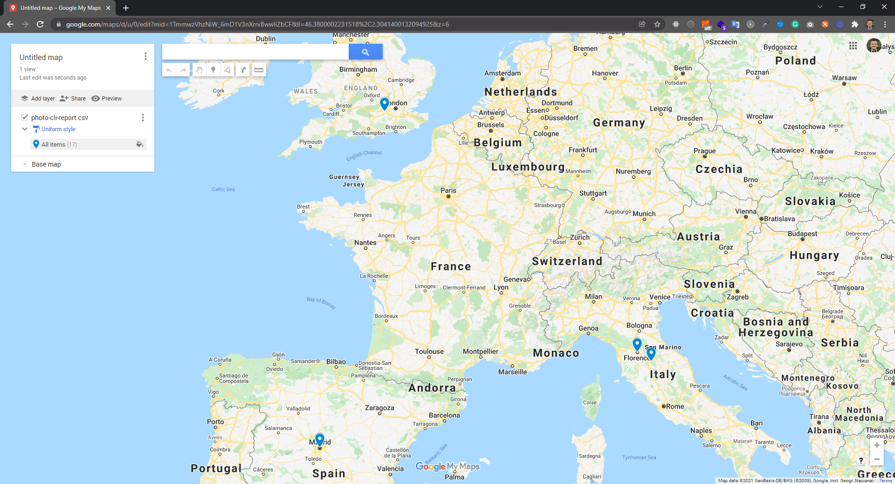

#### Google Earth Desktop

After installing [Google Earth Desktop](https://www.google.com/earth/versions/#earth-pro), on `File` menu, you can import your CSV file via `Import` menu item.


#### Google Earth Web
To navigate your photographs on [Google Earth Web](https://earth.google.com/web/), first you should import your CSV on Google Earth Desktop and save it as [KMZ or KML](https://en.wikipedia.org/wiki/Keyhole_Markup_Language). Then you can create a project and add this KML file.

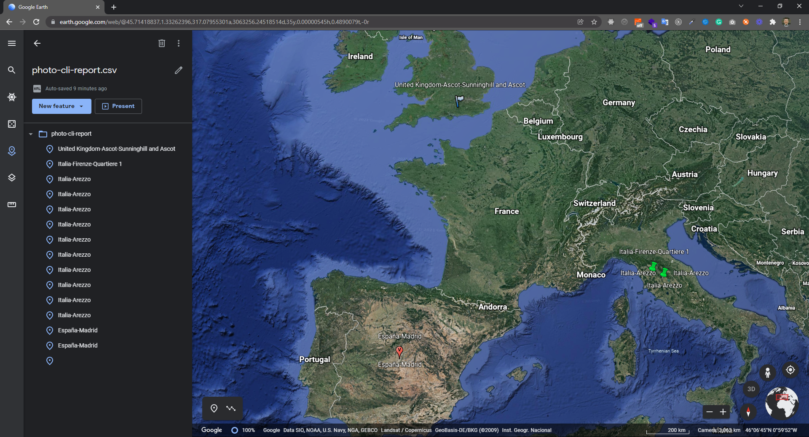

## Installation

This application can be installed by Homebrew (macOS & Linux), standalone executable (without dependency and SDK) or as .NET tool.

See the [installation](INSTALL.md) for details.

Installing the application globally provides access to the `photo-cli` command in your terminal.

```
photo-cli [command]

photo-cli help [command]
```

Note: You may test commands on [test photographs](docs/test-photographs) which has coordinates and photograph taken dates in it.

### Sample Usage Screenshots

The following command used in all samples with [test photographs](docs/test-photographs)
```
photo-cli copy -i photos -f 2 -s 8 -n 2 -a 4 -p 1 -e 2 -r country city town suburb -o organized-albums -c 3 -t 3
```

- [Windows](#windows)
- [macOS](#macos)
- [Linux](#linux)

### Windows

#### Executing

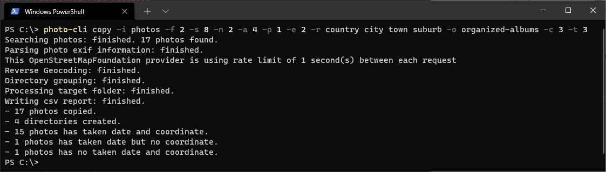

#### File Explorer

<details>
  <summary>Click to expand</summary>

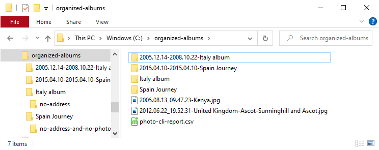

</details>

#### Microsoft Excel

<details>
  <summary>Click to expand</summary>

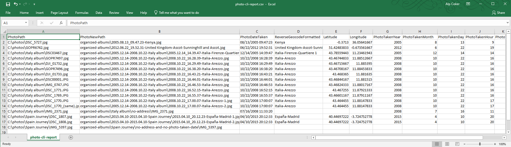

</details>

#### Tree Command

<details>
  <summary>Click to expand</summary>

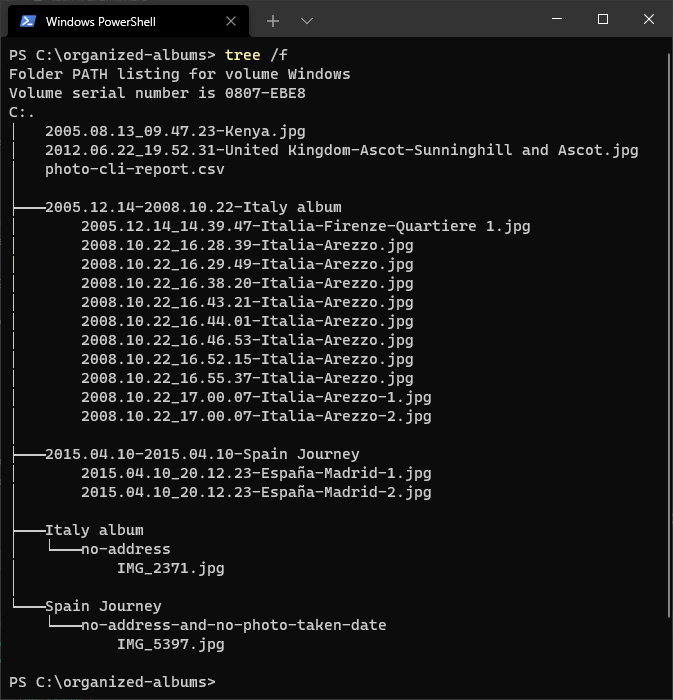

</details>

### macOS

##### Executing

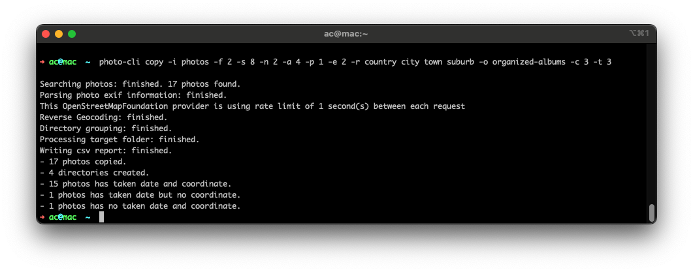

##### Finder

<details>
  <summary>Click to expand</summary>

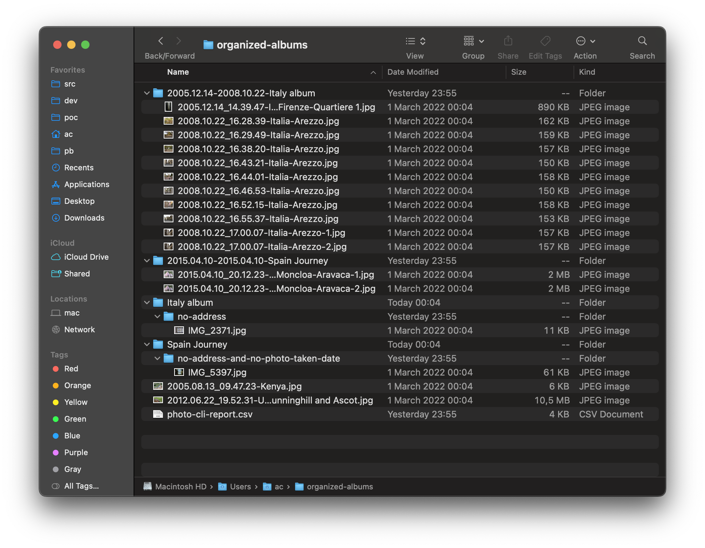

</details>

##### Apple Numbers

<details>
  <summary>Click to expand</summary>

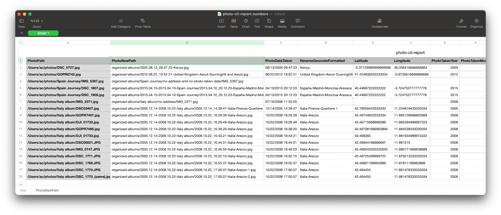

</details>

##### Tree Command

<details>
  <summary>Click to expand</summary>

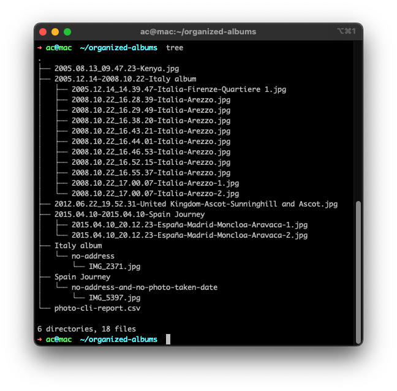

</details>

### Linux

##### Executing

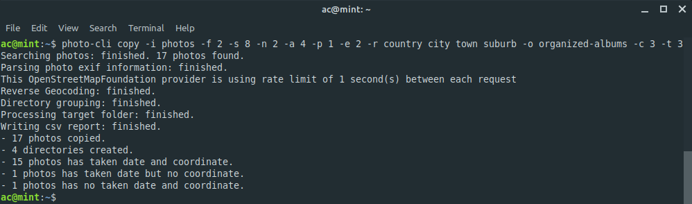

##### File Manager

<details>
  <summary>Click to expand</summary>

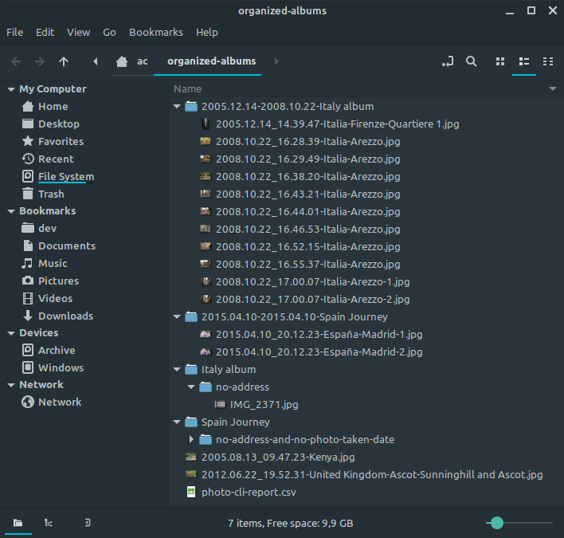

</details>

##### Libre Office Calc

<details>
  <summary>Click to expand</summary>

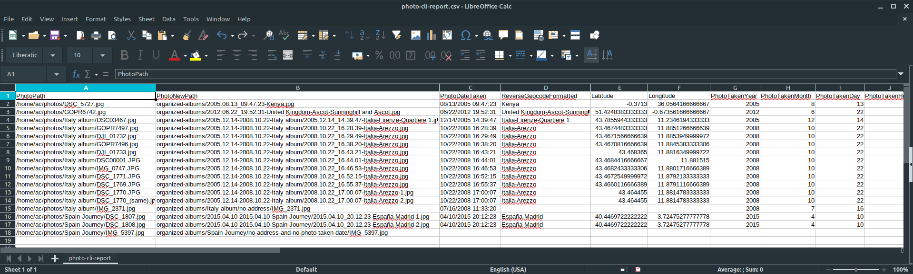

</details>

##### Tree Command

<details>
  <summary>Click to expand</summary>

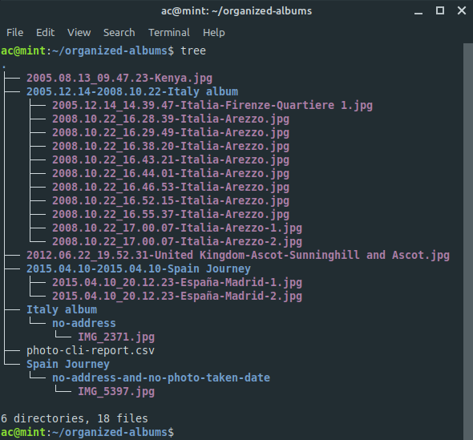

</details>

## How It's Done?

By extracting [Exchangeable image file format](https://en.wikipedia.org/wiki/Exif) stored on each of your photographs.

### When

[Photograph's taken date](https://en.wikipedia.org/wiki/Exif#Background) used to determine when photograph's date. Most of the camera/cell phones save this data without any setting.

### Where

[Photograph's coordinate data](https://en.wikipedia.org/wiki/Exif#Geolocation) is sent to selected third-party reverse geocode provider to [build a address](#address-building--reverse-geocoding).

Most of the cameras and cellphones have [GPS](https://en.wikipedia.org/wiki/Global_Positioning_System) receiver on them. You need to be sure that on settings something like `Save GPS location` should
be enabled.

## Supported Photo Types

With the default settings, we can process `jpg`, `jpeg`, `heic` and `png` photo files. As this tool internally using [MetadataExtractor](https://www.nuget.org/packages/MetadataExtractor/) package to extract image EXIF data, you can extend the supported photos with the [MetadataExtractor supported files](https://github.com/drewnoakes/metadata-extractor-dotnet?tab=readme-ov-file#features) by using [settings verb's set action](#setting-a-single-value).

#### Setting Supported Extensions Example
```
settings -k SupportedExtensions -v jpg,ext1,ext2,ext3
```

## Processing Companion Files

We are also processing the companion files with the same name of your main photo files. The default settings is currently only `mov` which is popular among [iPhone Live Photos](https://support.apple.com/en-us/104966) output is also exporting with a video file next to your photo.

You can extend this companion extension by using [settings verb's set action](#setting-a-single-value).

#### Setting Companion Extensions Example
```
settings -k CompanionExtensions -v mov,ext1,ext2,ext3
```

## Address Building & Reverse Geocoding

If you use only photo taken date and not interested in building address from reverse geocode, you can skip reading this section. But if you want to use address (reverse geocode) in file and/or folder naming, you should read the following sections and must learn the details.

### 1. Selecting Third-Party Reverse Geocode Provider

To build addresses we need a reserve geocode provider. Currently, there is four reverse geocode provider is supported.

1. BigDataCloud
2. Open Street Map Foundation - Nominatim
3. Google Maps
4. LocationIq

#### Comparison of Supported Third-Party Reverse Geocode Providers

| Reverse Geocode Provider                                                                         | API Key Required | Free Tier | Free Count Limit             | Free Rate Limit (free) | Map Data Owner                                                                        |
|--------------------------------------------------------------------------------------------------|------------------|-----------|------------------------------|------------------------|---------------------------------------------------------------------------------------|
| [BigDataCloud](https://www.bigdatacloud.com/geocoding-apis/reverse-geocode-to-city-api/)         | Yes              | Yes -     | 50.000 req/month             |                        | [Big Data Cloud](https://www.bigdatacloud.com/about-us/)                              |
| [Open Street Map Foundation - Nominatim](https://nominatim.org/release-docs/latest/api/Reverse/) | No               | -         | -                            | 1req/sec               | [Open Street Map Foundation](https://en.wikipedia.org/wiki/OpenStreetMap_Foundation/) |
| [GoogleMaps](https://developers.google.com/maps/documentation/geocoding/overview/)               | Yes              | No        | -                            | -                      | [Google](https://en.wikipedia.org/wiki/Google_Maps/)                                  |
| [LocationIq](https://locationiq.com/sandbox/geocoding/reverse/)                                  | Yes              | Yes       | 5.000 req/day                | 1req/sec               | [Open Street Map Foundation](https://en.wikipedia.org/wiki/OpenStreetMap_Foundation/) |

### 2. Setting API Key

After selecting reverse geocode provider, you need to provide an API key. There are three ways to provide this API key;

1. Send as an argument every time
2. Use [persist a setting](#setting-a-single-value) to save it as configuration, so you don't need to submit everytime.
3. Use environment variable, so you don't need to submit everytime.

| Reverse Geocode Provider                                                                         | Settings Key         | Environment Variable               | Argument                      |
|--------------------------------------------------------------------------------------------------|----------------------|------------------------------------|-------------------------------|
| [BigDataCloud](https://www.bigdatacloud.com/geocoding-apis/reverse-geocode-to-city-api/)         | `BigDataCloudApiKey` | `PHOTO_CLI_BIG_DATA_CLOUD_API_KEY` | `-b` or  `--bigdatacloud-key` |
| [Open Street Map Foundation - Nominatim](https://nominatim.org/release-docs/latest/api/Reverse/) | -                    | -                                  | -                             |
| [GoogleMaps](https://developers.google.com/maps/documentation/geocoding/overview/)               | `GoogleMapsApiKey`   | `PHOTO_CLI_GOOGLE_MAPS_API_KEY`    | `-k` or `--googlemaps-key`    |
| [LocationIq](https://locationiq.com/sandbox/geocoding/reverse/)                                  | `LocationIqApiKey`   | `PHOTO_CLI_LOCATIONIQ_API_KEY`     | `-q` or `--locationiq-key`    |

### 3. Understanding Reverse Geocode Response

Every reverse geocode provider has its data and they also represent it very differently. The information returned from reverse geocode provider is different or may differ in the level of detail. As there is no way to generalize every reverse geocode provider's response into the same address administrative level, users must understand the response returned from their selected reverse geocode provider.

There is two way to understand the reverse geocoding response.

1. [Easy Way To Inspect Reserve Geocode Response](#easy-way-to-inspect-reserve-geocode-response)
2. [Power User Way To Inspect Reserve Geocode Response](#power-user-way-to-inspect-reserve-geocode-response)

#### Easy Way To Inspect Reserve Geocode Response

`photo-cli` has a feature to extract and list the response of each reverse geocode provider. If you are using a reverse geocode provider that needs an API key, first you need to get it from the provider and [set API key](#2-setting-api-key).

Listing Reverse Geocode Response. Ref: [reverse geocode provider command line arguments](#reverse-geocode-provider---e---reverse-geocode-)

```
photo-cli address --input [input-file.jpg] --reverse-geocode [selected-reverse-geocode-provider]`
```

For example, a photo was taken on Anıtkabir(place), Çankaya(town), Ankara(city), Turkey(country) with coordinate as `39.925054` and longitude
as `32.8347552` ([Coordinate in Google Maps](https://goo.gl/maps/p5mrL54A2k7PnEQv6)) responses should be like the following.

##### Big Data Cloud

```
photo-cli address -i DSC_7082.jpg -e 1
```

```
AdminLevel2: Turkey
AdminLevel3: Central Anatolia Region
AdminLevel4: Ankara Province
AdminLevel6: Çankaya
AdminLevel8: Mebusevleri Mahallesi
```

##### Open Street Map - Nominatim

```
photo-cli address -i DSC_7082.jpg -e 2
```

```
CountryCode: tr
Country: Türkiye
Region: İç Anadolu Bölgesi
Province: Ankara
City: Ankara
Town: Çankaya
Postcode: 06430
Suburb: Yücetepe Mahallesi
Road: İlk Sokak
Military: Anıtkabir
```

##### Google Maps

```
photo-cli address -i DSC_7082.jpg -e 3
```

```
plus_code: WRGM+2W
administrative_area_level_2: Çankaya
administrative_area_level_1: Ankara
country: Turkey
route: Anıtkabir
administrative_area_level_4: Mebusevleri
postal_code: 06570
street_number: 108
```

##### Map Quest

```
photo-cli address -i DSC_7082.jpg -e 4
```

```
CountryCode: tr
Country: Türkiye
City: Ankara
Postcode: 06580
Suburb: Mebusevleri Mahallesi
```

##### Location Iq

```
photo-cli address -i DSC_7082.jpg -e 5
```

```
CountryCode: tr
Country: Turkey
Region: Central Anatolia Region
Province: Ankara
City: Ankara
Town: Çankaya
Postcode: 06570
Suburb: Yücetepe Mahallesi
Road: Ata Sokak
Barracks: Anıtkabir
```

#### Power User Way To Inspect Reserve Geocode Response

You should inspect the reverse geocode provider's response with the locations you occasionally take photographs. After getting the response, you can send the properties as an argument of your choice
of the administrative level you want to build an address for each photograph.

##### Using HTTP Files

To trigger HTTP files you may use [Visual Studio Code](https://code.visualstudio.com/) with the extension [REST Client](https://marketplace.visualstudio.com/items?itemName=humao.rest-client) or any IntelliJ IDE's.

You may replace `{{ApiKey}}` in the address with your API key or you can use the IntelliJ environment variable file.

| Reverse Geocode Provider                                                                         | HTTP File                                                              |
|--------------------------------------------------------------------------------------------------|------------------------------------------------------------------------|
| [BigDataCloud](https://www.bigdatacloud.com/geocoding-apis/reverse-geocode-to-city-api/)         | [big-data-cloud.http](docs/reverse-geocode/http/big-data-cloud.http)   |
| [Open Street Map Foundation - Nominatim](https://nominatim.org/release-docs/latest/api/Reverse/) | [open-street-map.http](docs/reverse-geocode/http/open-street-map.http) |
| [GoogleMaps](https://developers.google.com/maps/documentation/geocoding/overview/)               | [google-maps.http](docs/reverse-geocode/http/google-maps.http)         |
| [LocationIq](https://locationiq.com/sandbox/geocoding/reverse/)                                  | [location-iq.http](docs/reverse-geocode/http/location-iq.http)         |

##### Using Postman

You may import [photo-cli | Reverse Geocode](docs/reverse-geocode/postman/photo-cli_reverse_geocode.postman_collection.json) collection into [Postman](https://www.postman.com/).

You should prepare the following environment variables on Postman.

| Reverse Geocode Provider                                                                         | Postman Environment Variable |
|--------------------------------------------------------------------------------------------------|------------------------------|
| [BigDataCloud](https://www.bigdatacloud.com/geocoding-apis/reverse-geocode-to-city-api/)         | `BigDataCloud-ApiKey`        |
| [Open Street Map Foundation - Nominatim](https://nominatim.org/release-docs/latest/api/Reverse/) | -                            |
| [GoogleMaps](https://developers.google.com/maps/documentation/geocoding/overview/)               | `GoogleMaps-ApiKey`          |
| [LocationIq](https://locationiq.com/sandbox/geocoding/reverse/)                                  | `LocationIq-ApiKey`          |

##### Sample Responses

Sample responses in JSON format are listed below from each reverse geocode for the coordinate with latitude as `39.925054` and longitude as `32.8347552` ([Coordinate in Google Maps](https://goo.gl/maps/p5mrL54A2k7PnEQv6)).

| Reverse Geocode Provider                                                                         | Sample Response                                                                    |
|--------------------------------------------------------------------------------------------------|------------------------------------------------------------------------------------|
| [BigDataCloud](https://www.bigdatacloud.com/geocoding-apis/reverse-geocode-to-city-api/)         | [big-data-cloud.json](docs/reverse-geocode/sample-responses/big-data-cloud.json)   |
| [Open Street Map Foundation - Nominatim](https://nominatim.org/release-docs/latest/api/Reverse/) | [open-street-map.json](docs/reverse-geocode/sample-responses/open-street-map.json) |
| [GoogleMaps](https://developers.google.com/maps/documentation/geocoding/overview/)               | [google-maps.json](docs/reverse-geocode/sample-responses/google-maps.json)         |
| [LocationIq](https://locationiq.com/sandbox/geocoding/reverse/)                                  | [location-iq.json](docs/reverse-geocode/sample-responses/location-iq.json)         |

### 4. Building Your Own Address With Selected Properties

Every reverse geocode provider has its address building parameters. With `address` command you can inspect any photograph's reverse geocode response. These different levels of selected address properties will be used in exported into CSV file for [info command](#info) or used as file and/or folder names depending on your naming strategies for [copy command](#copy).

| Reverse Geocode Provider                                                                         | Address Building Parameters                           |
|--------------------------------------------------------------------------------------------------|-------------------------------------------------------|
| [BigDataCloud](https://www.bigdatacloud.com/geocoding-apis/reverse-geocode-to-city-api/)         | [BigDataCloud Properties](#big-data-cloud-parameters) |
| [Open Street Map Foundation - Nominatim](https://nominatim.org/release-docs/latest/api/Reverse/) | [OpenStreet Properties](#open-street-map-parameters)  |
| [GoogleMaps](https://developers.google.com/maps/documentation/geocoding/overview/)               | [GoogleMaps Properties](#google-maps-properties)      |
| [LocationIq](https://locationiq.com/sandbox/geocoding/reverse/)                                  | [OpenStreet Properties](#open-street-map-parameters)  |

#### Big Data Cloud Parameters

Getting a sample reverse geocoding response with all properties listed.

```
photo-cli address -i DSC_7082.jpg -e 1
```

```
AdminLevel2: Turkey
AdminLevel3: Central Anatolia Region
AdminLevel4: Ankara Province
AdminLevel6: Çankaya
AdminLevel8: Mebusevleri Mahallesi
```

If we want to build an address like with levels only contains `Turkey`, `Ankara Province`, and `Çankaya`, we should use levels `2,4,6`. To verify our address is building correctly, you may use `type` parameter as `SelectedProperties` and `bigdatacloud-levels` arguments separated with space like the following example.

```
photo-cli address --input DSC_7082.jpg --reverse-geocode BigDataCloud --type SelectedProperties --bigdatacloud-levels 2 4 6
```

```
Turkey
Ankara Province
Çankaya
```

#### Open Street Map Parameters

Getting a sample reverse geocoding response with all properties listed.

```
photo-cli address -i DSC_7082.jpg -e 2
```

```
CountryCode: tr
Country: Türkiye
Region: İç Anadolu Bölgesi
Province: Ankara
City: Ankara
Town: Çankaya
Postcode: 06430
Suburb: Yücetepe Mahallesi
Road: İlk Sokak
Military: Anıtkabir
```

If we want to build an address like with levels only contains `tr`, `06430`, and `Yücetepe Mahallesi`, we should use properties `CountryCode, Postcode, Suburb`. To verify our address is building correctly, you may use `type` as `SelectedProperties` and `openstreetmap-properties` arguments separated with space like the following example.

```
photo-cli address --input DSC_7082.jpg --reverse-geocode OpenStreetMapFoundation --type SelectedProperties --openstreetmap-properties CountryCode Postcode Suburb
```

```
tr
06430
Yücetepe Mahallesi
```

#### Google Maps Properties

Getting a sample reverse geocoding response with all properties listed.

```
photo-cli address -i DSC_7082.jpg -e GoogleMaps
```

```
plus_code: WRGM+2W
administrative_area_level_2: Çankaya
administrative_area_level_1: Ankara
country: Turkey
route: Anıtkabir
administrative_area_level_4: Mebusevleri
postal_code: 06570
street_number: 108
```

If we want to build an address like with levels only contains `Mebusevleri`, `108`, and `Anıtkabir`, we should use properties `administrative_area_level_4, street_number, route`. To verify our address is building correctly, you may use `type` as `SelectedProperties` and `googlemaps-types` arguments separated with space like the following example.

```
photo-cli address --input DSC_7082.jpg --reverse-geocode GoogleMaps --type SelectedProperties --googlemaps-types administrative_area_level_4 street_number route
```

```
Mebusevleri
108
Anıtkabir
```

### 5. Merging Selected Address Level Properties Into Single Address

After selecting our properties specialized by our selected third-party reverse geocode provider, we can use our address in file and folder names. To merge address levels, `-` character is used as default.

Example merged address may used in file/folder names: `Turkey-Ankara-Çankaya-Mebusevleri-Anıtkabir`

You may change default separator (`-`) via [settings](#settings) command with a setting key `AddressSeparator`

### 6. Caching Reverse Geocode Responses

Since the responses in close coordinate's requests in pretty close results, we implemented a caching mechanism for optimization. This is done by rounding the fractional digits of coordinates from the end. We are currently only use 4 fraction digits.

For example the original coordinate for 39.92501234567890, 32.83471234567890 will interpreted as 39.9250, 32.8347 internally before sending the request.

If you need more precise results in your reverse geocode responses, you can increase this value on [settings](#settings) with a key of `CoordinatePrecision`.

## Usages

We can't cover all possible options, because there are so many option combination. Some important [copy](#copy) command examples with comparing of original photos directory structure and output directory of `photo-cli` listed below.

#### Names as Sequential Numbering in Same Folder Hierarchy

Preserve same folder hierarchy, copy photos with sequential number ordering by photo taken date.

```
photo-cli copy --process-type SubFoldersPreserveFolderHierarchy --naming-style Numeric --number-style PaddingZeroCharacter --input photos --output organized-albums
```

<details>
  <summary>Click to expand</summary>

<table>
<tr>
    <th>Original Folder Hierarchy</th>
    <th>After <b><i>photo-cli</i></b></th>
</tr>
<tr>
<td>
<pre>
├── DSC_5727.jpg
├── GOPR6742.jpg
├── Italy album
│   ├── DJI_01732.jpg
│   ├── DJI_01733.jpg
│   ├── DSC00001.JPG
│   ├── DSC03467.jpg
│   ├── DSC_1769.JPG
│   ├── DSC_1770.JPG
│   ├── DSC_1770_(same).jpg
│   ├── DSC_1771.JPG
│   ├── GOPR7496.jpg
│   ├── GOPR7497.jpg
│   ├── IMG_0747.JPG
│   └── IMG_2371.jpg
└── Spain Journey
    ├── DSC_1807.jpg
    ├── DSC_1808.jpg
    └── IMG_5397.jpg

2 directories, 17 files
</pre>
</td>
<td>
<pre>
├── 1.jpg
├── 2.jpg
├── Italy album
│   ├── 01.jpg
│   ├── 02.jpg
│   ├── 03.jpg
│   ├── 04.jpg
│   ├── 05.jpg
│   ├── 06.jpg
│   ├── 07.jpg
│   ├── 08.jpg
│   ├── 09.jpg
│   ├── 10.jpg
│   ├── 11.jpg
│   └── 12.jpg
├── photo-cli-report.csv
└── Spain Journey
    ├── 1.jpg
    ├── 2.jpg
    └── 3.jpg

2 directories, 18 files
</pre>
</td>
</tr>
</table>

</details>

#### Group Into Taken Year/Month/Day Folders, Name as Date & Time

Groups photos by photo taken year, month, day than copy on [year]/[month]/[day] directory with a file name as photo taken date.

```
photo-cli copy --process-type FlattenAllSubFolders --group-by YearMonthDay --naming-style DateTimeWithSeconds --number-style OnlySequentialNumbers --input photos --output organized-albums
```

<details>
  <summary>Click to expand</summary>

<table>
<tr>
    <th>Original Folder Hierarchy</th>
    <th>After <b><i>photo-cli</i></b></th>
</tr>
<tr>
<td>
<pre>
├── DSC_5727.jpg
├── GOPR6742.jpg
├── Italy album
│   ├── DJI_01732.jpg
│   ├── DJI_01733.jpg
│   ├── DSC00001.JPG
│   ├── DSC03467.jpg
│   ├── DSC_1769.JPG
│   ├── DSC_1770.JPG
│   ├── DSC_1770_(same).jpg
│   ├── DSC_1771.JPG
│   ├── GOPR7496.jpg
│   ├── GOPR7497.jpg
│   ├── IMG_0747.JPG
│   └── IMG_2371.jpg
└── Spain Journey
    ├── DSC_1807.jpg
    ├── DSC_1808.jpg
    └── IMG_5397.jpg

2 directories, 17 files
</pre>
</td>
<td>
<pre>
├── 2005
│   ├── 08
│   │   └── 13
│   │       └── 2005.08.13_09.47.23.jpg
│   └── 12
│       └── 14
│           └── 2005.12.14_14.39.47.jpg
├── 2008
│   ├── 07
│   │   └── 16
│   │       └── 2008.07.16_11.33.20.jpg
│   └── 10
│       └── 22
│           ├── 2008.10.22_16.28.39.jpg
│           ├── 2008.10.22_16.29.49.jpg
│           ├── 2008.10.22_16.38.20.jpg
│           ├── 2008.10.22_16.43.21.jpg
│           ├── 2008.10.22_16.44.01.jpg
│           ├── 2008.10.22_16.46.53.jpg
│           ├── 2008.10.22_16.52.15.jpg
│           ├── 2008.10.22_16.55.37.jpg
│           ├── 2008.10.22_17.00.07-1.jpg
│           └── 2008.10.22_17.00.07-2.jpg
├── 2012
│   └── 06
│       └── 22
│           └── 2012.06.22_19.52.31.jpg
├── 2015
│   └── 04
│       └── 10
│           ├── 2015.04.10_20.12.23-1.jpg
│           └── 2015.04.10_20.12.23-2.jpg
├── IMG_5397.jpg
└── photo-cli-report.csv

16 directories, 18 files
</pre>
</td>
</tr>
</table>

</details>

#### Folders Prefixed With Date Range, Names as Address & Date

Adding day range as a prefix to existing folder names and photos copied with a file name as address and day.

```
photo-cli copy --process-type SubFoldersPreserveFolderHierarchy --folder-append DayRange --folder-append-location Prefix --naming-style AddressDay --reverse-geocode OpenStreetMapFoundation --openstreetmap-properties country city town suburb  --number-style AllNamesAreSameLength --input photos --output organized-albums
```

<details>
  <summary>Click to expand</summary>

<table>
<tr>
    <th>Original Folder Hierarchy</th>
    <th>After <b><i>photo-cli</i></b></th>
</tr>
<tr>
<td>
<pre>
├── DSC_5727.jpg
├── GOPR6742.jpg
├── Italy album
│   ├── DJI_01732.jpg
│   ├── DJI_01733.jpg
│   ├── DSC00001.JPG
│   ├── DSC03467.jpg
│   ├── DSC_1769.JPG
│   ├── DSC_1770.JPG
│   ├── DSC_1770_(same).jpg
│   ├── DSC_1771.JPG
│   ├── GOPR7496.jpg
│   ├── GOPR7497.jpg
│   ├── IMG_0747.JPG
│   └── IMG_2371.jpg
└── Spain Journey
    ├── DSC_1807.jpg
    ├── DSC_1808.jpg
    └── IMG_5397.jpg

2 directories, 17 files
</pre>
</td>
<td>
<pre>
├── 2005.12.14-2008.10.22-Italy album
│   ├── IMG_2371.jpg
│   ├── Italia-Arezzo-2008.10.22-10.jpg
│   ├── Italia-Arezzo-2008.10.22-11.jpg
│   ├── Italia-Arezzo-2008.10.22-12.jpg
│   ├── Italia-Arezzo-2008.10.22-13.jpg
│   ├── Italia-Arezzo-2008.10.22-14.jpg
│   ├── Italia-Arezzo-2008.10.22-15.jpg
│   ├── Italia-Arezzo-2008.10.22-16.jpg
│   ├── Italia-Arezzo-2008.10.22-17.jpg
│   ├── Italia-Arezzo-2008.10.22-18.jpg
│   ├── Italia-Arezzo-2008.10.22-19.jpg
│   └── Italia-Firenze-Quartiere 1-2005.12.14.jpg
├── 2015.04.10-2015.04.10-Spain Journey
│   ├── España-Madrid-2015.04.10-1.jpg
│   ├── España-Madrid-2015.04.10-2.jpg
│   └── IMG_5397.jpg
├── Kenya-2005.08.13.jpg
├── photo-cli-report.csv
└── United Kingdom-Ascot-Sunninghill and Ascot-2012.06.22.jpg

2 directories, 18 files
</pre>
</td>
</tr>
</table>

</details>

#### Naming With Address, Date in Same Folder Hierarchy

Preserve same folder hierarchy, copy photos with a file name as photo taken date, time and address. Possible file name will have number suffix. Photos that don't have any coordinate or photo taken date will be copied in a relative subfolder.

```
photo-cli copy --process-type SubFoldersPreserveFolderHierarchy --naming-style AddressDateTimeWithSeconds  --reverse-geocode OpenStreetMapFoundation --openstreetmap-properties country city town suburb --number-style AllNamesAreSameLength --no-taken-date InSubFolder --no-coordinate InSubFolder --input photos --output organized-albums
```

<details>
  <summary>Click to expand</summary>

<table>
<tr>
    <th>Original Folder Hierarchy</th>
    <th>After <b><i>photo-cli</i></b></th>
</tr>
<tr>
<td>
<pre>
├── DSC_5727.jpg
├── GOPR6742.jpg
├── Italy album
│   ├── DJI_01732.jpg
│   ├── DJI_01733.jpg
│   ├── DSC00001.JPG
│   ├── DSC03467.jpg
│   ├── DSC_1769.JPG
│   ├── DSC_1770.JPG
│   ├── DSC_1770_(same).jpg
│   ├── DSC_1771.JPG
│   ├── GOPR7496.jpg
│   ├── GOPR7497.jpg
│   ├── IMG_0747.JPG
│   └── IMG_2371.jpg
└── Spain Journey
    ├── DSC_1807.jpg
    ├── DSC_1808.jpg
    └── IMG_5397.jpg

2 directories, 17 files
</pre>
</td>
<td>
<pre>
├── Italy album
│   ├── Italia-Arezzo-2008.10.22_16.28.39.jpg
│   ├── Italia-Arezzo-2008.10.22_16.29.49.jpg
│   ├── Italia-Arezzo-2008.10.22_16.38.20.jpg
│   ├── Italia-Arezzo-2008.10.22_16.43.21.jpg
│   ├── Italia-Arezzo-2008.10.22_16.44.01.jpg
│   ├── Italia-Arezzo-2008.10.22_16.46.53.jpg
│   ├── Italia-Arezzo-2008.10.22_16.52.15.jpg
│   ├── Italia-Arezzo-2008.10.22_16.55.37.jpg
│   ├── Italia-Arezzo-2008.10.22_17.00.07-1.jpg
│   ├── Italia-Arezzo-2008.10.22_17.00.07-2.jpg
│   ├── Italia-Firenze-Quartiere 1-2005.12.14_14.39.47.jpg
│   └── no-address
│       └── IMG_2371.jpg
├── Kenya-2005.08.13_09.47.23.jpg
├── photo-cli-report.csv
├── Spain Journey
│   ├── España-Madrid-2015.04.10_20.12.23-1.jpg
│   ├── España-Madrid-2015.04.10_20.12.23-2.jpg
│   └── no-address-and-no-photo-taken-date
│       └── IMG_5397.jpg
└── United Kingdom-Ascot-Sunninghill and Ascot-2012.06.22_19.52.31.jpg

4 directories, 18 files
</pre>
</td>
</tr>
</table>

</details>

### Grouped Into Country/City/Town Folders, Names as Taken Date and Address

Groups photos by address hierarchy than copy on [country]/[city]/[town] directory with a file name as photo taken date. Photos that don't have any coordinate will be copied in a relative subfolder.

```
photo-cli copy --process-type FlattenAllSubFolders --group-by AddressHierarchy --naming-style DayAddress --reverse-geocode OpenStreetMapFoundation --openstreetmap-properties country city town suburb --number-style OnlySequentialNumbers --no-taken-date AppendToEndOrderByFileName --no-coordinate InSubFolder --input photos --output organized-albums
```

<details>
  <summary>Click to expand</summary>

<table>
<tr>
    <th>Original Folder Hierarchy</th>
    <th>After <b><i>photo-cli</i></b></th>
</tr>
<tr>
<td>
<pre>
├── DSC_5727.jpg
├── GOPR6742.jpg
├── Italy album
│   ├── DJI_01732.jpg
│   ├── DJI_01733.jpg
│   ├── DSC00001.JPG
│   ├── DSC03467.jpg
│   ├── DSC_1769.JPG
│   ├── DSC_1770.JPG
│   ├── DSC_1770_(same).jpg
│   ├── DSC_1771.JPG
│   ├── GOPR7496.jpg
│   ├── GOPR7497.jpg
│   ├── IMG_0747.JPG
│   └── IMG_2371.jpg
└── Spain Journey
    ├── DSC_1807.jpg
    ├── DSC_1808.jpg
    └── IMG_5397.jpg

2 directories, 17 files
</pre>
</td>
<td>
<pre>
├── España
│   └── Madrid
│       ├── 2015.04.10-España-Madrid-1.jpg
│       └── 2015.04.10-España-Madrid-2.jpg
├── Italia
│   ├── Arezzo
│   │   ├── 2008.10.22-Italia-Arezzo-10.jpg
│   │   ├── 2008.10.22-Italia-Arezzo-1.jpg
│   │   ├── 2008.10.22-Italia-Arezzo-2.jpg
│   │   ├── 2008.10.22-Italia-Arezzo-3.jpg
│   │   ├── 2008.10.22-Italia-Arezzo-4.jpg
│   │   ├── 2008.10.22-Italia-Arezzo-5.jpg
│   │   ├── 2008.10.22-Italia-Arezzo-6.jpg
│   │   ├── 2008.10.22-Italia-Arezzo-7.jpg
│   │   ├── 2008.10.22-Italia-Arezzo-8.jpg
│   │   └── 2008.10.22-Italia-Arezzo-9.jpg
│   └── Firenze
│       └── Quartiere 1
│           └── 2005.12.14-Italia-Firenze-Quartiere 1.jpg
├── Kenya
│   └── 2005.08.13-Kenya.jpg
├── no-address
│   ├── IMG_2371.jpg
│   └── IMG_5397.jpg
├── photo-cli-report.csv
└── United Kingdom
    └── Ascot
        └── Sunninghill and Ascot
            └── 2012.06.22-United Kingdom-Ascot-Sunninghill and Ascot.jpg

11 directories, 18 files
</pre>
</td>
</tr>
</table>

</details>

## Commands / Verbs

| Subcommand              | description                                                                                                                          |
|-------------------------|--------------------------------------------------------------------------------------------------------------------------------------|
| [`info`](#info)         | Creates a report (CSV file) listing all photo taken date and address (reverse geocode).                                              |
| [`copy`](#copy)         | Copies photos into new folder hierarchy with given arguments using photograph's taken date and coordinate address (reverse geocode). |
| [`archive`](#archive)   | Archives photos into specific folder and indexing photo taken date, address (reverse geocode) information into SQLite database.      |
| [`address`](#address)   | Get address (reverse geocode) of single photo.                                                                                       |
| [`settings`](#settings) | Lists, saves and get settings.                                                                                                       |

### Info

Creates a report (CSV file) listing all photo taken date and address (reverse geocode).

```
photo-cli help info
```

```
  -o, --output                      (MUST) File system path to write report file.

  -i, --input                       (Default current executing folder) File system path to read & copy photos from. ( there will be no modification on input path )

  -a, --all-folders                 (Optional) Read & list all photos in all sub folders (no extra parameter needed)

  -t, --no-taken-date               (Optional) Action to do when a photo with a no taken date. ( Continue: 0, PreventProcess: 1 )

  -c, --no-coordinate               (Optional) Action to do when a photo with a no coordinate. ( Continue: 0, PreventProcess: 1 )

  -e, --reverse-geocode             (Optional) Third-party provider to resolve photo taken address by photo's coordinates. ( Disabled: 0 [default], BigDataCloud: 1, OpenStreetMapFoundation: 2, GoogleMaps: 3, LocationIq: 5 )

  -b, --bigdatacloud-key            (Optional) API key needed to use BigDataCloud. https://www.bigdatacloud.com/geocoding-apis/reverse-geocode-to-city-api/ (Instead of using this option, environment name: PHOTO_CLI_BIG_DATA_CLOUD_API_KEY can be used. )

  -u, --bigdatacloud-levels         (Optional) Admin levels separated with space. ( To see which level correspond to which address level, you may use `photo-cli address` to see full response returned from BigDataCloud. )

  -m, --googlemaps-types            (Optional) GoogleMaps address types separated with space. ( To see which level correspond to which address level, you may use `photo-cli address` to see full response returned from GoogleMaps. )

  -k, --googlemaps-key              (Optional) API key needed to use GoogleMaps. https://developers.google.com/maps/documentation/geocoding/overview/ (Instead of using this option, environment name: PHOTO_CLI_GOOGLE_MAPS_API_KEY can be used. )

  -r, --openstreetmap-properties    (Optional) OpenStreetMap properties separated with space. ( To see which level correspond to which address level, you may use `photo-cli address` to see full response returned from OpenStreetMap provider. )

  -q, --locationiq-key              (Optional) API key needed to use LocationIq. https://locationiq.com/docs/ (Instead of using this option, environment name: PHOTO_CLI_LOCATIONIQ_API_KEY can be used. )

  -h, --has-paid-license            (Optional) Bypass rate limit if you have paid license. ( For LocationIq )

  -l, --language                    (Optional) Language/culture value to get localized address result for BigDataCloud ( https://www.bigdatacloud.com/supported-languages/ ) and GoogleMaps (https://developers.google.com/maps/faq#languagesupport ).

  --help                            Display this help screen.

  --version                         Display version information.

NOTES:
- Instead of option names (for ex: DateTimeWithMinutes), you may use options values too. (for ex: 3)
- You can use relative folder paths. If you use the input folder as the working directory, you don't need to use the input argument.

EXAMPLE USAGES:
- Photos located on all subfolders will be processed and their photograph's taken date and address information will be saved on CSV file using BigDataCloud reverse geocode provider.

Example with long argument names;
photo-cli info --all-folders --reverse-geocode OpenStreetMapFoundation --input [input-folder] --output [output-file].csv --openstreetmap-properties country city town suburb

Example with short argument names;
photo-cli info -a -e OpenStreetMapFoundation -i [input-folder] -o [output-file].csv -r country city town suburb

- Using Google Maps reverse geocode provider (need api key) with an option to prevent processing if there is no coordinate or no photo taken date found on any photo.

Example with long argument names;
photo-cli info --no-coordinate PreventProcess --reverse-geocode GoogleMaps --input [input-folder] --googlemaps-key google-api-key --googlemaps-types administrative_area_level_1 administrative_area_level_2 --output [output-file].csv --no-taken-date PreventProcess

Example with short argument names;
photo-cli info -c PreventProcess -e GoogleMaps -i [input-folder] -k google-api-key -m administrative_area_level_1 administrative_area_level_2 -o [output-file].csv -t PreventProcess
```

### Copy

Copies photos into new folder hierarchy with given arguments using photograph's taken date and coordinate address (reverse geocode).

```
photo-cli help copy
```

```
  -o, --output                      (MUST) File system path to create new organized folder. A new folder hierarchy will be created on that location with new file names. (will create folder if not exists)

  -s, --naming-style                (MUST) Naming strategy of newly copied file name. ( Numeric: 1, Day: 2, DateTimeWithMinutes: 3, DateTimeWithSeconds: 4, Address: 5, DayAddress: 6, DateTimeWithMinutesAddress: 7, DateTimeWithSecondsAddress: 8, AddressDay: 9,
                                    AddressDateTimeWithMinutes: 10, AddressDateTimeWithSeconds: 11 )

  -f, --process-type                (MUST) Reading photos strategy from input folder. ( Single: 1, SubFoldersPreserveFolderHierarchy: 2, FlattenAllSubFolders: 3 )

  -n, --number-style                (MUST) Number naming strategy when using `NamingStyle` as `Numeric` or using to numbering the possible same names. ( AllNamesAreSameLength: 1, PaddingZeroCharacter: 2, OnlySequentialNumbers: 3 )

  -t, --no-taken-date               (MUST) Action to do when a photo with a no taken date. ( Continue: 0, PreventProcess: 1, DontCopyToOutput: 2, InSubFolder: 3, AppendToEndOrderByFileName: 4, InsertToBeginningOrderByFileName: 5 )

  -c, --no-coordinate               (MUST) Action to do when a photo with a no coordinate. ( Continue: 0, PreventProcess: 1, DontCopyToOutput: 2, InSubFolder: 3 )

  -i, --input                       (Default current executing folder) File system path to read & copy photos from. ( there will be no modification on input path )

  -d, --dry-run                     (Optional) Simulate the same process without writing to the output folder. (no extra parameter needed)

  -g, --group-by                    (Optional) Strategy to group photos into folders. [Can't use with `FolderProcessType` is `SubFoldersPreserveFolderHierarchy`] ( YearMonthDay: 1, YearMonth: 2, Year: 3, Address: 4 )

  -a, --folder-append               (Optional) Appending name strategy to folder names cloned from source folder hierarchy. [Can be with `FolderProcessType` is `SubFoldersPreserveFolderHierarchy`] ( FirstYearMonthDay: 1, FirstYearMonth: 2, FirstYear: 3, DayRange: 4,
                                    MatchingMinimumAddress: 5 )

  -p, --folder-append-location      (Optional) Append location for `FolderAppendType`. [Can be use with `FolderProcessType` is `SubFoldersPreserveFolderHierarchy`] ( Prefix: 1, Suffix: 2 )

  -v, --verify                      (Optional) Verify that all photo files copied successfully by comparing file hashes. (no extra parameter needed)

  -e, --reverse-geocode             (Optional) Third-party provider to resolve photo taken address by photo's coordinates. ( Disabled: 0 [default], BigDataCloud: 1, OpenStreetMapFoundation: 2, GoogleMaps: 3, LocationIq: 5 )

  -b, --bigdatacloud-key            (Optional) API key needed to use BigDataCloud. https://www.bigdatacloud.com/geocoding-apis/reverse-geocode-to-city-api/ (Instead of using this option, environment name: PHOTO_CLI_BIG_DATA_CLOUD_API_KEY can be used. )

  -u, --bigdatacloud-levels         (Optional) Admin levels separated with space. ( To see which level correspond to which address level, you may use `photo-cli address` to see full response returned from BigDataCloud. )

  -m, --googlemaps-types            (Optional) GoogleMaps address types separated with space. ( To see which level correspond to which address level, you may use `photo-cli address` to see full response returned from GoogleMaps. )

  -k, --googlemaps-key              (Optional) API key needed to use GoogleMaps. https://developers.google.com/maps/documentation/geocoding/overview/ (Instead of using this option, environment name: PHOTO_CLI_GOOGLE_MAPS_API_KEY can be used. )

  -r, --openstreetmap-properties    (Optional) OpenStreetMap properties separated with space. ( To see which level correspond to which address level, you may use `photo-cli address` to see full response returned from OpenStreetMap provider. )

  -q, --locationiq-key              (Optional) API key needed to use LocationIq. https://locationiq.com/docs/ (Instead of using this option, environment name: PHOTO_CLI_LOCATIONIQ_API_KEY can be used. )

  -h, --has-paid-license            (Optional) Bypass rate limit if you have paid license. ( For LocationIq. )

  -l, --language                    (Optional) Language/culture value to get localized address result for BigDataCloud ( https://www.bigdatacloud.com/supported-languages/ ) and GoogleMaps (https://developers.google.com/maps/faq#languagesupport ).

  --help                            Display this help screen.

  --version                         Display version information.

NOTES:
- Instead of option names (for ex: DateTimeWithMinutes), you may use options values too. (for ex: 3)
- You can use relative folder paths. If you use the input folder as the working directory, you don't need to use the input argument.

EXAMPLE USAGES:
- By preserving existing folder hierarchy, photos copied with a file name as photo taken date and time. Photos taken on same date and time, will have a number suffix. Photos that don't have any coordinate or photo taken date will be copied in a relative sub folder.

Example with long argument names;
photo-cli copy --no-coordinate InSubFolder --process-type SubFoldersPreserveFolderHierarchy --input [input-folder] --number-style PaddingZeroCharacter --output [output-folder] --naming-style DateTimeWithMinutes --no-taken-date InSubFolder

Example with short argument names;
photo-cli copy -c InSubFolder -f SubFoldersPreserveFolderHierarchy -i [input-folder] -n PaddingZeroCharacter -o [output-folder] -s DateTimeWithMinutes -t InSubFolder

- Preserving folder hierarchy, photos copied with a sequential file name. Photos that don't have any coordinate or photo taken date won't be copied to output.

Example with long argument names;
photo-cli copy --no-coordinate DontCopyToOutput --process-type SubFoldersPreserveFolderHierarchy --input [input-folder] --number-style AllNamesAreSameLength --output [output-folder] --naming-style Numeric --no-taken-date DontCopyToOutput

Example with short argument names;
photo-cli copy -c DontCopyToOutput -f SubFoldersPreserveFolderHierarchy -i [input-folder] -n AllNamesAreSameLength -o [output-folder] -s Numeric -t DontCopyToOutput

- Grouping all photos in folders with a name photo taken year and month. Photos will be copied with a file name date, time, and address received from OpenStreetMap reverse geocode provider.

Example with long argument names;
photo-cli copy --reverse-geocode OpenStreetMapFoundation --process-type FlattenAllSubFolders --group-by YearMonth --input [input-folder] --number-style OnlySequentialNumbers --output [output-folder] --openstreetmap-properties country city town suburb --naming-style DateTimeWithSecondsAddress --no-taken-date AppendToEndOrderByFileName

Example with short argument names;
photo-cli copy -e OpenStreetMapFoundation -f FlattenAllSubFolders -g YearMonth -i [input-folder] -n OnlySequentialNumbers -o [output-folder] -r country city town suburb -s DateTimeWithSecondsAddress -t AppendToEndOrderByFileName

- Process single folder and copy photos with file names as their address which will get from BigDataCloud

Example with long argument names;
photo-cli copy --no-coordinate PreventProcess --reverse-geocode BigDataCloud --process-type Single --input [input-folder] --number-style AllNamesAreSameLength --output [output-folder] --naming-style Address --no-taken-date DontCopyToOutput --bigdatacloud-levels 2 4 6 8

Example with short argument names;
photo-cli copy -c PreventProcess -e BigDataCloud -f Single -i [input-folder] -n AllNamesAreSameLength -o [output-folder] -s Address -t DontCopyToOutput -u 2 4 6 8

- Adding year month day as a prefix to existing folder names and photos copied with a file name as day and address. The address will be built from Google Maps (need API key).

Example with long argument names;
photo-cli copy --folder-append FirstYearMonthDay --no-coordinate PreventProcess --reverse-geocode GoogleMaps --process-type SubFoldersPreserveFolderHierarchy --input [input-folder] --googlemaps-key google-api-key --googlemaps-types administrative_area_level_1 administrative_area_level_2 administrative_area_level_3 --number-style AllNamesAreSameLength --output [output-folder] --folder-append-location Prefix --naming-style DayAddress --no-taken-date PreventProcess

Example with short argument names;
photo-cli copy -a FirstYearMonthDay -c PreventProcess -e GoogleMaps -f SubFoldersPreserveFolderHierarchy -i [input-folder] -k google-api-key -m administrative_area_level_1 administrative_area_level_2 administrative_area_level_3 -n AllNamesAreSameLength -o [output-folder] -p Prefix -s DayAddress -t PreventProcess
```

### Archive

Archives photos into specific folder and indexing photo taken date, address (reverse geocode) information into SQLite database.

```
photo-cli help archive
```

```
  -o, --output                      (MUST) File system path to create new organized folder. A new folder hierarchy will be created on that location with new file names. (will create folder if not exist)

  -i, --input                       (Default current executing folder) File system path to read & copy photos from. ( there will be no modification on the input path )

  -d, --dry-run                     (Optional) Simulate the same process without writing to the output folder. (no extra parameter needed)

  -x, --invalid-format              (Optional) Action to do when a photo format is invalid. ( Continue: 0 [default], PreventProcess: 1 )

  -t, --no-taken-date               (Optional) Action to do when a photo with a no taken date. ( Continue: 0 [default], PreventProcess: 1 )

  -c, --no-coordinate               (Optional) Action to do when a photo with a no coordinate. ( Continue: 0 [default], PreventProcess: 1 )

  -e, --reverse-geocode             (Optional) Third-party provider to resolve photo taken address by photo's coordinates. ( Disabled: 0 [default], BigDataCloud: 1, OpenStreetMapFoundation: 2, GoogleMaps:
                                    3, LocationIq: 5 )

  -b, --bigdatacloud-key            (Optional) API key needed to use BigDataCloud. https://www.bigdatacloud.com/geocoding-apis/reverse-geocode-to-city-api/ (Instead of using this option, environment name:
                                    PHOTO_CLI_BIG_DATA_CLOUD_API_KEY can be used or `BigDataCloudApiKey` key can be set via settings command. )

  -u, --bigdatacloud-levels         (Optional) Admin levels separated with space. ( To see which level correspond to which address level, you may use `photo-cli address` to see the full response returned
                                    from BigDataCloud. )

  -m, --googlemaps-types            (Optional) GoogleMaps address types separated with space. ( To see which level correspond to which address level, you may use `photo-cli address` to see the full
                                    response returned from GoogleMaps. )

  -k, --googlemaps-key              (Optional) API key needed to use GoogleMaps. https://developers.google.com/maps/documentation/geocoding/overview/ (Instead of using this option, environment name:
                                    PHOTO_CLI_GOOGLE_MAPS_API_KEY can be used or `GoogleMapsApiKey` key can be set via settings command. )

  -r, --openstreetmap-properties    (Optional) OpenStreetMap properties separated with space. ( To see which level correspond to which address level, you may use `photo-cli address` to see the full
                                    response returned from OpenStreetMap provider. )

  -q, --locationiq-key              (Optional) API key needed to use LocationIq. https://locationiq.com/docs/ (Instead of using this option, environment name: PHOTO_CLI_LOCATIONIQ_API_KEY can be used or
                                    `LocationIqApiKey` key can be set via settings command. )

  -h, --has-paid-license            (Optional) Bypass the free rate limit if you have paid license. ( For LocationIq. )

  -l, --language                    (Optional) Language/culture value to get localized address result for BigDataCloud ( https://www.bigdatacloud.com/supported-languages/ ) and GoogleMaps
                                    (https://developers.google.com/maps/faq#languagesupport ).

  --help                            Display this help screen.

  --version                         Display version information.

NOTES:
- Instead of option names (for ex: DateTimeWithMinutes), you may use options values too. (for ex: 3)
- You can use relative folder paths. If you use the input folder as the working directory, you don't need to use the input argument.

EXAMPLE USAGES:
- Archive all photos in current folder (and it's subfolders recursively) into output folder by [year]/[month]/[day] hierarchy with a file name photo taken date with seconds prefixed by file hash. Saves all photo taken information into local SQLite database.

Example with long argument names;
photo-cli archive --output [output-folder]

Example with short argument names;
photo-cli archive -o [output-folder]

- Archive all photos in input folder (and it's subfolders recursively), fetches all photo's reverse geocode information, copies into output folder by [year]/[month]/[day] hierarchy with a file name photo taken date with seconds prefixed by file hash. Saves all photo taken information and it's address (reverse geocode) into local SQLite database.

Example with long argument names;
photo-cli archive --no-coordinate PreventProcess --reverse-geocode OpenStreetMapFoundation --input [input-folder] --output [output-folder] --openstreetmap-properties country city town suburb --no-taken-date PreventProcess --invalid-format PreventProcess

Example with short argument names;
photo-cli archive -c PreventProcess -e OpenStreetMapFoundation -i [input-folder] -o [output-folder] -r country city town suburb -t PreventProcess -x PreventProcess
```

### Address

Get address (reverse geocode) of single photo.

```
photo-cli help address
```

```
  -i, --input                       (Default current executing folder) File system path to read & copy photos from. ( there will be no modification on the input path )

  -e, --reverse-geocode             (Optional) Third-party provider to resolve photo taken address by photo's coordinates. ( Disabled: 0 [default], BigDataCloud: 1, OpenStreetMapFoundation: 2, GoogleMaps: 3, LocationIq: 5 )

  -t, --type                        (MUST) Response list detail level. ( AllAvailableProperties: 0, SelectedProperties: 1, FullResponse: 2 )

  -b, --bigdatacloud-key            (Optional) API key needed to use BigDataCloud. https://www.bigdatacloud.com/geocoding-apis/reverse-geocode-to-city-api/ (Instead of using this option, environment name: PHOTO_CLI_BIG_DATA_CLOUD_API_KEY can be used. )

  -u, --bigdatacloud-levels         (Optional) Admin levels separated with space. ( To see which level correspond to which address level, you may use `photo-cli address` to see full response returned from BigDataCloud. )

  -m, --googlemaps-types            (Optional) GoogleMaps address types separated with space. ( To see which level correspond to which address level, you may use `photo-cli address` to see full response returned from GoogleMaps. )

  -k, --googlemaps-key              (Optional) API key needed to use GoogleMaps. https://developers.google.com/maps/documentation/geocoding/overview/ (Instead of using this option, environment name: PHOTO_CLI_GOOGLE_MAPS_API_KEY can be used. )

  -r, --openstreetmap-properties    (Optional) OpenStreetMap properties separated with space. ( To see which level correspond to which address level, you may use `photo-cli address` to see full response returned from OpenStreetMap provider. )

  -q, --locationiq-key              (Optional) API key needed to use LocationIq. https://locationiq.com/docs/ (Instead of using this option, environment name: PHOTO_CLI_LOCATIONIQ_API_KEY can be used. )

  -h, --has-paid-license            (Optional) Bypass rate limit if you have paid license. ( For LocationIq. )

  -l, --language                    (Optional) Language/culture value to get localized address result for BigDataCloud ( https://www.bigdatacloud.com/supported-languages/ ) and GoogleMaps (https://developers.google.com/maps/faq#languagesupport ).

  --help                            Display this help screen.

  --version                         Display version information.

NOTES:
- Instead of option names (for ex: DateTimeWithMinutes), you may use options values too. (for ex: 3)
- You can use relative folder paths. If you use the input folder as the working directory, you don't need to use the input argument.

EXAMPLE USAGES:
- All properties

Example with long argument names;
photo-cli address --reverse-geocode OpenStreetMapFoundation --input [photo-path].jpg

Example with short argument names;
photo-cli address -e OpenStreetMapFoundation -i [photo-path].jpg

- Selected properties

Example with long argument names;
photo-cli address --reverse-geocode OpenStreetMapFoundation --input [photo-path].jpg --openstreetmap-properties country city town suburb --type SelectedProperties

Example with short argument names;
photo-cli address -e OpenStreetMapFoundation -i [photo-path].jpg -r country city town suburb -t SelectedProperties

- Show full response

Example with long argument names;
photo-cli address --reverse-geocode OpenStreetMapFoundation --input [photo-path].jpg --type FullResponse

Example with short argument names;
photo-cli address -e OpenStreetMapFoundation -i [photo-path].jpg -t FullResponse
```

### Settings

List, save and get settings.

```
photo-cli help settings
```

```
  -k, --key      (Optional) Setting property name to change.

  -v, --value    (Optional) Setting value to set.

  -r, --reset    (Optional) Reset all settings value to default ones. (no extra parameter needed)

  --help         Display this help screen.

  --version      Display version information.

NOTES:
- Instead of option names (for ex: DateTimeWithMinutes), you may use options values too. (for ex: 3)
- You can use relative folder paths. If you use input folder as working directory, you don't need to use input argument.

EXAMPLE USAGES:
- List all settings

Example with long argument names;
photo-cli settings

Example with short argument names;
photo-cli settings

- Get a setting

Example with long argument names;
photo-cli settings --key YearFormat

Example with short argument names;
photo-cli settings -k YearFormat

- Save a setting

Example with long argument names;
photo-cli settings --key YearFormat --value yyyy

Example with short argument names;
photo-cli settings -k YearFormat -v yyyy

- Reset all settings

Example with long argument names;
photo-cli settings --reset

Example with short argument names;
photo-cli settings -r
```

## Command Line Options / Arguments

### Input Path ( -i, --input )

Optional use for `copy`, `archive`, `info` verb. Must be used on `address` verb. File system path to read & copy photos from. If not given, the current executing folder will be used. There will be no
modification on input path.

### Output Path ( -o, --output )

Must be used on `copy`, `archive`, `info` verbs. File system path to write output. For `copy`, new folder hierarchy created on that location with new file names. It will create folder if not exists. For `info`, report csv file path to write.

### Folder Process Type ( -f, --process-type )

Must be used on `copy` verb. You must select folder process behavior to whether use original folder hierarchy or flatten into single folder/grouped folder by [Group By Folder](#group-by-folder---g---group-by-).

| Option                            | Name |
|-----------------------------------|------|
| Single                            | 1    |
| SubFoldersPreserveFolderHierarchy | 2    |
| FlattenAllSubFolders              | 3    |

### Naming Style ( -s, --naming-style )

Must be used on `copy` verb. While copying to a new organized folder, you must select one of these file naming strategies for a newly copied photo file name.

| Option                     | Value |
|----------------------------|-------|
| Numeric                    | 1     |
| Day                        | 2     |
| DateTimeWithMinutes        | 3     |
| DateTimeWithSeconds        | 4     |
| Address                    | 5     |
| DayAddress                 | 6     |
| DateTimeWithMinutesAddress | 7     |
| DateTimeWithSecondsAddress | 8     |
| AddressDay                 | 9     |
| AddressDateTimeWithMinutes | 10    |
| AddressDateTimeWithSeconds | 11    |

### Folder Append Type ( -a, --folder-append )

Optional use for `copy` verb. While copying to a new organized folder (you should select [Folder Process Type](#folder-process-type---f---process-type-) as `SubFoldersPreserveFolderHierarchy` ), you may select one of these file folder naming strategies. Must used with [Folder Append Location Type](#folder-append-location-type---p---folder-append-location-)

| Option                 | Value |
|------------------------|-------|
| FirstYearMonthDay      | 1     |
| FirstYearMonth         | 2     |
| FirstYear              | 3     |
| DayRange               | 4     |
| MatchingMinimumAddress | 5     |

### Folder Append Location Type ( -p, --folder-append-location )

Optional use for `copy` verb. While copying to a new organized folder (you should select [Folder Process Type](#folder-process-type---f---process-type-) as `SubFoldersPreserveFolderHierarchy` ), you may select one of these file folder naming strategies. Must used with [Folder Append Location](#folder-append-type---a---folder-append-)

| Option | Value |
|--------|-------|
| Prefix | 1     |
| Suffix | 2     |

### Group By Folder ( -g, --group-by )

Optional use for `copy` verb. If you want to group photos by EXIF data, you may select one of these strategies.

| Option       | Value |
|--------------|-------|
| YearMonthDay | 1     |
| YearMonth    | 2     |
| Year         | 3     |
| Address      | 4     |

### Number Naming Text Style ( -n, --number-style )

Must be used on `copy` verb. Number naming strategy when using [Naming Style](#naming-style---s---naming-style-) as `Numeric` or using to numbering the possible same names.

| Option                | Value |
|-----------------------|-------|
| AllNamesAreSameLength | 1     |
| PaddingZeroCharacter  | 2     |
| OnlySequentialNumbers | 3     |

### Verify ( -v, --verify)

Optional use for `copy` verb. Verify that all photo files copied successfully by comparing file hashes. (no extra parameter needed)

### Is Dry Run ( -d, --dry-run )

Optional use for `copy`, `archive` verb. Simulate the same process without writing to output folder. No extra parameter needed.

### Reverse Geocode Provider ( -e, --reverse-geocode )

Optional use for `copy`, `archive`, `info` verb. Must be used on `address` verb. Third-party provider to resolve photo taken address by photo's coordinates.

| Option                  | Value |
|-------------------------|-------|
| BigDataCloud            | 1     |
| OpenStreetMapFoundation | 2     |
| GoogleMaps              | 3     |
| LocationIq              | 5     |

### Big Data Cloud API Key ( -b, --bigdatacloud-key )

Sets [Big Data Cloud reverse geocode](https://www.bigdatacloud.com/geocoding-apis/reverse-geocode-to-city-api/) API key. Alternatively, you may use the environment variable `PHOTO_CLI_BIG_DATA_CLOUD_API_KEY`.

### Google Maps API Key ( -k, --googlemaps-key )

Sets [Google Maps reverse geocode](https://developers.google.com/maps/documentation/geocoding/overview/) API key. Alternatively, you may use the environment variable `PHOTO_CLI_GOOGLE_MAPS_API_KEY`.

### Location Iq API Key ( -q, --locationiq-key )

Sets [Location Iq reverse geocode](https://locationiq.com/sandbox/geocoding/reverse/) API key. Alternatively, you may use the environment variable `PHOTO_CLI_LOCATIONIQ_API_KEY`.

### BigDataCloud Admin Levels ( -u, --bigdatacloud-levels )

Must be used when `BigDataCloud` is selected as reverse geocode provider. Big Data Cloud admin levels are separated with space. ( To see which level correspond to which address level, you may use `photo-cli address` to see the full response returned from BigDataCloud. )

### OpenStreetMapProperties ( -r, --openstreetmap-properties )

Must be used when any of `OpenStreetMapFoundation`, `LocationIq` is selected as reverse geocode provider. OpenStreetMap properties separated with space. ( To see which level correspond to which address level, you may use `photo-cli address` to see the full response returned from OpenStreetMap provider. )

### Google Maps Address Types ( -m, --googlemaps-types )

Must be used when `GoogleMaps` selected as reverse geocode provider. Google Maps address types separated with space. ( To see which level correspond to which address level, you may use `photo-cli address` to see full the response returned from GoogleMaps. )

### Has Paid License ( -h, --has-paid-license )

Bypass the free rate limit if you have paid license. (For `LocationIq` reverse geocode providers)

### No Photograph Taken Date Action [for `copy` command ] ( -t, --no-taken-date )

Optional use for `copy` verb. Action to do when a photograph with a no taken date. Default is `Continue`.

| Option                           | Value       |
|----------------------------------|-------------|
| Continue (default)               | 0 (default) |
| PreventProcess                   | 1           |
| DontCopyToOutput                 | 2           |
| InSubFolder                      | 3           |
| AppendToEndOrderByFileName       | 4           |
| InsertToBeginningOrderByFileName | 5           |

### No Coordinate Action [for `copy` command ] ( -c, --no-coordinate )

Optional use for `copy` verb. Action to do when a photo with a no coordinate.

| Option           | Value |
|------------------|-------|
| Continue         | 0     |
| PreventProcess   | 1     |
| DontCopyToOutput | 2     |
| InSubFolder      | 3     |

### All Folders ( -a, --all-folders )

Optional use for `info` verb. Read & list all photos in all subfolders.

### No Photograph Taken Date Action [for `info` command ] ( -t, --no-taken-date )

Optional use for `info` verb. Action to do when a photograph with a no taken date. Default is `Continue`.

| Option                           | Value       |
|----------------------------------|-------------|
| Continue (default)               | 0 (default) |
| PreventProcess                   | 1           |

### No Coordinate Action [for `info` command ] ( -c, --no-coordinate )

Optional use for `info` verb. Action to do when a photo with a no coordinate.

| Option           | Value |
|------------------|-------|
| Continue         | 0     |
| PreventProcess   | 1     |

### No Photograph Taken Date Action [for `archive` command ] ( -t, --no-taken-date )

Optional use for `archive` verb. Action to do when a photograph with a no taken date. Default is `Continue`.

| Option                           | Value       |
|----------------------------------|-------------|
| Continue (default)               | 0 (default) |
| PreventProcess                   | 1           |

### No Coordinate Action [for `archive` command ] ( -c, --no-coordinate )

Optional use for `archive` verb. Action to do when a photo with a no coordinate.

| Option           | Value |
|------------------|-------|
| Continue         | 0     |
| PreventProcess   | 1     |

## Settings

User can customize & set these options via `settings` command.

- All date & time formats. Reference values: [MSDN Date Time Format Strings](https://docs.microsoft.com/en-us/dotnet/standard/base-types/standard-date-and-time-format-strings)
- File & folder naming separators
- Report file names
- `No Photo Taken Date Action` folder name.
- `No Address Action` folder name.
- Third-party reverse geocode API keys.
- Change [maximum concurrent connection limit](https://docs.microsoft.com/en-us/dotnet/api/System.Net.ServicePointManager.DefaultConnectionLimit?view=net-6.0) to connect third-party reverse geocode provider.

### Listing All Settings

```
photo-cli settings
```

```
LogLevel=Warning
CompanionExtensions=mov
SupportedExtensions=jpg,jpeg,heic,png
AddressSeparator=-
ArchivePhotoTakenDateHashSeparator=-
BigDataCloudApiKey=
ConnectionLimit=4
CoordinatePrecision=4
CsvReportFileName=photo-cli-report.csv
DateFormatWithDay=yyyy.MM.dd
DateFormatWithMonth=yyyy.MM
DateTimeFormatWithMinutes=yyyy.MM.dd_HH.mm
DateTimeFormatWithSeconds=yyyy.MM.dd_HH.mm.ss
DayFormat=dd
DayRangeSeparator=-
DryRunCsvReportFileName=photo-cli-dry-run.csv
FolderAppendSeparator=-
GoogleMapsApiKey=
LocationIqApiKey=
MonthFormat=MM
NoAddressAndPhotoTakenDateFolderName=no-address-and-no-photo-taken-date
NoAddressFolderName=no-address
NoPhotoTakenDateFolderName=no-photo-taken-date
PhotoFormatInvalidFolderName=invalid-photo-format
SameNameNumberSeparator=-
YearFormat=yyyy
```

### Getting a Single Value

```
photo-cli settings --key YearFormat
```

```
YearFormat=yyyy
```

### Setting a Single Value

```
photo-cli settings --key YearFormat --value y
```

```
No output when successful.
```

### Resetting All Values To Defaults

```
photo-cli settings --reset
```

```
No output when successful
```

## Exit Codes

Process exit codes listed below;

| Option                                          | Value |
|-------------------------------------------------|-------|
| Success                                         | 0     |
| ParseArgsFailed                                 | 1     |
| AppSettingsInvalidFile                          | 2     |
| ApiKeyStoreValidationFailed                     | 10    |
| AddressOptionsValidationFailed                  | 11    |
| InfoOptionsValidationFailed                     | 12    |
| CopyOptionsValidationFailed                     | 13    |
| SettingsOptionsValidationFailed                 | 14    |
| ArchiveOptionsValidationFailed                  | 15    |
| InputFolderNotExists                            | 20    |
| NoPhotoFoundOnDirectory                         | 21    |
| OutputFolderIsNotEmpty                          | 22    |
| OutputPathIsExists                              | 23    |
| OutputPathDontHaveWriteFilePermission           | 24    |
| OutputPathDontHaveCreateDirectoryPermission     | 25    |
| InputFileNotExists                              | 26    |
| PhotosWithNoDatePreventedProcess                | 30    |
| PhotosWithNoCoordinatePreventedProcess          | 31    |
| PhotosWithNoCoordinateAndNoDatePreventedProcess | 32    |
| PropertyNotFound                                | 40    |
| InvalidSettingsValue                            | 41    |

## Roadmap

See the [roadmap](ROADMAP.md).

## Contributing

See the [contributing](CONTRIBUTING.md).

## Code of Conduct

See the [code of conduct](CODE_OF_CONDUCT.md).

## Changelog - Release History

See the [changelog](CHANGELOG.md).

### Attribution

Many thanks to these open source libraries. This work can not be done without these beautiful libraries and their contributors.

- [CommandLineParser](https://github.com/commandlineparser/commandline/)
- [coverlet](https://github.com/coverlet-coverage/coverlet/)
- [CsvHelper](https://github.com/JoshClose/CsvHelper/)
- [FluentAssertions](https://github.com/fluentassertions/fluentassertions/)
- [FluentValidation](https://github.com/FluentValidation/FluentValidation/)
- [MetadataExtractor](https://github.com/drewnoakes/metadata-extractor-dotnet/)
- [Moq](https://github.com/moq/moq4/)
- [Polly](https://github.com/App-vNext/Polly/)
- [System.IO.Abstractions](https://github.com/TestableIO/System.IO.Abstractions/)
- [xunit](https://github.com/xunit/xunit/)

Also thanks [exif-samples](https://github.com/ianare/exif-samples) for sample images, to make project test various EXIF data variations.

## License

Everything inside this repository is [Apache 2.0 licensed](./LICENSE).

## Uninstallation

```
dotnet tool uninstall -g photo-cli
```

## Credits

This tool is currently developed by [Alp Coker](https://github.com/alpcoker/) and is open for contributors.

