<p align="center">
  <picture>
    <source media="(prefers-color-scheme: dark)" srcset="./docs/assets/logo-dark.svg">
    <source media="(prefers-color-scheme: light)" srcset="./docs/assets/logo-light.svg">
    
  </picture>
</p>

[](https-://www.nuget.org/packages/photo-cli/) [](https://www.nuget.org/packages/photo-cli/) [](https://hub.docker.com/r/photocli/photocli) [](https://github.com/photo-cli/homebrew-photo-cli) [](https://sonarcloud.io/summary/new_code?id=photo-cli_photo-cli) [](https://github.com/photo-cli/photo-cli/actions/workflows/CI.yml) [](https://github.com/photo-cli/photo-cli/actions/workflows/stable.yml)

[](https://photocli.com) [](https://sonarcloud.io/summary/new_code?id=photo-cli_photo-cli) [](https://sonarcloud.io/summary/new_code?id=photo-cli_photo-cli) [](https://sonarcloud.io/summary/new_code?id=photo-cli_photo-cli) [](https://sonarcloud.io/summary/new_code?id=photo-cli_photo-cli) [](https://sonarcloud.io/summary/new_code?id=photo-cli_photo-cli) [](https://github.com/photo-cli/photo-cli/blob/main/LICENSE) [](https://www.nuget.org/packages/photo-cli/#versions-body-tab) [](https://github.com/photo-cli/photo-cli/actions/workflows/preview.yml)

`photo-cli` is a [CLI](https://en.wikipedia.org/wiki/Command-line_interface) tool (works on Linux, macOS & Windows) that extracts when and where ([reverse geocode](https://en.wikipedia.org/wiki/Reverse_geocoding)) your photographs were taken, [archives](#archive) or [copies](#copy) them into a new organized folder (without modifying the source folder) with various [folder](#folder-append-type---a---folder-append-) & [file naming](#naming-style---s---naming-style-) strategies, with album support to categorize, [list & view](#list) them easily. All photo metadata is stored in a local SQLite database for archive operations and CSV for others. From the [CSV](https://en.wikipedia.org/wiki/Comma-separated_values) file (viewable in Microsoft Excel, Libre/OpenOffice Calc, Apple Numbers, Google Sheets), you can [navigate your photo locations on Google Maps & Earth with your custom label and pin style](#3-navigate-your-photo-locations-on-google-maps--earth).

## Contents

- [Features Explained With An Example](#features-explained-with-examples)
- [Installation](#installation)
- [MCP (Model Context Protocol) Server](#mcp-model-context-protocol-server)
- [Sample Usage Screenshots](#sample-usage-screenshots)
- [How It's Done?](#how-its-done)
- [Supported Photo Types](#supported-photo-types)
- [Processing Companion Files](#processing-companion-files)
- [Address Building & Reverse Geocoding](#address-building--reverse-geocoding)
- [Usages](#usages)
- [Commands](#commands--verbs)
- [Command Line Options/Arguments](#command-line-options--arguments)
- [Settings](#settings)
- [Exit Codes](#exit-codes)
- [Contributing](#contributing)
- [Code of Conduct](#code-of-conduct)
- [Changelog - Release History](#changelog---release-history)
- [Attribution](#attribution)
- [License](#license)
- [Uninstallation](#uninstallation)
- [Credits](#credits)

## Features Explained With Examples

There are six main features that can be explained better with examples.

1. [Archive & index with albums into a specific folder with metadata stored locally on SQLite with `photo-cli archive` command](#1-archive--index-with-albums-into-a-specific-folder-with-metadata-stored-locally-on-sqlite-with-photo-cli-archive-command)
2. [Copy into a new organized folder example with `photo-cli copy` command](#2-copy-into-a-new-organized-folder-example-with-photo-cli-copy-command)
3. [List/Open Photos by their metadata on Archived Folder](#3-listopen-photos-by-their-metadata-on-archived-folder)
4. [Query your photo archive with AI assistants over MCP](#4-query-your-photo-archive-with-ai-assistants-over-mcp)
5. [Export all extracted information into a CSV Report With `photo-cli info` Command](#5-export-all-extracted-information-into-a-csv-report-with-photo-cli-info-command)
6. [Navigate Your Photo Locations on Google Maps & Earth](#6-navigate-your-photo-locations-on-google-maps--earth)

### 1. Archive & index with albums into a specific folder with metadata stored locally on SQLite with `photo-cli archive` command

#### Folder & File Hierarchy Before -> After

<table>
<tr>
    <th>Original Folder Hierarchy</th>
    <th>After <b><i>photo-cli</i></b></th>
</tr>
<tr>
<td>
<pre>
├── DSC_5727.jpg
├── GOPR6742.jpg
├── Italy album
│   ├── DJI_01732.jpg
│   ├── DJI_01733.jpg
│   ├── DSC00001.JPG
│   ├── DSC03467.jpg
│   ├── DSC_1769.JPG
│   ├── DSC_1770.JPG
│   ├── DSC_1770_(same).jpg
│   ├── DSC_1771.JPG
│   ├── GOPR7496.jpg
│   ├── GOPR7497.jpg
│   ├── IMG_0747.JPG
│   ├── IMG_1979.HEIC
│   ├── IMG_1979.mov
│   ├── IMG_1979.xmp
│   ├── IMG_2371.jpg
│   └── IMG_O1979.aae
└── Spain Journey
    ├── DSC_1807.jpg
    ├── DSC_1808.jpg
    └── IMG_5397.jpg

2 directories, 21 files
</pre>
</td>
<td>
<pre>
├── 2005
│   ├── 08
│   │   └── 13
│   │       └── 2005.08.13_09.47.23-5842c73cfdc5f347551bb6016e00c71bb1393169.jpg
│   └── 12
│       └── 14
│           └── 2005.12.14_14.39.47-03cb14d5c68beed97cbe73164de9771d537fcd96.jpg
├── 2008
│   ├── 07
│   │   └── 16
│   │       └── 2008.07.16_11.33.20-90d835861e1aa3c829e3ab28a7f01ec3a090f664.jpg
│   └── 10
│       └── 22
│           ├── 2008.10.22_16.28.39-5d66eec547469a1817bda4abe35c801359b2bb55.jpg
│           ├── 2008.10.22_16.29.49-629b0b141634d6c0906e49af448bec8d755ba32c.jpg
│           ├── 2008.10.22_16.38.20-620d23336a12ab54f9f0190fe93960a4dba2df59.jpg
│           ├── 2008.10.22_16.43.21-3b0a3215b4f66d7ff4804dd223f192c21aee71bc.jpg
│           ├── 2008.10.22_16.44.01-d470205a1d331a9d3765b3762b7c954bb8efc6ea.jpg
│           ├── 2008.10.22_16.46.53-f670f2bb6c54898894b06b083185b05086bd4e6e.jpg
│           ├── 2008.10.22_16.52.15-6b89a245809031ecc47789cdeaa332545330fc39.jpg
│           ├── 2008.10.22_16.55.37-dd42edcde2433a7df4a3d67bf61944a20884da89.jpg
│           └── 2008.10.22_17.00.07-a0ab699f5f99fce8ff49163e87c7590c2c9a66eb.jpg
├── 2012
│   └── 06
│       └── 22
│           └── 2012.06.22_19.52.31-bb649a18b3e7bb3df3701587a13f833749091817.jpg
├── 2015
│   └── 04
│       └── 10
│           ├── 2015.04.10_20.12.23-3907fc960f2873f40c8f35643dd444e0468be131.jpg
│           └── 2015.04.10_20.12.23-9f4e6d352ec172e1059571250655e376769080fe.jpg
├── 2025
│   └── 06
│       └── 03
│           ├── 2025.06.03_13.53.36-8a45af72730474e22582afbe72f53685d705a72c.heic
│           └── 2025.06.03_13.53.36-8a45af72730474e22582afbe72f53685d705a72c.mov
├── no-photo-taken-date
│   └── cf756397cc3ca81b2650c8801fd64e172504015a.jpg
└── photo-cli.sqlite3

20 directories, 19 files
</pre>
</td>
</tr>
</table>

#### What Happened? / How It Is Processed?

This archive process is done by running only the following single command;

```
photo-cli archive --input [relative|full folder path] --output [relative|full folder path] --album-type DateRange --album-name My-Album --auto-reverse-geocode-album --expected-day-range 7300 --delete-on-source --reverse-geocode OpenStreetMapFoundation --openstreetmap-properties country city
```

Same command with shorter alias of all argument names & values

```
photo-cli archive -i [relative|full folder path] -o [relative|full folder path] -y 2 -a My-Album -s -w 7300 -f -e 2 -r country city
```

##### Console/terminal output (as progress may take time, for each operation completion status shown with progress)

<details>
  <summary>Click to expand</summary>

```
[17:07:27] Searching photo main files: started
[17:07:27] Searching photo main files: finished. 18 photo(s) found.
[17:07:27] Searching photo companion files: started
[17:07:27] Searching photo companion files: finished. 1 companion file(s) found.
[17:07:27] No coordinate found on `Gps` directory. Path:</test-photographs/Spain Journey/IMG_5397.jpg>
[17:07:27] No coordinate found on `Gps` directory. Path:</test-photographs/Italy album/IMG_2371.jpg>
[17:07:28] Calculating file hashes: started
[17:07:28] Calculating file hashes: finished.
[17:07:28] This OpenStreetMapFoundation provider is using rate limit of 1 second(s) between each request
[17:07:28] Reverse Geocoding: started
[17:07:31] Requested address types: City on index #2, not found on OpenStreetMap's response. Available types found:
{"country_code":"gb","country":"United Kingdom","postcode":"SL4 2DR","suburb":"Sunninghill and Ascot","road":"Windsor Road"}
. Path:</test-photographs/GOPR6742.jpg>
[17:07:47] Reverse Geocoding: finished.
[17:07:47] Directory grouping: started
[17:07:47] Directory grouping: finished.
[17:07:47] Processing target folder: started
[17:07:47] Photo is skipped due to same photo has already been archived. Same photo paths: <test-photographs/Italy album/DSC_1770.JPG>, <
/test-photographs/Italy album/DSC_1770_(same).jpg>
[17:07:47] Processing target folder: finished.
[17:07:47] Verified all photo files copied successfully by comparing file hashes from original photo files.
[17:07:47] Archiving photos to SQLite: started
[17:07:47] Archiving photos to SQLite: finished.
[17:07:47] Saving new date range album: started
[17:07:47] Saving new date range album: finished.
[17:07:47] Saving reverse geocode albums: started
[17:07:47] Saving reverse geocode albums: finished.
[17:07:47] Deleting source files: started
[17:07:47] Deleting source files: finished.
[17:07:47] Deleting empty directories: started
[17:07:47] Deleting empty directories: finished.
                        Statistics
┌────────────────────────────────────────────────┬───────┐
│ Statistic                                      │ Count │
├────────────────────────────────────────────────┼───────┤
│ File System Error(s)                           │ 0     │
│ Photo(s) found                                 │ 18    │
│ Photo(s) copied                                │ 17    │
│ Photo(s) existed on the output                 │ 0     │
│ Photo(s) are skipped, they have the same photo │ 1     │
│ Directory/directories created                  │ 8     │
│                                                │       │
│ Companion file(s) found                        │ 1     │
│ Companion file(s) copied                       │ 1     │
│ Companion file(s) existed on the output        │ 0     │
│                                                │       │
│ Source photo file(s) deleted                   │ 17    │
│ Source companion file(s) deleted               │ 1     │
│ Source empty directory(ies) deleted            │ 1     │
│                                                │       │
│ User defined album created                     │ 1     │
│ User defined album updated                     │ 0     │
│ Auto address album created                     │ 15    │
│                                                │       │
│ Reverse geocode request sent                   │ 14    │
│ Reverse geocode evaluated from memory          │ 2     │
│ Reverse geocode evaluated from database        │ 0     │
│ Photo(s) has taken date and coordinate         │ 16    │
│ Photo(s) has taken date but no coordinate      │ 1     │
│ Photo(s) has coordinate but no taken date      │ 0     │
│ Photo(s) has no taken date and coordinate      │ 1     │
│                                                │       │
│ Photo(s) has unknown/invalid format            │ 0     │
│ Photo(s) caused unexpected error internally    │ 0     │
└────────────────────────────────────────────────┴───────┘
[17:07:47] Archive process completed successfully
```
</details>

#### Step By Step `photo-cli archive` Process

1. Gather all photo paths in the source folder within subfolders.
2. Gather all photo companion files (if any), which are used for (but not limited to) storing metadata, edits, and RAW format files stored with the same file name. For example, Live Photos on iPhone store a short video clip of the photo with a `mov` extension.
3. Extract EXIF data for each photograph's taken date and coordinate. As a [third-party reverse geocode](#address-building--reverse-geocoding) is selected, the address is built using `OpenStreetMap` with [given administrative levels](#4-building-your-own-address-with-selected-properties) such as `city town` for each photograph.
4. As the `expected-day-range` argument is given, it validates the photo taken date range in days. If any photograph has a taken date outside the given day range, the process won't start. This is an optional argument to prevent archiving photos that are not within the expected day range.
5. Photos which don't have coordinate information or whose reverse geocode property is missing would be listed on the output by their paths as warnings.
6. As the `verify` argument is given, file hashes are calculated for each photograph to confirm that all photo files were copied successfully by comparing them against the original file hashes at the end of the process.
7. On the output folder, photos will be placed in a folder hierarchy by their photo taken date: `/[year]/[month]/[day]`. For example: `/2008/07/16/`.
8. Photo file names will be formatted as `yyyy.MM.dd_HH.mm.ss-{sha1-hash-of-file}.{extension}`. For example: `2008.07.16_11.33.20-90d835861e1aa3c829e3ab28a7f01ec3a090f664.jpg`. Input file name is: `IMG_2371.jpg`. Companion files are copied with the same name with their original file extension.
9. Input folder has duplicate photos with different names `DSC_1770.JPG`, `DSC_1770_(same).JPG`. We are only archiving one of them by comparing file hashes to output `2008/10/22/2008.10.22_17.00.07-a0ab699f5f99fce8ff49163e87c7590c2c9a66eb.jpg` and logs warning to output with their paths.
10. Photos that don't have a taken date, such as `Spain Journey/IMG_5397.jpg`, are copied into the `no-photo-taken-date` folder with only a SHA-1 hash as the file name: `cf756397cc3ca81b2650c8801fd64e172504015a.jpg`.
11. After copying all photos, we verify that all photo files were copied successfully by comparing file hashes. This guarantees that there won't be any corrupted photos caused by disk operation failures.
12. All photo taken dates and address information are saved in the local SQLite database at the top-most output folder: `photo-cli.sqlite3`, to enable opening photos by their full metadata.
13. As the `album-name` argument is given with a value of `My-Album` and an album type of `DateRange`, an album is created in the database with the earliest and latest photo taken date, so photographs can later be matched and opened by date range.
14. As the `auto-reverse-geocode-album` argument is given, albums are created in the database for each reverse geocode location property level, enabling photos to be opened by reverse geocode location. Some of the albums created for the sample photographs are: `Firenze`, `Venezia`, `Italia`, `United Kingdom`.
15. As the `delete-on-source` argument is given, all source photo files, companion files, and empty directories are deleted after the archiving process completes successfully.
16. Showing all the statistics of the process on the output.

##### Using `photo-cli list` command to see the `Albums` metadata of the previous output folder

```
photo-cli list --input [relative|full folder path] --type Albums
```

Same command with shorter alias of all argument names & values
```
photo-cli list -i [relative|full folder path] -t 1
```

###### Console/terminal output, rendering as table.
<details>
  <summary>Click to expand</summary>

```
┌────┬──────────────────┬────────────────┬─────────────────────┬──────────────────────────────────────────────────────────────────────────────────────────┐
│ Id │ Name             │ Type           │ Created At          │ Configuration                                                                            │
├────┼──────────────────┼────────────────┼─────────────────────┼──────────────────────────────────────────────────────────────────────────────────────────┤
│ 1  │ My-Album         │ UserDefined    │ 2025-07-27 17:07:47 │ {"PhotoIds":[3],"DateRange":{"Start":"2005-08-13T09:47:23","End":"2025-06-03T13:53:36"}} │
│ 2  │ United Kingdom   │ ReverseGeocode │ 2025-07-27 17:07:47 │ {"ReverseGeocode":{"ReverseGeocodeFormatted":"United Kingdom"}}                          │
│ 3  │ Kenya-Barut ward │ ReverseGeocode │ 2025-07-27 17:07:47 │ {"ReverseGeocode":{"ReverseGeocodeFormatted":"Kenya-Barut ward"}}                        │
│ 4  │ España-Madrid    │ ReverseGeocode │ 2025-07-27 17:07:47 │ {"ReverseGeocode":{"ReverseGeocodeFormatted":"España-Madrid"}}                           │
│ 5  │ Italia-Arezzo    │ ReverseGeocode │ 2025-07-27 17:07:47 │ {"ReverseGeocode":{"ReverseGeocodeFormatted":"Italia-Arezzo"}}                           │
│ 6  │ Italia-Venezia   │ ReverseGeocode │ 2025-07-27 17:07:47 │ {"ReverseGeocode":{"ReverseGeocodeFormatted":"Italia-Venezia"}}                          │
│ 7  │ Italia-Firenze   │ ReverseGeocode │ 2025-07-27 17:07:47 │ {"ReverseGeocode":{"ReverseGeocodeFormatted":"Italia-Firenze"}}                          │
│ 8  │ United Kingdom   │ ReverseGeocode │ 2025-07-27 17:07:47 │ {"ReverseGeocode":{"Address1":"United Kingdom"}}                                         │
│ 9  │ Kenya            │ ReverseGeocode │ 2025-07-27 17:07:47 │ {"ReverseGeocode":{"Address1":"Kenya"}}                                                  │
│ 10 │ España           │ ReverseGeocode │ 2025-07-27 17:07:47 │ {"ReverseGeocode":{"Address1":"España"}}                                                 │
│ 11 │ Italia           │ ReverseGeocode │ 2025-07-27 17:07:47 │ {"ReverseGeocode":{"Address1":"Italia"}}                                                 │
│ 12 │ Barut ward       │ ReverseGeocode │ 2025-07-27 17:07:47 │ {"ReverseGeocode":{"Address2":"Barut ward"}}                                             │
│ 13 │ Madrid           │ ReverseGeocode │ 2025-07-27 17:07:47 │ {"ReverseGeocode":{"Address2":"Madrid"}}                                                 │
│ 14 │ Arezzo           │ ReverseGeocode │ 2025-07-27 17:07:47 │ {"ReverseGeocode":{"Address2":"Arezzo"}}                                                 │
│ 15 │ Venezia          │ ReverseGeocode │ 2025-07-27 17:07:47 │ {"ReverseGeocode":{"Address2":"Venezia"}}                                                │
│ 16 │ Firenze          │ ReverseGeocode │ 2025-07-27 17:07:47 │ {"ReverseGeocode":{"Address2":"Firenze"}}                                                │
└────┴──────────────────┴────────────────┴─────────────────────┴──────────────────────────────────────────────────────────────────────────────────────────┘
```
</details>

##### Contents of the `Photos` table in `photo-cli.sqlite3` SQLite Database in Markdown Table (output of `archive` command)

<details>
  <summary>Click to expand</summary>

| Id | Path | CreatedAt | DateTaken | ReverseGeocodeFormatted | Latitude | Longitude | Year | Month | Day | Hour | Minute | Seconds | Address1 | Address2 | Address3 | Address4 | Address5 | Address6 | Address7 | Address8 | Sha1Hash | IsDeleted | ModifiedAt |
| :--- | :--- | :--- | :--- | :--- | :--- | :--- | :--- | :--- | :--- | :--- | :--- | :--- | :--- | :--- | :--- | :--- | :--- | :--- | :--- | :--- | :--- | :--- | :--- |
| 1 | 2012/06/22/2012.06.22\_19.52.31-bb649a18b3e7bb3df3701587a13f833749091817.jpg | 2025-07-27 17:07:47.378073 | 2012-06-22 19:52:31 | United Kingdom | 51.4248 | -0.6736 | 2012 | 6 | 22 | 19 | 52 | 31 | United Kingdom | null | null | null | null | null | null | null | bb649a18b3e7bb3df3701587a13f833749091817 | 0 | null |
| 2 | 2005/08/13/2005.08.13\_09.47.23-5842c73cfdc5f347551bb6016e00c71bb1393169.jpg | 2025-07-27 17:07:47.378273 | 2005-08-13 09:47:23 | Kenya-Barut ward | -0.3713 | 36.0564 | 2005 | 8 | 13 | 9 | 47 | 23 | Kenya | Barut ward | null | null | null | null | null | null | 5842c73cfdc5f347551bb6016e00c71bb1393169 | 0 | null |
| 3 | no-photo-taken-date/cf756397cc3ca81b2650c8801fd64e172504015a.jpg | 2025-07-27 17:07:47.378275 | null | null | null | null | null | null | null | null | null | null | null | null | null | null | null | null | null | null | cf756397cc3ca81b2650c8801fd64e172504015a | 0 | null |
| 4 | 2015/04/10/2015.04.10\_20.12.23-9f4e6d352ec172e1059571250655e376769080fe.jpg | 2025-07-27 17:07:47.378276 | 2015-04-10 20:12:23 | España-Madrid | 40.447 | -3.7248 | 2015 | 4 | 10 | 20 | 12 | 23 | España | Madrid | null | null | null | null | null | null | 9f4e6d352ec172e1059571250655e376769080fe | 0 | null |
| 5 | 2015/04/10/2015.04.10\_20.12.23-3907fc960f2873f40c8f35643dd444e0468be131.jpg | 2025-07-27 17:07:47.378277 | 2015-04-10 20:12:23 | España-Madrid | 40.447 | -3.7248 | 2015 | 4 | 10 | 20 | 12 | 23 | España | Madrid | null | null | null | null | null | null | 3907fc960f2873f40c8f35643dd444e0468be131 | 0 | null |
| 6 | 2008/07/16/2008.07.16\_11.33.20-90d835861e1aa3c829e3ab28a7f01ec3a090f664.jpg | 2025-07-27 17:07:47.378278 | 2008-07-16 11:33:20 | null | null | null | 2008 | 7 | 16 | 11 | 33 | 20 | null | null | null | null | null | null | null | null | 90d835861e1aa3c829e3ab28a7f01ec3a090f664 | 0 | null |
| 7 | 2008/10/22/2008.10.22\_16.44.01-d470205a1d331a9d3765b3762b7c954bb8efc6ea.jpg | 2025-07-27 17:07:47.378278 | 2008-10-22 16:44:01 | Italia-Arezzo | 43.4684 | 11.8815 | 2008 | 10 | 22 | 16 | 44 | 1 | Italia | Arezzo | null | null | null | null | null | null | d470205a1d331a9d3765b3762b7c954bb8efc6ea | 0 | null |
| 8 | 2008/10/22/2008.10.22\_17.00.07-a0ab699f5f99fce8ff49163e87c7590c2c9a66eb.jpg | 2025-07-27 17:07:47.378279 | 2008-10-22 17:00:07 | Italia-Arezzo | 43.4645 | 11.8815 | 2008 | 10 | 22 | 17 | 0 | 7 | Italia | Arezzo | null | null | null | null | null | null | a0ab699f5f99fce8ff49163e87c7590c2c9a66eb | 0 | null |
| 9 | 2008/10/22/2008.10.22\_16.52.15-6b89a245809031ecc47789cdeaa332545330fc39.jpg | 2025-07-27 17:07:47.37828 | 2008-10-22 16:52:15 | Italia-Arezzo | 43.4673 | 11.8792 | 2008 | 10 | 22 | 16 | 52 | 15 | Italia | Arezzo | null | null | null | null | null | null | 6b89a245809031ecc47789cdeaa332545330fc39 | 0 | null |
| 10 | 2008/10/22/2008.10.22\_16.55.37-dd42edcde2433a7df4a3d67bf61944a20884da89.jpg | 2025-07-27 17:07:47.378281 | 2008-10-22 16:55:37 | Italia-Arezzo | 43.466 | 11.8791 | 2008 | 10 | 22 | 16 | 55 | 37 | Italia | Arezzo | null | null | null | null | null | null | dd42edcde2433a7df4a3d67bf61944a20884da89 | 0 | null |
| 11 | 2008/10/22/2008.10.22\_16.43.21-3b0a3215b4f66d7ff4804dd223f192c21aee71bc.jpg | 2025-07-27 17:07:47.378282 | 2008-10-22 16:43:21 | Italia-Arezzo | 43.4684 | 11.8816 | 2008 | 10 | 22 | 16 | 43 | 21 | Italia | Arezzo | null | null | null | null | null | null | 3b0a3215b4f66d7ff4804dd223f192c21aee71bc | 0 | null |
| 12 | 2008/10/22/2008.10.22\_16.29.49-629b0b141634d6c0906e49af448bec8d755ba32c.jpg | 2025-07-27 17:07:47.378282 | 2008-10-22 16:29:49 | Italia-Arezzo | 43.4672 | 11.8854 | 2008 | 10 | 22 | 16 | 29 | 49 | Italia | Arezzo | null | null | null | null | null | null | 629b0b141634d6c0906e49af448bec8d755ba32c | 0 | null |
| 13 | 2008/10/22/2008.10.22\_16.38.20-620d23336a12ab54f9f0190fe93960a4dba2df59.jpg | 2025-07-27 17:07:47.378283 | 2008-10-22 16:38:20 | Italia-Arezzo | 43.4671 | 11.8845 | 2008 | 10 | 22 | 16 | 38 | 20 | Italia | Arezzo | null | null | null | null | null | null | 620d23336a12ab54f9f0190fe93960a4dba2df59 | 0 | null |
| 14 | 2008/10/22/2008.10.22\_16.28.39-5d66eec547469a1817bda4abe35c801359b2bb55.jpg | 2025-07-27 17:07:47.378284 | 2008-10-22 16:28:39 | Italia-Arezzo | 43.4674 | 11.8851 | 2008 | 10 | 22 | 16 | 28 | 39 | Italia | Arezzo | null | null | null | null | null | null | 5d66eec547469a1817bda4abe35c801359b2bb55 | 0 | null |
| 15 | 2008/10/22/2008.10.22\_16.46.53-f670f2bb6c54898894b06b083185b05086bd4e6e.jpg | 2025-07-27 17:07:47.378284 | 2008-10-22 16:46:53 | Italia-Arezzo | 43.4682 | 11.8802 | 2008 | 10 | 22 | 16 | 46 | 53 | Italia | Arezzo | null | null | null | null | null | null | f670f2bb6c54898894b06b083185b05086bd4e6e | 0 | null |
| 16 | 2025/06/03/2025.06.03\_13.53.36-8a45af72730474e22582afbe72f53685d705a72c.heic | 2025-07-27 17:07:47.378285 | 2025-06-03 13:53:36 | Italia-Venezia | 45.4332 | 12.3246 | 2025 | 6 | 3 | 13 | 53 | 36 | Italia | Venezia | null | null | null | null | null | null | 8a45af72730474e22582afbe72f53685d705a72c | 0 | null |
| 17 | 2005/12/14/2005.12.14\_14.39.47-03cb14d5c68beed97cbe73164de9771d537fcd96.jpg | 2025-07-27 17:07:47.378286 | 2005-12-14 14:39:47 | Italia-Firenze | 43.7856 | 11.2346 | 2005 | 12 | 14 | 14 | 39 | 47 | Italia | Firenze | null | null | null | null | null | null | 03cb14d5c68beed97cbe73164de9771d537fcd96 | 0 | null |
</details>

### 2. Copy Into a New Organized Folder Example With `photo-cli copy` Command

#### Folder & File Hierarchy Before -> After

<table>
<tr>
    <th>Original Folder Hierarchy</th>
    <th>After <b><i>photo-cli</i></b></th>
</tr>
<tr>
<td>
<pre>
├── DSC_5727.jpg
├── GOPR6742.jpg
├── Italy album
│   ├── DJI_01732.jpg
│   ├── DJI_01733.jpg
│   ├── DSC00001.JPG
│   ├── DSC03467.jpg
│   ├── DSC_1769.JPG
│   ├── DSC_1770.JPG
│   ├── DSC_1770_(same).jpg
│   ├── DSC_1771.JPG
│   ├── GOPR7496.jpg
│   ├── GOPR7497.jpg
│   ├── IMG_0747.JPG
│   ├── IMG_1979.HEIC
│   ├── IMG_1979.mov
│   ├── IMG_1979.xmp
│   ├── IMG_2371.jpg
│   └── IMG_O1979.aae
└── Spain Journey
    ├── DSC_1807.jpg
    ├── DSC_1808.jpg
    └── IMG_5397.jpg

2 directories, 21 files
</pre>
</td>
<td>
<pre>
.
├── 2005.08.13_09.47.23-Kenya-Barut ward.jpg
├── 2005.12.14-2025.06.03-Italy album
│   ├── 2005.12.14_14.39.47-Italia-Firenze.jpg
│   ├── 2008.10.22_16.28.39-Italia-Arezzo.jpg
│   ├── 2008.10.22_16.29.49-Italia-Arezzo.jpg
│   ├── 2008.10.22_16.38.20-Italia-Arezzo.jpg
│   ├── 2008.10.22_16.43.21-Italia-Arezzo.jpg
│   ├── 2008.10.22_16.44.01-Italia-Arezzo.jpg
│   ├── 2008.10.22_16.46.53-Italia-Arezzo.jpg
│   ├── 2008.10.22_16.52.15-Italia-Arezzo.jpg
│   ├── 2008.10.22_16.55.37-Italia-Arezzo.jpg
│   ├── 2008.10.22_17.00.07-Italia-Arezzo-1.jpg
│   ├── 2008.10.22_17.00.07-Italia-Arezzo-2.jpg
│   ├── 2025.06.03_13.53.36-Italia-Venezia.heic
│   └── 2025.06.03_13.53.36-Italia-Venezia.mov
├── 2012.06.22_19.52.31-United Kingdom.jpg
├── 2015.04.10-2015.04.10-Spain Journey
│   ├── 2015.04.10_20.12.23-España-Madrid-1.jpg
│   └── 2015.04.10_20.12.23-España-Madrid-2.jpg
├── Italy album
│   └── no-address
│       └── IMG_2371.jpg
├── Spain Journey
│   └── no-address-and-no-photo-taken-date
│       └── IMG_5397.jpg
├── photo-cli-report.csv
└── sha1.lst

6 directories, 21 files
</pre>
</td>
</tr>
</table>

#### What Happened? / How It Is Processed?

There are lots of [transformation options](#usages) and [customization settings](#listing-all-settings); this is just one of them. This transformation is done by running only the following single command;

Command with explicit argument names & values
```
photo-cli copy --process-type SubFoldersPreserveFolderHierarchy --naming-style DateTimeWithSecondsAddress --number-style PaddingZeroCharacter --folder-append DayRange --folder-append-location Prefix --reverse-geocode OpenStreetMapFoundation --openstreetmap-properties country city --output photo-cli-test --no-coordinate InSubFolder --no-taken-date InSubFolder --verify --expected-day-range 7300 --missing-reverse-geocode Continue
```

Same command with shorter alias of all argument names & values
```
photo-cli copy -f 2 -s 8 -n 2 -a 4 -p 1 -e 2 -r country city -o photo-cli-test -c 3 -t 3 -v -w 7300 -z 0
```

##### Console/terminal output (as progress may take time, for each operation completion status shown with progress)

<details>
  <summary>Click to expand</summary>

```
[17:07:28] Searching photo main files: started
[17:07:28] Searching photo main files: finished. 18 photo(s) found.
[17:07:28] Searching photo companion files: started
[17:07:28] Searching photo companion files: finished. 1 companion file(s) found.
[17:07:28] No coordinate found on `Gps` directory. Path:<
/Users/ac/src/photo-cli/docs/test-photographs/Spain Journey/IMG_5397.jpg>
[17:07:28] No coordinate found on `Gps` directory. Path:<
/Users/ac/src/photo-cli/docs/test-photographs/Italy album/IMG_2371.jpg>
[17:07:28] This OpenStreetMapFoundation provider is using rate limit of 1
second(s) between each request
[17:07:28] Reverse Geocoding: started
[17:07:29] Requested address types: City on index #2, not found on OpenStreetMap's response. Available types found:
{"country_code":"gb","country":"United Kingdom","postcode":"SL4 2DR","suburb":"Sunninghill and Ascot","road":"Windsor Road"}
. Path:</Users/ac/src/photo-cli/docs/test-photographs/GOPR6742.jpg>
[17:07:44] Reverse Geocoding: finished.
[17:07:44] Directory grouping: started
[17:07:44] Directory grouping: finished.
[17:07:44] Processing target folder: started
[17:07:45] Processing target folder: finished.
[17:07:45] Verified all photo files copied successfully by comparing file hashes from original photo files.
[17:07:45] All files SHA1 hashes written into file: sha1.lst. You may verify yourself with `sha1sum --check sha1.lst` tool in Linux/macOS.
[17:07:45] Writing csv report: started
[17:07:45] Writing csv report: finished.
                        Statistics
┌────────────────────────────────────────────────┬───────┐ddress
│ Statistic                                      │ Count │
├────────────────────────────────────────────────┼───────┤
│ File System Error(s)                           │ 0     │
│ Photo(s) found                                 │ 18    │
│ Photo(s) copied                                │ 18    │
│ Photo(s) existed on the output                 │ 0     │
│ Photo(s) are skipped, they have the same photo │ 0     │
│ Directory/directories created                  │ 4     │
│                                                │       │
│ Companion file(s) found                        │ 1     │
│ Companion file(s) copied                       │ 1     │
│ Companion file(s) existed on the output        │ 0     │
│                                                │       │
│ Source photo file(s) deleted                   │ 0     │
│ Source companion file(s) deleted               │ 0     │
│ Source empty directory(ies) deleted            │ 0     │
│                                                │       │
│ User defined album created                     │ 0     │
│ User defined album updated                     │ 0     │
│ Auto address album created                     │ 0     │
│                                                │       │
│ Reverse geocode request sent                   │ 14    │
│ Reverse geocode evaluated from memory          │ 2     │
│ Reverse geocode evaluated from database        │ 0     │
│ Photo(s) has taken date and coordinate         │ 16    │
│ Photo(s) has taken date but no coordinate      │ 1     │
│ Photo(s) has coordinate but no taken date      │ 0     │
│ Photo(s) has no taken date and coordinate      │ 1     │
│                                                │       │
│ Photo(s) has unknown/invalid format            │ 0     │
│ Photo(s) caused unexpected error internally    │ 0     │
└────────────────────────────────────────────────┴───────┘
[17:07:45] Copy process completed successfully
```
</details>

#### Step By Step `photo-cli copy` Process

1. Gather all photo paths in the source folder within subfolders.
2. Extract EXIF data of each photograph's taken date and coordinate.
3. As [the file name strategy](#naming-style---s---naming-style-) is selected as `DateTimeWithSecondsAddress` (which includes the address), the address is built using the [third-party reverse geocode provider](#address-building--reverse-geocoding) `OpenStreetMap` with [given administrative levels](#4-building-your-own-address-with-selected-properties) such as `city town suburb` for each photograph.
4. As [the folder process type](#folder-process-type---f---process-type-) is selected as `SubFoldersPreserveFolderHierarchy`, the folder and file hierarchy in the new output folder will be the same.
5. As [the folder append type](#folder-append-type---a---folder-append-) is selected as `DayRange` and [folder append location](#folder-append-location-type---p---folder-append-location-) is `Prefix`, folder names in the output folder will be created with the same name prefixed with the earliest and latest photograph taken date. For example: `2005.12.14-2008.10.22-Italy album` (original folder name is `Italy album`).
6. As [the file name strategy](#naming-style---s---naming-style-) is selected as `DateTimeWithSecondsAddress`, each photograph's file name will include the photo taken date combined with the address built from the third-party reverse geocode provider using the photograph's coordinate. For example: `2012.06.22_19.52.31-United Kingdom-Ascot-Sunninghill and Ascot.jpg` (original file name is `GOPR6742.jpg`).
7. As [no photograph taken date action](#no-photograph-taken-date-action-for-copy-command----t---no-taken-date-) is selected as `InSubFolder` and [no coordinate action](#no-coordinate-action-for-copy-command----c---no-coordinate-) is selected as `InSubFolder`, photographs with no related EXIF data are copied into a subfolder following the original folder hierarchy. For example: `/Italy album/no-address/IMG_2371.jpg` and `/Spain Journey/no-address-and-no-photo-taken-date/IMG_5397.jpg`.
8. As [verify](#verify---v---verify) is added, it verifies that all photo files were copied successfully by comparing file hashes, guaranteeing that there won't be any corrupted photos caused by disk operation failures.
9. To review all information in one place, a `photo-cli-report.csv` report will be created in the output folder. It can be examined as a [Markdown table](#contents-of-photo-cli-reportcsv-file-in-markdown-table-report-of-copy-command) or [CSV file](#contents-of-photo-cli-reportcsv-file-in-raw-text-format-report-of-copy-command).

#### Contents of `photo-cli-report.csv` File in Markdown Table (report of `copy` command)

<details>
  <summary>Click to expand</summary>

|PhotoPath                                  |PhotoNewPath                                                                                       |PhotoDateTaken     |ReverseGeocodeFormatted                   |Latitude            |Longitude          |PhotoTakenYear|PhotoTakenMonth|PhotoTakenDay|PhotoTakenHour|PhotoTakenMinute|PhotoTakenSeconds|Address1      |Address2|Address3             |Address4|Address5|Address6|Address7|Address8|
|-------------------------------------------|---------------------------------------------------------------------------------------------------|-------------------|------------------------------------------|--------------------|-------------------|--------------|---------------|-------------|--------------|----------------|-----------------|--------------|--------|---------------------|--------|--------|--------|--------|--------|
|/TestImages/DSC_5727.jpg                   |photo-cli-test/2005.08.13_09.47.23-Kenya.jpg                                                       |08/13/2005 09:47:23|Kenya                                     |-0.37129999999999996|36.056416666666664 |2005          |8              |13           |9             |47              |23               |Kenya         |        |                     |        |        |        |        |        |
|/TestImages/GOPR6742.jpg                   |photo-cli-test/2012.06.22_19.52.31-United Kingdom-Ascot-Sunninghill and Ascot.jpg                  |06/22/2012 19:52:31|United Kingdom-Ascot-Sunninghill and Ascot|51.424838333333334  |-0.6735616666666666|2012          |6              |22           |19            |52              |31               |United Kingdom|Ascot   |Sunninghill and Ascot|        |        |        |        |        |
|/TestImages/Italy album/DSC03467.jpg       |photo-cli-test/2005.12.14-2008.10.22-Italy album/2005.12.14_14.39.47-Italia-Firenze-Quartiere 1.jpg|12/14/2005 14:39:47|Italia-Firenze-Quartiere 1                |43.78559443333333   |11.234619433333334 |2005          |12             |14           |14            |39              |47               |Italia        |Firenze |Quartiere 1          |        |        |        |        |        |
|/TestImages/Italy album/GOPR7497.jpg       |photo-cli-test/2005.12.14-2008.10.22-Italy album/2008.10.22_16.28.39-Italia-Arezzo.jpg             |10/22/2008 16:28:39|Italia-Arezzo                             |43.46744833333334   |11.885126666663888 |2008          |10             |22           |16            |28              |39               |Italia        |Arezzo  |                     |        |        |        |        |        |
|/TestImages/Italy album/DJI_01732.jpg      |photo-cli-test/2005.12.14-2008.10.22-Italy album/2008.10.22_16.29.49-Italia-Arezzo.jpg             |10/22/2008 16:29:49|Italia-Arezzo                             |43.46715666666389   |11.885394999997223 |2008          |10             |22           |16            |29              |49               |Italia        |Arezzo  |                     |        |        |        |        |        |
|/TestImages/Italy album/GOPR7496.jpg       |photo-cli-test/2005.12.14-2008.10.22-Italy album/2008.10.22_16.38.20-Italia-Arezzo.jpg             |10/22/2008 16:38:20|Italia-Arezzo                             |43.467081666663894  |11.884538333330555 |2008          |10             |22           |16            |38              |20               |Italia        |Arezzo  |                     |        |        |        |        |        |
|/TestImages/Italy album/DJI_01733.jpg      |photo-cli-test/2005.12.14-2008.10.22-Italy album/2008.10.22_16.43.21-Italia-Arezzo.jpg             |10/22/2008 16:43:21|Italia-Arezzo                             |43.468365           |11.881634999972222 |2008          |10             |22           |16            |43              |21               |Italia        |Arezzo  |                     |        |        |        |        |        |
|/TestImages/Italy album/DSC00001.JPG       |photo-cli-test/2005.12.14-2008.10.22-Italy album/2008.10.22_16.44.01-Italia-Arezzo.jpg             |10/22/2008 16:44:01|Italia-Arezzo                             |43.46844166666667   |11.881515          |2008          |10             |22           |16            |44              |1                |Italia        |Arezzo  |                     |        |        |        |        |        |
|/TestImages/Italy album/IMG_0747.JPG       |photo-cli-test/2005.12.14-2008.10.22-Italy album/2008.10.22_16.46.53-Italia-Arezzo.jpg             |10/22/2008 16:46:53|Italia-Arezzo                             |43.468243333330555  |11.880171666638889 |2008          |10             |22           |16            |46              |53               |Italia        |Arezzo  |                     |        |        |        |        |        |
|/TestImages/Italy album/DSC_1771.JPG       |photo-cli-test/2005.12.14-2008.10.22-Italy album/2008.10.22_16.52.15-Italia-Arezzo.jpg             |10/22/2008 16:52:15|Italia-Arezzo                             |43.46725499999722   |11.879213333333334 |2008          |10             |22           |16            |52              |15               |Italia        |Arezzo  |                     |        |        |        |        |        |
|/TestImages/Italy album/DSC_1769.JPG       |photo-cli-test/2005.12.14-2008.10.22-Italy album/2008.10.22_16.55.37-Italia-Arezzo.jpg             |10/22/2008 16:55:37|Italia-Arezzo                             |43.46601166663889   |11.87911166663889  |2008          |10             |22           |16            |55              |37               |Italia        |Arezzo  |                     |        |        |        |        |        |
|/TestImages/Italy album/DSC_1770.JPG       |photo-cli-test/2005.12.14-2008.10.22-Italy album/2008.10.22_17.00.07-Italia-Arezzo-1.jpg           |10/22/2008 17:00:07|Italia-Arezzo                             |43.464455           |11.881478333333334 |2008          |10             |22           |17            |0               |7                |Italia        |Arezzo  |                     |        |        |        |        |        |
|/TestImages/Italy album/DSC_1770_(same).jpg|photo-cli-test/2005.12.14-2008.10.22-Italy album/2008.10.22_17.00.07-Italia-Arezzo-2.jpg           |10/22/2008 17:00:07|Italia-Arezzo                             |43.464455           |11.881478333333334 |2008          |10             |22           |17            |0               |7                |Italia        |Arezzo  |                     |        |        |        |        |        |
|/TestImages/Italy album/IMG_2371.jpg       |photo-cli-test/Italy album/no-address/IMG_2371.jpg                                                 |07/16/2008 11:33:20|                                          |                    |                   |2008          |7              |16           |11            |33              |20               |              |        |                     |        |        |        |        |        |
|/TestImages/Spain Journey/DSC_1807.jpg     |photo-cli-test/2015.04.10-2015.04.10-Spain Journey/2015.04.10_20.12.23-España-Madrid-1.jpg         |04/10/2015 20:12:23|España-Madrid                             |40.44697222222222   |-3.724752777777778 |2015          |4              |10           |20            |12              |23               |España        |Madrid  |                     |        |        |        |        |        |
|/TestImages/Spain Journey/DSC_1808.jpg     |photo-cli-test/2015.04.10-2015.04.10-Spain Journey/2015.04.10_20.12.23-España-Madrid-2.jpg         |04/10/2015 20:12:23|España-Madrid                             |40.44697222222222   |-3.724752777777778 |2015          |4              |10           |20            |12              |23               |España        |Madrid  |                     |        |        |        |        |        |
|/TestImages/Spain Journey/IMG_5397.jpg     |photo-cli-test/Spain Journey/no-address-and-no-photo-taken-date/IMG_5397.jpg                       |                   |                                          |                    |                   |              |               |             |              |                |                 |              |        |                     |        |        |        |        |        |

</details>

#### Contents of `photo-cli-report.csv` File in Raw Text Format (report of `copy` command)

<details>
  <summary>Click to expand</summary>

```csv
PhotoPath,PhotoNewPath,PhotoDateTaken,ReverseGeocodeFormatted,Latitude,Longitude,PhotoTakenYear,PhotoTakenMonth,PhotoTakenDay,PhotoTakenHour,PhotoTakenMinute,PhotoTakenSeconds,Address1,Address2,Address3,Address4,Address5,Address6,Address7,Address8
/TestImages/DSC_5727.jpg,photo-cli-test/2005.08.13_09.47.23-Kenya.jpg,08/13/2005 09:47:23,Kenya,-0.37129999999999996,36.056416666666664,2005,8,13,9,47,23,Kenya,,,,,,,
/TestImages/GOPR6742.jpg,photo-cli-test/2012.06.22_19.52.31-United Kingdom-Ascot-Sunninghill and Ascot.jpg,06/22/2012 19:52:31,United Kingdom-Ascot-Sunninghill and Ascot,51.424838333333334,-0.6735616666666666,2012,6,22,19,52,31,United Kingdom,Ascot,Sunninghill and Ascot,,,,,
/TestImages/Italy album/DSC03467.jpg,photo-cli-test/2005.12.14-2008.10.22-Italy album/2005.12.14_14.39.47-Italia-Firenze-Quartiere 1.jpg,12/14/2005 14:39:47,Italia-Firenze-Quartiere 1,43.78559443333333,11.234619433333334,2005,12,14,14,39,47,Italia,Firenze,Quartiere 1,,,,,
/TestImages/Italy album/GOPR7497.jpg,photo-cli-test/2005.12.14-2008.10.22-Italy album/2008.10.22_16.28.39-Italia-Arezzo.jpg,10/22/2008 16:28:39,Italia-Arezzo,43.46744833333334,11.885126666663888,2008,10,22,16,28,39,Italia,Arezzo,,,,,,
/TestImages/Italy album/DJI_01732.jpg,photo-cli-test/2005.12.14-2008.10.22-Italy album/2008.10.22_16.29.49-Italia-Arezzo.jpg,10/22/2008 16:29:49,Italia-Arezzo,43.46715666666389,11.885394999997223,2008,10,22,16,29,49,Italia,Arezzo,,,,,,
/TestImages/Italy album/GOPR7496.jpg,photo-cli-test/2005.12.14-2008.10.22-Italy album/2008.10.22_16.38.20-Italia-Arezzo.jpg,10/22/2008 16:38:20,Italia-Arezzo,43.467081666663894,11.884538333330555,2008,10,22,16,38,20,Italia,Arezzo,,,,,,
/TestImages/Italy album/DJI_01733.jpg,photo-cli-test/2005.12.14-2008.10.22-Italy album/2008.10.22_16.43.21-Italia-Arezzo.jpg,10/22/2008 16:43:21,Italia-Arezzo,43.468365,11.881634999972222,2008,10,22,16,43,21,Italia,Arezzo,,,,,,
/TestImages/Italy album/DSC00001.JPG,photo-cli-test/2005.12.14-2008.10.22-Italy album/2008.10.22_16.44.01-Italia-Arezzo.jpg,10/22/2008 16:44:01,Italia-Arezzo,43.46844166666667,11.881515,2008,10,22,16,44,1,Italia,Arezzo,,,,,,
/TestImages/Italy album/IMG_0747.JPG,photo-cli-test/2005.12.14-2008.10.22-Italy album/2008.10.22_16.46.53-Italia-Arezzo.jpg,10/22/2008 16:46:53,Italia-Arezzo,43.468243333330555,11.880171666638889,2008,10,22,16,46,53,Italia,Arezzo,,,,,,
/TestImages/Italy album/DSC_1771.JPG,photo-cli-test/2005.12.14-2008.10.22-Italy album/2008.10.22_16.52.15-Italia-Arezzo.jpg,10/22/2008 16:52:15,Italia-Arezzo,43.46725499999722,11.879213333333334,2008,10,22,16,52,15,Italia,Arezzo,,,,,,
/TestImages/Italy album/DSC_1769.JPG,photo-cli-test/2005.12.14-2008.10.22-Italy album/2008.10.22_16.55.37-Italia-Arezzo.jpg,10/22/2008 16:55:37,Italia-Arezzo,43.46601166663889,11.87911166663889,2008,10,22,16,55,37,Italia,Arezzo,,,,,,
/TestImages/Italy album/DSC_1770.JPG,photo-cli-test/2005.12.14-2008.10.22-Italy album/2008.10.22_17.00.07-Italia-Arezzo-1.jpg,10/22/2008 17:00:07,Italia-Arezzo,43.464455,11.881478333333334,2008,10,22,17,0,7,Italia,Arezzo,,,,,,
/TestImages/Italy album/DSC_1770_(same).jpg,photo-cli-test/2005.12.14-2008.10.22-Italy album/2008.10.22_17.00.07-Italia-Arezzo-2.jpg,10/22/2008 17:00:07,Italia-Arezzo,43.464455,11.881478333333334,2008,10,22,17,0,7,Italia,Arezzo,,,,,,
/TestImages/Italy album/IMG_2371.jpg,photo-cli-test/Italy album/no-address/IMG_2371.jpg,07/16/2008 11:33:20,,,,2008,7,16,11,33,20,,,,,,,,
/TestImages/Spain Journey/DSC_1807.jpg,photo-cli-test/2015.04.10-2015.04.10-Spain Journey/2015.04.10_20.12.23-España-Madrid-1.jpg,04/10/2015 20:12:23,España-Madrid,40.44697222222222,-3.724752777777778,2015,4,10,20,12,23,España,Madrid,,,,,,
/TestImages/Spain Journey/DSC_1808.jpg,photo-cli-test/2015.04.10-2015.04.10-Spain Journey/2015.04.10_20.12.23-España-Madrid-2.jpg,04/10/2015 20:12:23,España-Madrid,40.44697222222222,-3.724752777777778,2015,4,10,20,12,23,España,Madrid,,,,,,
/TestImages/Spain Journey/IMG_5397.jpg,photo-cli-test/Spain Journey/no-address-and-no-photo-taken-date/IMG_5397.jpg,,,,,,,,,,,,,,,,,,
```

</details>

### 3. List/Open Photos by their metadata on Archived Folder

After archiving our photos like the [first example](#1-archive--index-with-albums-into-a-specific-folder-with-metadata-stored-locally-on-sqlite-with-photo-cli-archive-command), we can list all the photos metadata and open the photos (currently only macOS Preview App is supported) by some filters.

#### Viewing Photos Taken on Year 2008 October in macOS Preview App

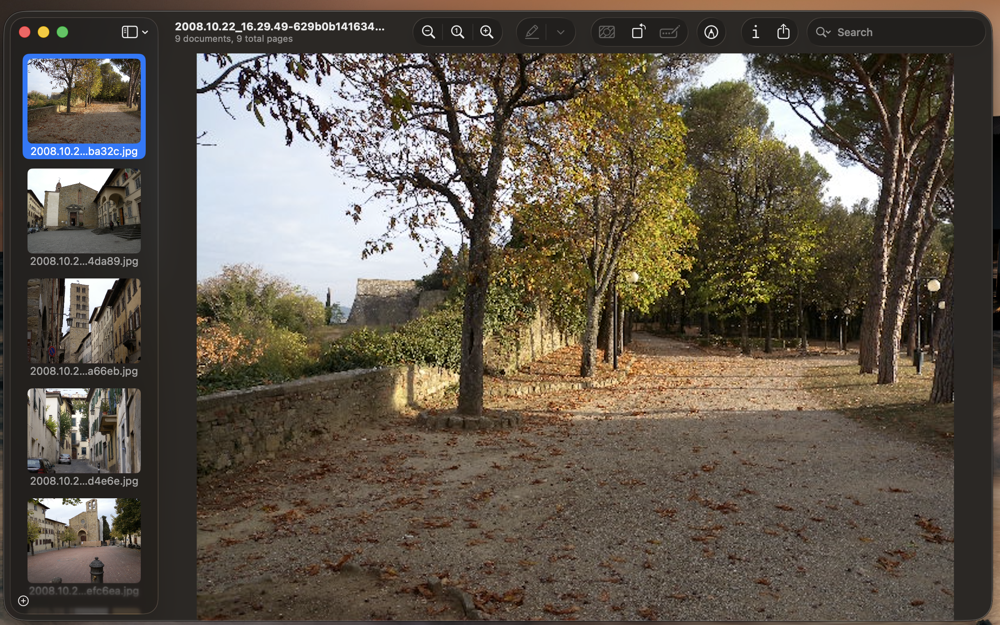

This viewing process is done by running the following single command;

```
photo-cli list --input [relative|full existing archive path] --type PhotosByDate --year 2008 --month 10
```

Same command with shorter alias of all argument names & values
```
photo-cli list -i [relative|full existing archive path] -t 3 -y 2008 -m 10
```

Note: You can also open the photos by geolocation name (if you have used the argument `auto-reverse-geocode-album` while archiving) or by album ID.

**Important note**: If using Windows or Linux, you will get a list of full photo paths as output (like below), as there are no default photo viewer apps on these operating systems. If you want to open the photos in your preferred photo viewer app, you can pipe these photo paths to it.

##### Console Output of `list` command on Windows & Linux

<details>
  <summary>Click to expand</summary>

```
/[archive-full-folder-path]/2008/10/22/2008.10.22_16.29.49-629b0b141634d6c0906e49af448bec8d755ba32c.jpg
/[archive-full-folder-path]/2008/10/22/2008.10.22_16.55.37-dd42edcde2433a7df4a3d67bf61944a20884da89.jpg
/[archive-full-folder-path]/2008/10/22/2008.10.22_17.00.07-a0ab699f5f99fce8ff49163e87c7590c2c9a66eb.jpg
/[archive-full-folder-path]/2008/10/22/2008.10.22_16.46.53-f670f2bb6c54898894b06b083185b05086bd4e6e.jpg
/[archive-full-folder-path]/2008/10/22/2008.10.22_16.44.01-d470205a1d331a9d3765b3762b7c954bb8efc6ea.jpg
/[archive-full-folder-path]/2008/10/22/2008.10.22_16.52.15-6b89a245809031ecc47789cdeaa332545330fc39.jpg
/[archive-full-folder-path]/2008/10/22/2008.10.22_16.28.39-5d66eec547469a1817bda4abe35c801359b2bb55.jpg
/[archive-full-folder-path]/2008/10/22/2008.10.22_16.38.20-620d23336a12ab54f9f0190fe93960a4dba2df59.jpg
/[archive-full-folder-path]/2008/10/22/2008.10.22_16.43.21-3b0a3215b4f66d7ff4804dd223f192c21aee71bc.jpg
```
</details>

### 4. Query your photo archive with AI assistants over MCP

The `mcp` command starts a [Model Context Protocol](https://modelcontextprotocol.io/) stdio server that exposes your archive's SQLite database to AI assistants. Once connected, tools like Claude Code, Claude Desktop, and VS Code can search by date, location, album, or proximity to a GPS coordinate — and on macOS, open matching photos directly in Preview.

#### Run the command

```
photo-cli mcp --input /path/to/archive
```

This launches a stdio MCP server pointing at the archive's `photo-cli.sqlite3`. You usually don't run it by hand — your AI client launches it from its MCP config.

#### Ask the assistant in plain language

Once connected, ask questions like *"What cities and when did I go to Italy?"*, *"Show me everything taken within 5 km of 43.78, 11.23"*, or *"Open all photos in the Italia-Firenze album"*. The assistant picks the right MCP tool, fills in the parameters, and photo-cli answers from the SQLite index.

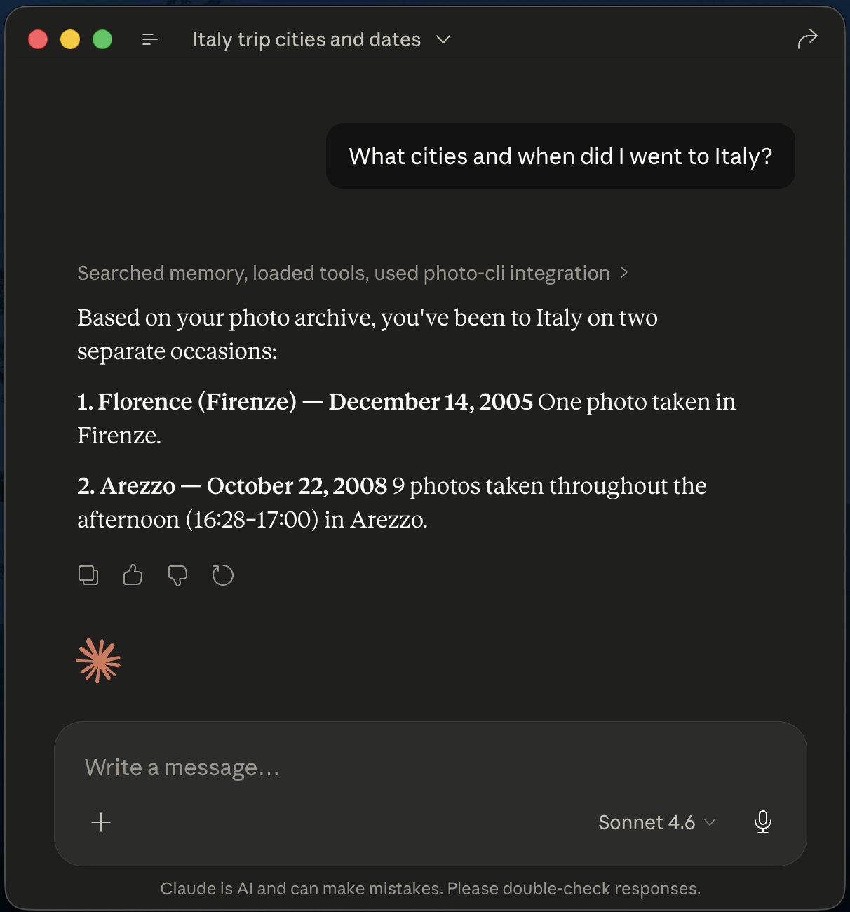

#### How tools map to the SQLite index

Each exposed MCP tool is a typed query against the archive database — `list_photos_by_date_range`, `find_near_location`, `list_albums`, `open_photos_by_album_name`, and so on. The MCP Inspector view below shows the available tools and their input schemas, which is exactly what the assistant sees when deciding how to answer your question.

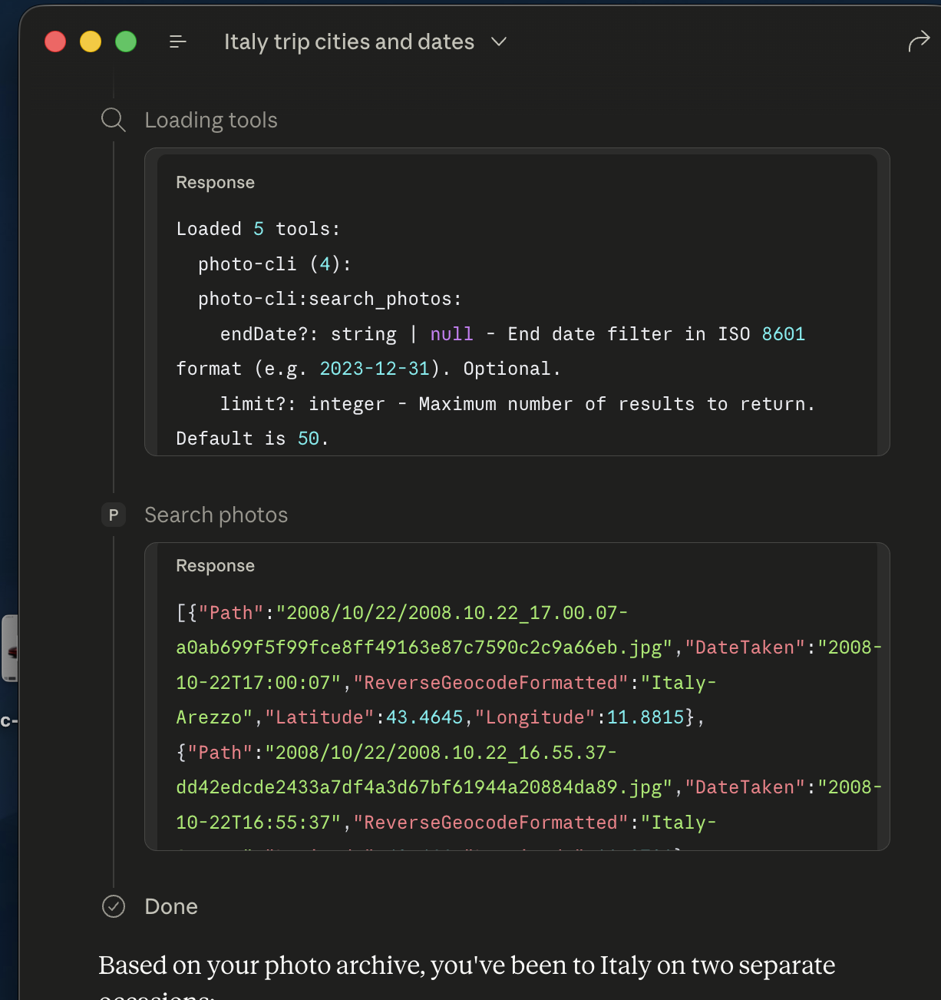

#### Open the matching photos from the assistant

When you ask the assistant to *open* photos rather than just list them, the MCP server hands the matching files off to your OS image viewer. This is wired up for macOS today — matches open directly in Preview. On Linux and Windows the `open_photos_*` tools are not active yet; use the `list_photos_*` tools and pipe the returned paths to your viewer of choice.

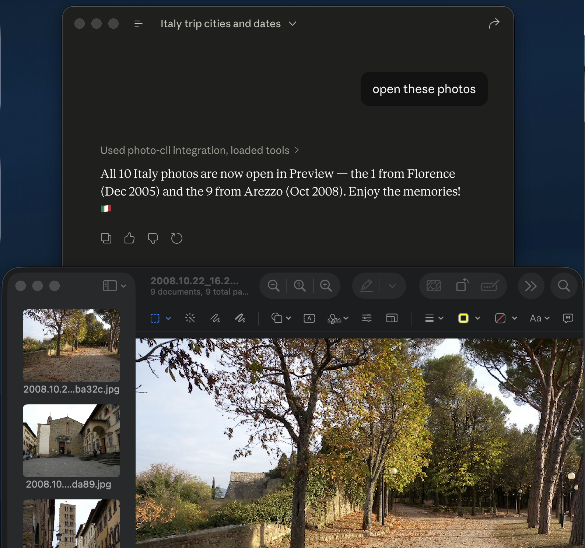

### 5. Export all extracted information into a CSV Report With `photo-cli info` Command

#### Contents of photo-info.csv File in Markdown Table (output of `info` command)

<details>
  <summary>Click to expand</summary>

|PhotoPath                                  |PhotoNewPath|PhotoDateTaken     |ReverseGeocodeFormatted                   |Latitude            |Longitude          |PhotoTakenYear|PhotoTakenMonth|PhotoTakenDay|PhotoTakenHour|PhotoTakenMinute|PhotoTakenSeconds|Address1      |Address2|Address3             |Address4|Address5|Address6|Address7|Address8|
|-------------------------------------------|------------|-------------------|------------------------------------------|--------------------|-------------------|--------------|---------------|-------------|--------------|----------------|-----------------|--------------|--------|---------------------|--------|--------|--------|--------|--------|
|/TestImages/DSC_5727.jpg                   |            |08/13/2005 09:47:23|Kenya                                     |-0.37129999999999996|36.056416666666664 |2005          |8              |13           |9             |47              |23               |Kenya         |        |                     |        |        |        |        |        |
|/TestImages/GOPR6742.jpg                   |            |06/22/2012 19:52:31|United Kingdom-Ascot-Sunninghill and Ascot|51.424838333333334  |-0.6735616666666666|2012          |6              |22           |19            |52              |31               |United Kingdom|Ascot   |Sunninghill and Ascot|        |        |        |        |        |
|/TestImages/Italy album/DSC_1770.JPG       |            |10/22/2008 17:00:07|Italia-Arezzo                             |43.464455           |11.881478333333334 |2008          |10             |22           |17            |0               |7                |Italia        |Arezzo  |                     |        |        |        |        |        |
|/TestImages/Italy album/DSC_1771.JPG       |            |10/22/2008 16:52:15|Italia-Arezzo                             |43.46725499999722   |11.879213333333334 |2008          |10             |22           |16            |52              |15               |Italia        |Arezzo  |                     |        |        |        |        |        |
|/TestImages/Italy album/IMG_0747.JPG       |            |10/22/2008 16:46:53|Italia-Arezzo                             |43.468243333330555  |11.880171666638889 |2008          |10             |22           |16            |46              |53               |Italia        |Arezzo  |                     |        |        |        |        |        |
|/TestImages/Italy album/IMG_2371.jpg       |            |07/16/2008 11:33:20|                                          |                    |                   |2008          |7              |16           |11            |33              |20               |              |        |                     |        |        |        |        |        |
|/TestImages/Italy album/DSC_1770_(same).jpg|            |10/22/2008 17:00:07|Italia-Arezzo                             |43.464455           |11.881478333333334 |2008          |10             |22           |17            |0               |7                |Italia        |Arezzo  |                     |        |        |        |        |        |
|/TestImages/Italy album/DJI_01733.jpg      |            |10/22/2008 16:43:21|Italia-Arezzo                             |43.468365           |11.881634999972222 |2008          |10             |22           |16            |43              |21               |Italia        |Arezzo  |                     |        |        |        |        |        |
|/TestImages/Italy album/DSC00001.JPG       |            |10/22/2008 16:44:01|Italia-Arezzo                             |43.46844166666667   |11.881515          |2008          |10             |22           |16            |44              |1                |Italia        |Arezzo  |                     |        |        |        |        |        |
|/TestImages/Italy album/DSC_1769.JPG       |            |10/22/2008 16:55:37|Italia-Arezzo                             |43.46601166663889   |11.87911166663889  |2008          |10             |22           |16            |55              |37               |Italia        |Arezzo  |                     |        |        |        |        |        |
|/TestImages/Italy album/GOPR7497.jpg       |            |10/22/2008 16:28:39|Italia-Arezzo                             |43.46744833333334   |11.885126666663888 |2008          |10             |22           |16            |28              |39               |Italia        |Arezzo  |                     |        |        |        |        |        |
|/TestImages/Italy album/DSC03467.jpg       |            |12/14/2005 14:39:47|Italia-Firenze-Quartiere 1                |43.78559443333333   |11.234619433333334 |2005          |12             |14           |14            |39              |47               |Italia        |Firenze |Quartiere 1          |        |        |        |        |        |
|/TestImages/Italy album/GOPR7496.jpg       |            |10/22/2008 16:38:20|Italia-Arezzo                             |43.467081666663894  |11.884538333330555 |2008          |10             |22           |16            |38              |20               |Italia        |Arezzo  |                     |        |        |        |        |        |
|/TestImages/Italy album/DJI_01732.jpg      |            |10/22/2008 16:29:49|Italia-Arezzo                             |43.46715666666389   |11.885394999997223 |2008          |10             |22           |16            |29              |49               |Italia        |Arezzo  |                     |        |        |        |        |        |
|/TestImages/Spain Journey/DSC_1807.jpg     |            |04/10/2015 20:12:23|España-Madrid                             |40.44697222222222   |-3.724752777777778 |2015          |4              |10           |20            |12              |23               |España        |Madrid  |                     |        |        |        |        |        |
|/TestImages/Spain Journey/DSC_1808.jpg     |            |04/10/2015 20:12:23|España-Madrid                             |40.44697222222222   |-3.724752777777778 |2015          |4              |10           |20            |12              |23               |España        |Madrid  |                     |        |        |        |        |        |
|/TestImages/Spain Journey/IMG_5397.jpg     |            |                   |                                          |                    |                   |              |               |             |              |                |                 |              |        |                     |        |        |        |        |        |

</details>

#### Contents of `photo-info.csv` File in Raw Text Format (report of `info` command)

<details>
  <summary>Click to expand</summary>

```csv
PhotoPath,PhotoNewPath,PhotoDateTaken,ReverseGeocodeFormatted,Latitude,Longitude,PhotoTakenYear,PhotoTakenMonth,PhotoTakenDay,PhotoTakenHour,PhotoTakenMinute,PhotoTakenSeconds,Address1,Address2,Address3,Address4,Address5,Address6,Address7,Address8
/TestImages/DSC_5727.jpg,,08/13/2005 09:47:23,Kenya,-0.37129999999999996,36.056416666666664,2005,8,13,9,47,23,Kenya,,,,,,,
/TestImages/GOPR6742.jpg,,06/22/2012 19:52:31,United Kingdom-Ascot-Sunninghill and Ascot,51.424838333333334,-0.6735616666666666,2012,6,22,19,52,31,United Kingdom,Ascot,Sunninghill and Ascot,,,,,
/TestImages/Italy album/DSC_1770.JPG,,10/22/2008 17:00:07,Italia-Arezzo,43.464455,11.881478333333334,2008,10,22,17,0,7,Italia,Arezzo,,,,,,
/TestImages/Italy album/DSC_1771.JPG,,10/22/2008 16:52:15,Italia-Arezzo,43.46725499999722,11.879213333333334,2008,10,22,16,52,15,Italia,Arezzo,,,,,,
/TestImages/Italy album/IMG_0747.JPG,,10/22/2008 16:46:53,Italia-Arezzo,43.468243333330555,11.880171666638889,2008,10,22,16,46,53,Italia,Arezzo,,,,,,
/TestImages/Italy album/IMG_2371.jpg,,07/16/2008 11:33:20,,,,2008,7,16,11,33,20,,,,,,,,
/TestImages/Italy album/DSC_1770_(same).jpg,,10/22/2008 17:00:07,Italia-Arezzo,43.464455,11.881478333333334,2008,10,22,17,0,7,Italia,Arezzo,,,,,,
/TestImages/Italy album/DJI_01733.jpg,,10/22/2008 16:43:21,Italia-Arezzo,43.468365,11.881634999972222,2008,10,22,16,43,21,Italia,Arezzo,,,,,,
/TestImages/Italy album/DSC00001.JPG,,10/22/2008 16:44:01,Italia-Arezzo,43.46844166666667,11.881515,2008,10,22,16,44,1,Italia,Arezzo,,,,,,
/TestImages/Italy album/DSC_1769.JPG,,10/22/2008 16:55:37,Italia-Arezzo,43.46601166663889,11.87911166663889,2008,10,22,16,55,37,Italia,Arezzo,,,,,,
/TestImages/Italy album/GOPR7497.jpg,,10/22/2008 16:28:39,Italia-Arezzo,43.46744833333334,11.885126666663888,2008,10,22,16,28,39,Italia,Arezzo,,,,,,
/TestImages/Italy album/DSC03467.jpg,,12/14/2005 14:39:47,Italia-Firenze-Quartiere 1,43.78559443333333,11.234619433333334,2005,12,14,14,39,47,Italia,Firenze,Quartiere 1,,,,,
/TestImages/Italy album/GOPR7496.jpg,,10/22/2008 16:38:20,Italia-Arezzo,43.467081666663894,11.884538333330555,2008,10,22,16,38,20,Italia,Arezzo,,,,,,
/TestImages/Italy album/DJI_01732.jpg,,10/22/2008 16:29:49,Italia-Arezzo,43.46715666666389,11.885394999997223,2008,10,22,16,29,49,Italia,Arezzo,,,,,,
/TestImages/Spain Journey/DSC_1807.jpg,,04/10/2015 20:12:23,España-Madrid,40.44697222222222,-3.724752777777778,2015,4,10,20,12,23,España,Madrid,,,,,,
/TestImages/Spain Journey/DSC_1808.jpg,,04/10/2015 20:12:23,España-Madrid,40.44697222222222,-3.724752777777778,2015,4,10,20,12,23,España,Madrid,,,,,,
/TestImages/Spain Journey/IMG_5397.jpg,,,,,,,,,,,,,,,,,,,
```

</details>

#### What Happened? / How It Is Processed?

There are [some options](#info) and [lots of customization settings](#listing-all-settings); this is just one of them. This information is extracted by running only the following single command;

Command with explicit argument names & values
```
photo-cli info --all-folders --output photo-info.csv --reverse-geocode OpenStreetMapFoundation --openstreetmap-properties country city --no-taken-date Continue --no-coordinate Continue --missing-reverse-geocode Continue
```

Same command with shorter alias of all argument names & values
```
photo-cli info -a -o photo-info.csv -e 2 -r country city -t 0 -c 0 -z 0
```

##### Console/terminal output (as progress may take time, for each operation completion status shown as percentage)

<details>
  <summary>Click to expand</summary>

```
[17:07:33] Searching photo main files: started
[17:07:33] Searching photo main files: finished. 18 photo(s) found.
[17:07:33] No coordinate found on `Gps` directory. Path:</Users/ac/src/photo-cli/docs/test-photographs/Spain Journey/IMG_5397.jpg>
[17:07:33] No coordinate found on `Gps` directory. Path:</Users/ac/src/photo-cli/docs/test-photographs/Italy album/IMG_2371.jpg>
[17:07:33] Reverse Geocoding: started
[17:07:33] Requested address types: City on index #2, not found on OpenStreetMap's response. Available types found:
{"country_code":"gb","country":"United Kingdom","postcode":"SL4 2DR","suburb":"Sunninghill and Ascot","road":"Windsor Road"}
. Path:</Users/ac/src/photo-cli/docs/test-photographs/GOPR6742.jpg>
[17:07:49] Reverse Geocoding: finished.
[17:07:49] Writing csv report: started
[17:07:49] Writing csv report: finished.
                        Statistics
┌────────────────────────────────────────────────┬───────┐
│ Statistic                                      │ Count │
├────────────────────────────────────────────────┼───────┤
│ File System Error(s)                           │ 0     │
│ Photo(s) found                                 │ 18    │
│ Photo(s) copied                                │ 0     │
│ Photo(s) existed on the output                 │ 0     │
│ Photo(s) are skipped, they have the same photo │ 0     │
│ Directory/directories created                  │ 0     │
│                                                │       │
│ Companion file(s) found                        │ 0     │
│ Companion file(s) copied                       │ 0     │
│ Companion file(s) existed on the output        │ 0     │
│                                                │       │
│ Source photo file(s) deleted                   │ 0     │
│ Source companion file(s) deleted               │ 0     │
│ Source empty directory(ies) deleted            │ 0     │
│                                                │       │
│ User defined album created                     │ 0     │
│ User defined album updated                     │ 0     │
│ Auto address album created                     │ 0     │
│                                                │       │
│ Reverse geocode request sent                   │ 14    │
│ Reverse geocode evaluated from memory          │ 2     │
│ Reverse geocode evaluated from database        │ 0     │
│ Photo(s) has taken date and coordinate         │ 16    │
│ Photo(s) has taken date but no coordinate      │ 1     │
│ Photo(s) has coordinate but no taken date      │ 0     │
│ Photo(s) has no taken date and coordinate      │ 1     │
│                                                │       │
│ Photo(s) has unknown/invalid format            │ 0     │
│ Photo(s) caused unexpected error internally    │ 0     │
└────────────────────────────────────────────────┴───────┘
```
</details>

#### Step By Step `photo-cli info` Process

1. As [all folders](#all-folders---a---all-folders-) is selected, all photo paths in the source folder and subfolders are gathered.
2. EXIF data is extracted for each photograph's taken date and coordinate.
3. As a [third-party reverse geocode](#address-building--reverse-geocoding) is selected, the address is built using `OpenStreetMap` with [given administrative levels](#4-building-your-own-address-with-selected-properties) such as `city town suburb` for each photograph.
4. As [no photograph taken date action](#no-photograph-taken-date-action-for-info-command----t---no-taken-date-) and [no coordinate action](#no-coordinate-action-for-info-command----c---no-coordinate-) are both selected as `Continue`, affected photos are listed in the report with empty data.

### 6. Navigate Your Photo Locations on Google Maps & Earth

If you want to discover your photographs interactively in the world, you may do it by importing your CSV output (whether [photo-cli copy](#copy) or [photo-cli info](#info) command) to [Google Maps](https://maps.google.com) and [Google Earth](https://earth.google.com), you can interactively navigate through your photographs.

#### Google Maps

[Open Google My Maps](https://www.google.com/maps/d) and after clicking `Create a New Map`, you can import your CSV file on a layer(you may add many layers).

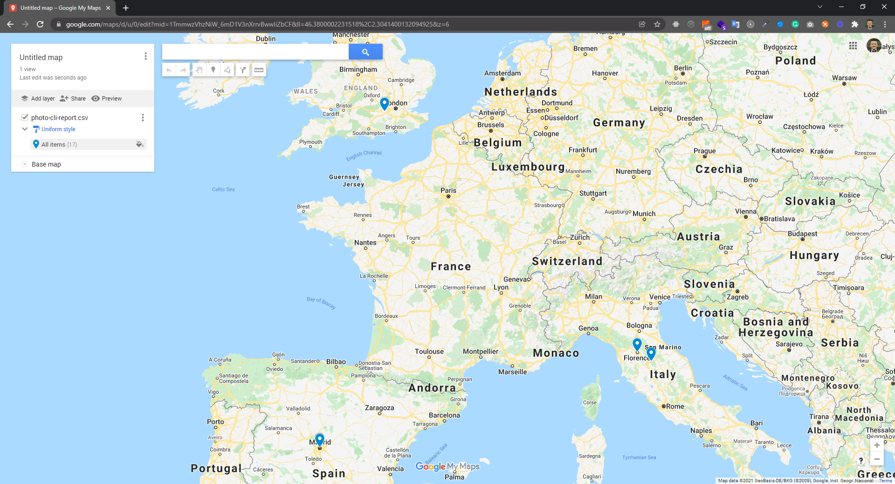

#### Google Earth Desktop

After installing [Google Earth Desktop](https://www.google.com/earth/versions/#earth-pro), on `File` menu, you can import your CSV file via `Import` menu item.

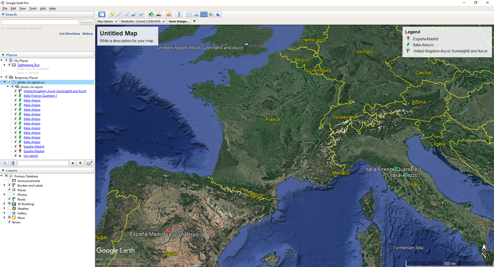

#### Google Earth Web
To navigate your photographs on [Google Earth Web](https://earth.google.com/web/), first you should import your CSV on Google Earth Desktop and save it as [KMZ or KML](https://en.wikipedia.org/wiki/Keyhole_Markup_Language). Then you can create a project and add this KML file.

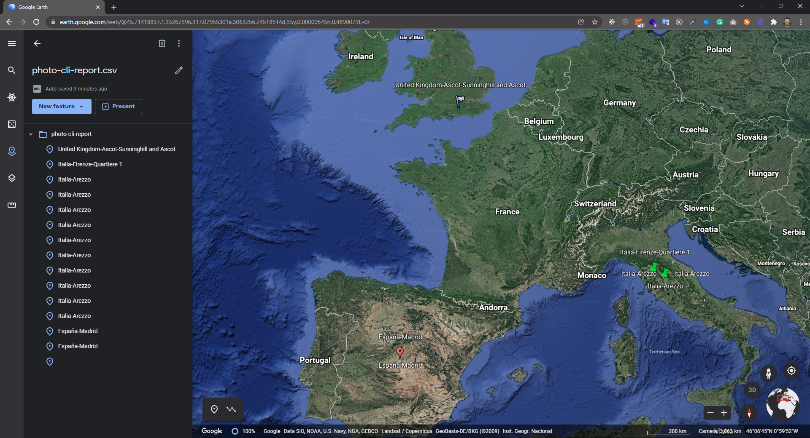

## Installation

This application can be installed by Homebrew (macOS & Linux), container (Docker, Podman), standalone executable (without dependency and SDK) or as .NET tool.

See the [installation](INSTALL.md) for details.

Note: You may test commands on [test photographs](docs/test-photographs) which has coordinates and photograph taken dates in it.

## MCP (Model Context Protocol) Server

`photo-cli` can act as an [MCP](https://modelcontextprotocol.io/) stdio server, exposing your archived photo database to AI assistants (Claude, Visual Studio Code, etc.) so they can query your photos conversationally.

### Prerequisites

- A photo archive folder created with `photo-cli archive` (must contain the `photo-cli.db` SQLite database).
- .NET runtime available (or use the self-contained executable).

### MCP Tools Exposed

| Tool                        | Description                                                                                     |
|-----------------------------|-----------------------------------------------------------------------------------------------------|
| `search_photos`             | Search photos by date range, location text, or limit. Returns paths, dates, and location info.      |
| `get_photo`                 | Get full metadata for a specific photo by its archive file path.                                    |
| `list_albums`               | List all albums with id, name, type, creation date, and configuration.                              |
| `get_statistics`            | Get photo counts grouped by year, month, country, city, or camera model.                            |
| `find_near_location`        | Find photos taken near a GPS coordinate within a given radius (Haversine formula).                  |
| `list_photos_by_album_id`   | List photos belonging to an album by its numeric ID. Returns paths, dates, and location info.       |
| `list_photos_by_album_name` | List photos belonging to an album by its name. Returns paths, dates, and location info.             |
| `list_photos_by_exact_date` | List photos matching an exact date (year, month, day). All parameters are optional.                 |
| `list_photos_by_date_range` | List photos within a date range. Both start and end dates are inclusive.                             |
| `open_photos_by_album_id`   | Open photos belonging to an album by its numeric ID in the default viewer (macOS Preview).          |
| `open_photos_by_album_name` | Open photos belonging to an album by its name in the default viewer (macOS Preview).                |
| `open_photos_by_exact_date` | Open photos matching an exact date in the default viewer (macOS Preview). All parameters optional.  |
| `open_photos_by_date_range` | Open photos within a date range in the default viewer (macOS Preview). Dates are inclusive.          |

### Setup

#### Claude Code (CLI)

```shell
claude mcp add photo-cli --scope user -- photo-cli mcp --input /path/to/archive-folder
```

#### Claude Desktop, Claude Code Config

Claude Desktop (`claude_desktop_config.json`) & Claude Code (`~/.claude.json`) has same structure as the following section.

```json
"mcpServers": {
  "photo-cli": {
    "command": "{photo-cli-standalone-executable-or-dotnet-tool-path-or-docker-command}",
    "args": [
      "mcp",
      "--input",
      "{archive-folder-path}"
    ]
  }
}
```

##### Example for macOS with dotnet tool installation

```json
"mcpServers": {
  "photo-cli": {
    "command": "/Users/{your-user-home-folder}/.dotnet/tools/photo-cli",
    "args": [
      "mcp",
      "--input",
      "/Users/{your-user-home-folder}/{archive-folder}"
    ]
  }
}
```

#### VS Code (`.vscode/mcp.json` or user settings)

```json
"photo-cli": {
  "type": "stdio",
  "command": "{photo-cli-standalone-executable-or-dotnet-tool-path-or-docker-command}",
  "args": [
    "mcp",
    "--input",
    "{archive-folder-path}"
  ]
}
```

##### Example for macOS with dotnet tool installation

```json
"photo-cli": {
  "type": "stdio",
  "command": "/Users/{your-user-home-folder}/.dotnet/tools/photo-cli",
  "args": [
    "mcp",
    "--input",
    "/Users/{your-user-home-folder}/{archive-folder}"
  ]
}
```

#### MCP Inspector (for debugging/testing)

```shell
npx @modelcontextprotocol/inspector {photo-cli-standalone-executable-or-dotnet-tool-path-or-docker-command} mcp --input {archive-folder-path}
```

##### Example for macOS with dotnet global tool installation

```shell
npx @modelcontextprotocol/inspector photo-cli mcp --input {archive-folder-path}
```

### `mcp` Command Arguments

```
photo-cli help mcp
```

| Argument           | Short | Description                                                                                             |
|--------------------|-------|---------------------------------------------------------------------------------------------------------|
| `--input`          | `-i`  | Archive folder path containing the photo-cli database to expose via MCP. Defaults to current directory. |

## Sample Usage Screenshots

The following command used in all samples with [test photographs](docs/test-photographs)
```
photo-cli archive --input [relative|full folder path] --output [relative|full folder path] --album-type DateRange --album-name My-Album --auto-reverse-geocode-album --expected-day-range 7300 --delete-on-source --reverse-geocode OpenStreetMapFoundation --openstreetmap-properties country city
```

- [macOS](#macos)
- [Windows](#windows)
- [Linux](#linux)
- [Container - Docker / Podman](#container---docker--podman)

### macOS

#### Executing

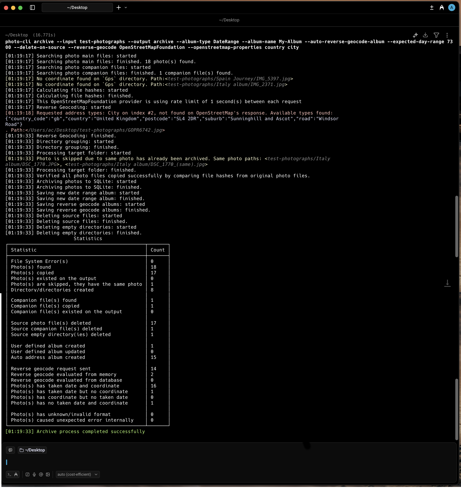

#### Opening Photos By Some Metadata Filter on Preview App

```
photo-cli list --input [relative|full existing archive path] --type PhotosByDate --year 2008 --month 10
```


<details>
  <summary>Click to expand</summary>


</details>

##### Finder

<details>
  <summary>Click to expand</summary>

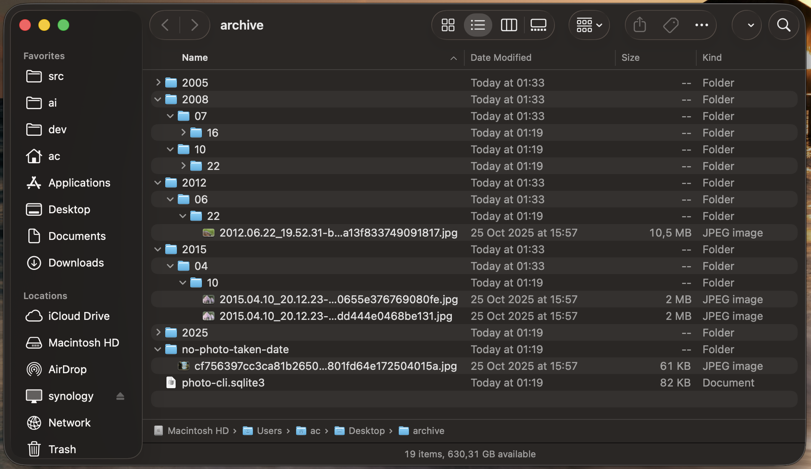

</details>

##### Tree Command

<details>
  <summary>Click to expand</summary>

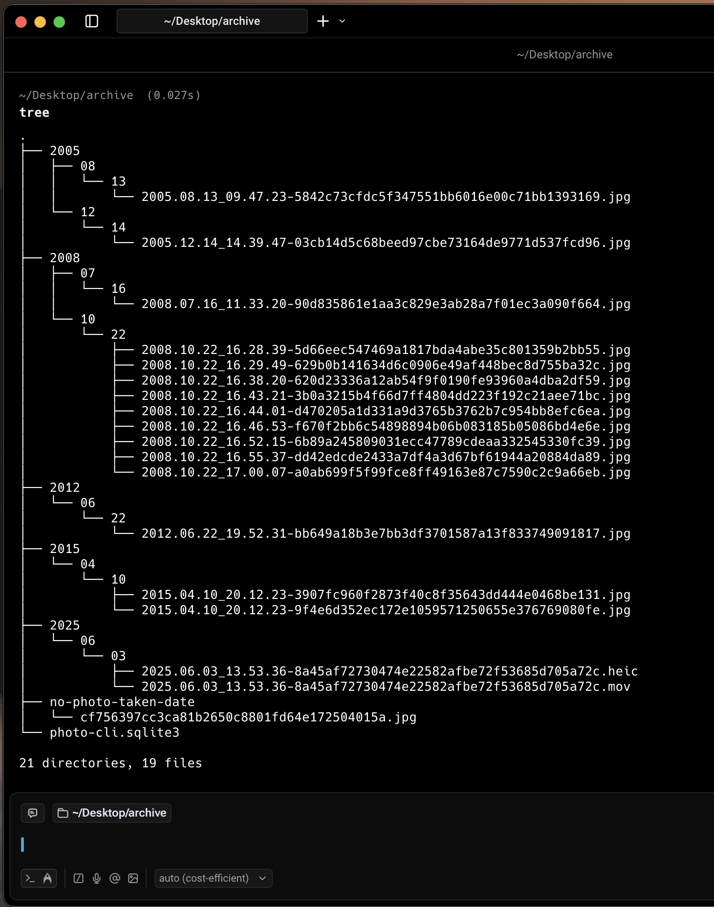

</details>

### Windows

#### Executing

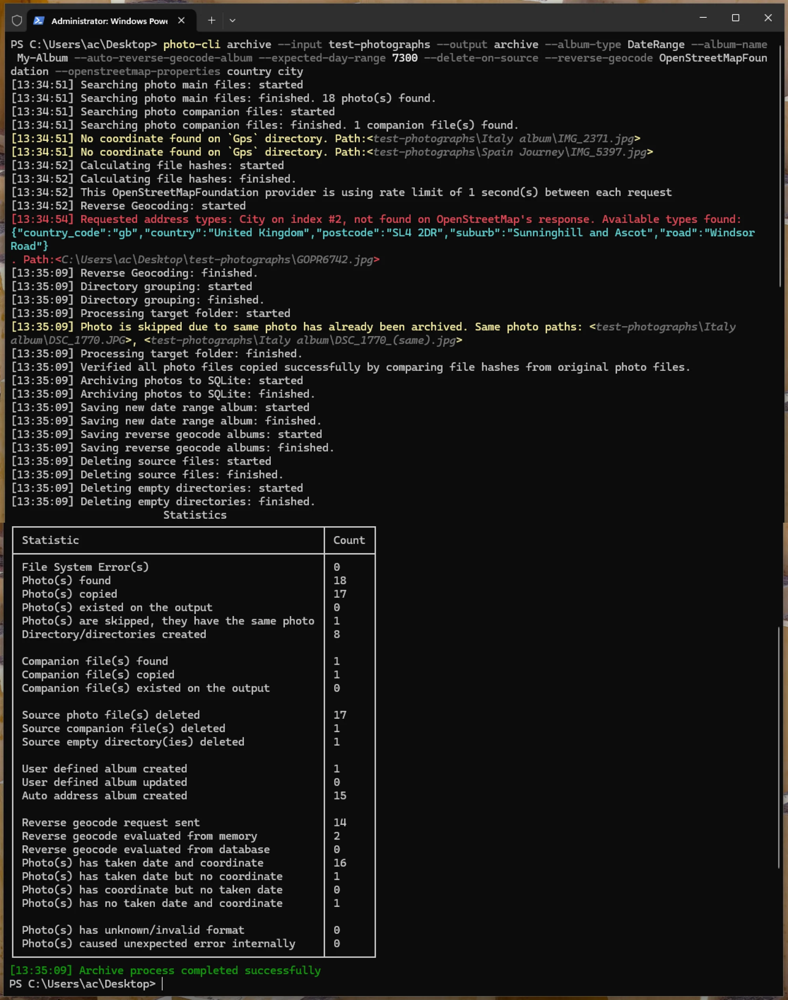

#### File Explorer

<details>
  <summary>Click to expand</summary>

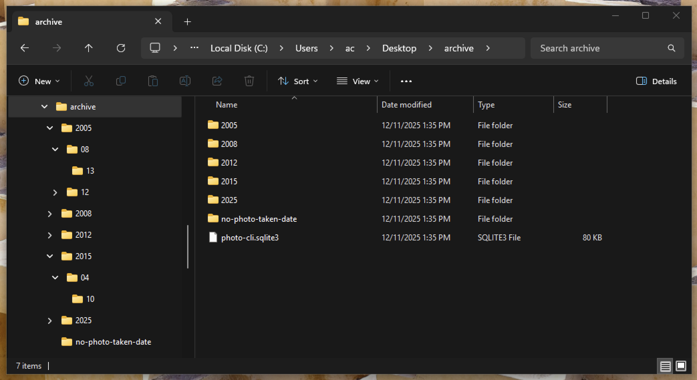

</details>

#### Tree Command

<details>
  <summary>Click to expand</summary>

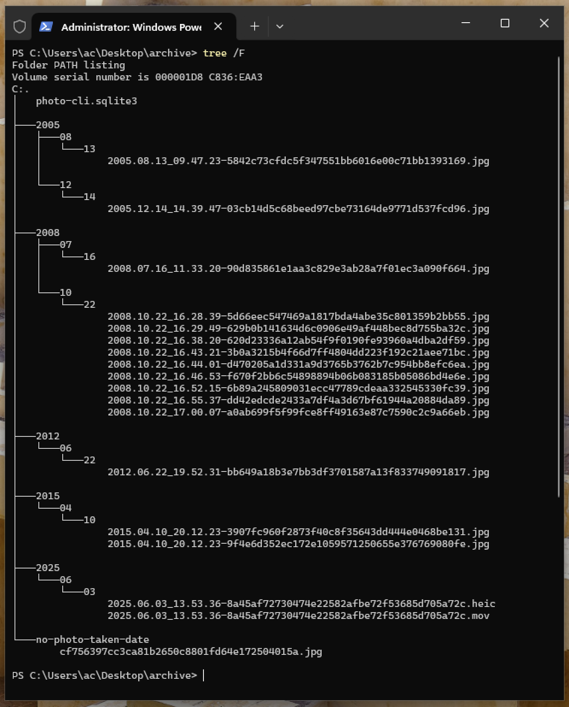

</details>

### Linux

#### Executing

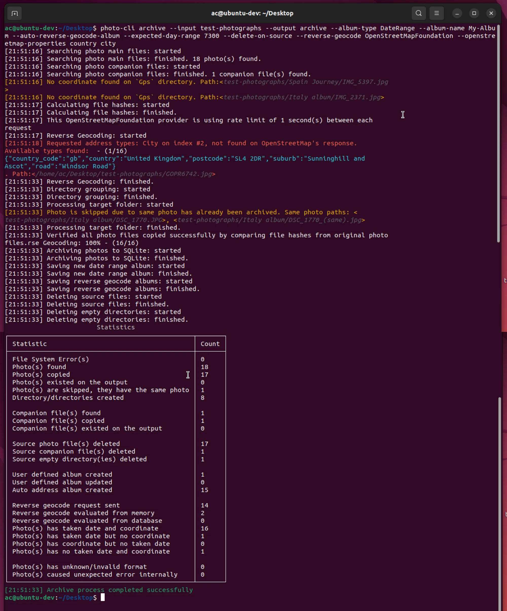

#### File Manager

<details>
  <summary>Click to expand</summary>

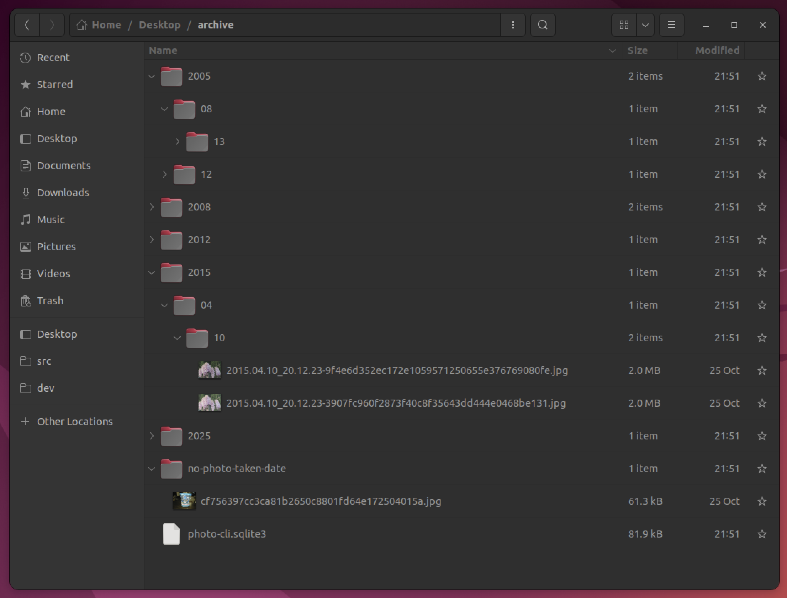

</details>

#### Tree Command

<details>
  <summary>Click to expand</summary>

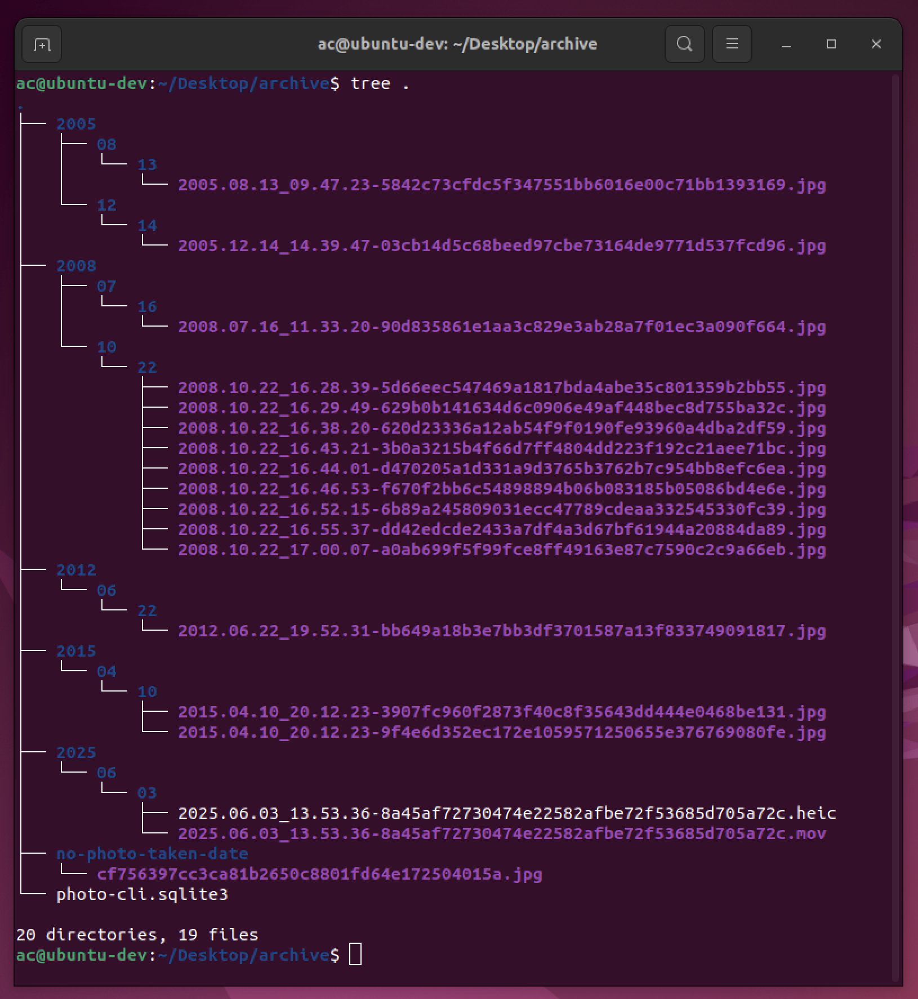

</details>

### Container - Docker / Podman

```shell
docker run --rm --volume ./test-photographs:/photos/input --volume ./archive:/photos/output photocli/photocli archive --input /photos/input --output /photos/output --album-type DateRange --album-name My-Album --auto-reverse-geocode-album --expected-day-range 7300 --delete-on-source --reverse-geocode OpenStreetMapFoundation --openstreetmap-properties country city
```

#### Executing

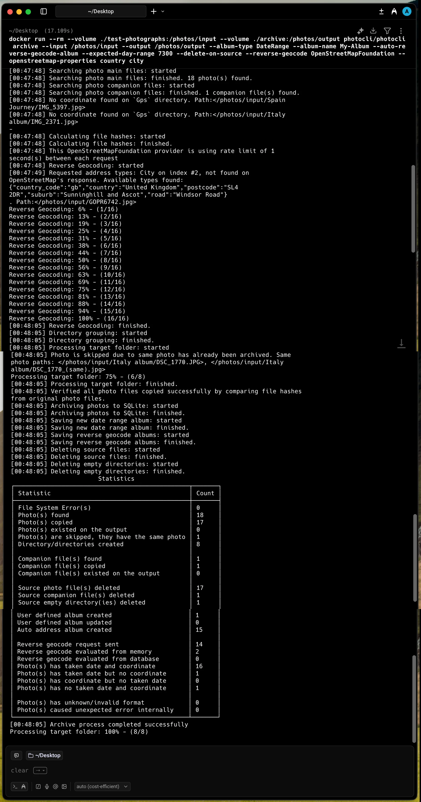

#### File Manager

<details>
  <summary>Click to expand</summary>

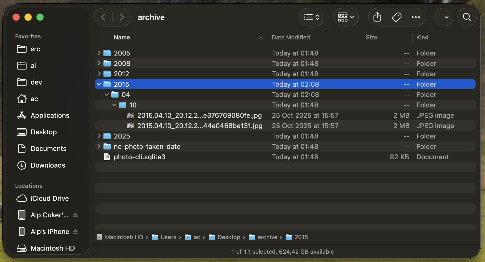

</details>

#### Tree Command

<details>
  <summary>Click to expand</summary>

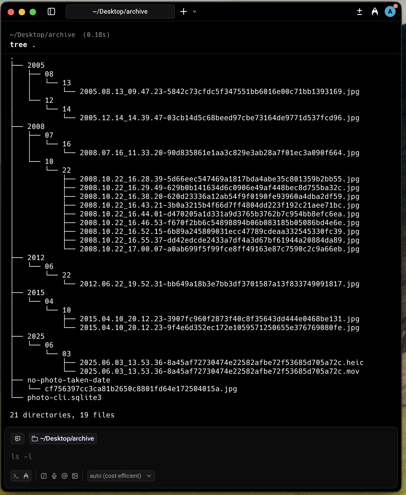

</details>

## How It's Done?

By extracting [Exchangeable image file format](https://en.wikipedia.org/wiki/Exif) stored on each of your photographs.

### When

[The photograph's taken date](https://en.wikipedia.org/wiki/Exif#Background) is used to determine when the photo was taken. Most cameras and cell phones save this data without any special setting.

### Where

[The photograph's coordinate data](https://en.wikipedia.org/wiki/Exif#Geolocation) is sent to the selected third-party reverse geocode provider to [build an address](#address-building--reverse-geocoding).

Most cameras and cell phones have a [GPS](https://en.wikipedia.org/wiki/Global_Positioning_System) receiver. You need to make sure that a setting such as `Save GPS location` is enabled.

## Supported Photo Types

With the default settings, `jpg`, `jpeg`, `heic`, and `png` photo files are supported. Since this tool internally uses the [MetadataExtractor](https://www.nuget.org/packages/MetadataExtractor/) package to extract image EXIF data, you can extend the supported formats to include any [MetadataExtractor supported files](https://github.com/drewnoakes/metadata-extractor-dotnet?tab=readme-ov-file#features) by using the [settings verb's set action](#setting-a-single-value).

#### Setting Supported Extensions Example
```
settings -k SupportedExtensions -v jpg,ext1,ext2,ext3
```

## Processing Companion Files

Companion files sharing the same name as your main photo files are also processed. The default companion extension is `mov`, which is commonly produced by [iPhone Live Photos](https://support.apple.com/en-us/104966) as a video clip alongside the photo.

You can extend this companion extension by using [settings verb's set action](#setting-a-single-value).

#### Setting Companion Extensions Example
```
settings -k CompanionExtensions -v mov,ext1,ext2,ext3
```

## Address Building & Reverse Geocoding

If you use only photo taken date and not interested in building address from reverse geocode, you can skip reading this section. But if you want to use address (reverse geocode) in file and/or folder naming, you should read the following sections and must learn the details.

### 1. Selecting Third-Party Reverse Geocode Provider

To build addresses we need a reverse geocode provider. Currently, four reverse geocode providers are supported.

1. BigDataCloud
2. Open Street Map Foundation - Nominatim
3. Google Maps
4. LocationIq

#### Comparison of Supported Third-Party Reverse Geocode Providers

| Reverse Geocode Provider                                                                         | API Key Required | Free Tier | Free Count Limit             | Free Rate Limit (free) | Map Data Owner                                                                        |
|--------------------------------------------------------------------------------------------------|------------------|-----------|------------------------------|------------------------|---------------------------------------------------------------------------------------|
| [BigDataCloud](https://www.bigdatacloud.com/geocoding-apis/reverse-geocode-to-city-api/)         | Yes              | Yes -     | 50.000 req/month             |                        | [Big Data Cloud](https://www.bigdatacloud.com/about-us/)                              |
| [Open Street Map Foundation - Nominatim](https://nominatim.org/release-docs/latest/api/Reverse/) | No               | -         | -                            | 1req/sec               | [Open Street Map Foundation](https://en.wikipedia.org/wiki/OpenStreetMap_Foundation/) |
| [GoogleMaps](https://developers.google.com/maps/documentation/geocoding/overview/)               | Yes              | No        | -                            | -                      | [Google](https://en.wikipedia.org/wiki/Google_Maps/)                                  |
| [LocationIq](https://locationiq.com/sandbox/geocoding/reverse/)                                  | Yes              | Yes       | 5.000 req/day                | 1req/sec               | [Open Street Map Foundation](https://en.wikipedia.org/wiki/OpenStreetMap_Foundation/) |

### 2. Setting API Key

After selecting reverse geocode provider, you need to provide an API key. There are three ways to provide this API key;

1. Send as an argument every time
2. Use [persist a setting](#setting-a-single-value) to save it as configuration, so you don't need to submit it every time.
3. Use environment variable, so you don't need to submit it every time.

| Reverse Geocode Provider                                                                         | Settings Key         | Environment Variable               | Argument                      |
|--------------------------------------------------------------------------------------------------|----------------------|------------------------------------|-------------------------------|
| [BigDataCloud](https://www.bigdatacloud.com/geocoding-apis/reverse-geocode-to-city-api/)         | `BigDataCloudApiKey` | `PHOTO_CLI_BIG_DATA_CLOUD_API_KEY` | `-b` or  `--bigdatacloud-key` |
| [Open Street Map Foundation - Nominatim](https://nominatim.org/release-docs/latest/api/Reverse/) | -                    | -                                  | -                             |
| [GoogleMaps](https://developers.google.com/maps/documentation/geocoding/overview/)               | `GoogleMapsApiKey`   | `PHOTO_CLI_GOOGLE_MAPS_API_KEY`    | `-k` or `--googlemaps-key`    |
| [LocationIq](https://locationiq.com/sandbox/geocoding/reverse/)                                  | `LocationIqApiKey`   | `PHOTO_CLI_LOCATIONIQ_API_KEY`     | `-q` or `--locationiq-key`    |

### 3. Understanding Reverse Geocode Response

Every reverse geocode provider has its data and they also represent it very differently. The information returned from reverse geocode provider is different or may differ in the level of detail. As there is no way to generalize every reverse geocode provider's response into the same address administrative level, users must understand the response returned from their selected reverse geocode provider.

There are two ways to understand the reverse geocoding response.

1. [Easy Way To Inspect Reverse Geocode Response](#easy-way-to-inspect-reverse-geocode-response)
2. [Power User Way To Inspect Reverse Geocode Response](#power-user-way-to-inspect-reverse-geocode-response)

#### Easy Way To Inspect Reverse Geocode Response

`photo-cli` has a feature to extract and list the response of each reverse geocode provider. If you are using a reverse geocode provider that needs an API key, first you need to get it from the provider and [set API key](#2-setting-api-key).

Listing Reverse Geocode Response. Ref: [reverse geocode provider command line arguments](#reverse-geocode-provider---e---reverse-geocode-)

```
photo-cli address --input [input-file.jpg] --reverse-geocode [selected-reverse-geocode-provider]`
```

For example, a photo was taken on Anıtkabir(place), Çankaya(town), Ankara(city), Turkey(country) with coordinate as `39.925054` and longitude
as `32.8347552` ([Coordinate in Google Maps](https://goo.gl/maps/p5mrL54A2k7PnEQv6)) responses should be like the following.

##### Big Data Cloud

```
photo-cli address -i DSC_7082.jpg -e 1
```

```
AdminLevel2: Turkey
AdminLevel3: Central Anatolia Region
AdminLevel4: Ankara Province
AdminLevel6: Çankaya
AdminLevel8: Mebusevleri Mahallesi
```

##### Open Street Map - Nominatim

```
photo-cli address -i DSC_7082.jpg -e 2
```

```
CountryCode: tr
Country: Türkiye
Region: İç Anadolu Bölgesi
Province: Ankara
City: Ankara
Town: Çankaya
Postcode: 06430
Suburb: Yücetepe Mahallesi
Road: İlk Sokak
Military: Anıtkabir
```

##### Google Maps

```
photo-cli address -i DSC_7082.jpg -e 3
```

```
plus_code: WRGM+2W
administrative_area_level_2: Çankaya
administrative_area_level_1: Ankara
country: Turkey
route: Anıtkabir
administrative_area_level_4: Mebusevleri
postal_code: 06570
street_number: 108
```

##### Map Quest

```
photo-cli address -i DSC_7082.jpg -e 4
```

```
CountryCode: tr
Country: Türkiye
City: Ankara
Postcode: 06580
Suburb: Mebusevleri Mahallesi
```

##### Location Iq

```
photo-cli address -i DSC_7082.jpg -e 5
```

```
CountryCode: tr
Country: Turkey
Region: Central Anatolia Region
Province: Ankara
City: Ankara
Town: Çankaya
Postcode: 06570
Suburb: Yücetepe Mahallesi
Road: Ata Sokak
Barracks: Anıtkabir
```

#### Power User Way To Inspect Reverse Geocode Response

You should inspect the reverse geocode provider's response with the locations you occasionally take photographs. After getting the response, you can send the properties as an argument of your choice
of the administrative level you want to build an address for each photograph.

##### Using HTTP Files

To trigger HTTP files you may use [Visual Studio Code](https://code.visualstudio.com/) with the extension [REST Client](https://marketplace.visualstudio.com/items?itemName=humao.rest-client) or any IntelliJ IDEs.

You may replace `{{ApiKey}}` in the address with your API key or you can use the IntelliJ environment variable file.

| Reverse Geocode Provider                                                                         | HTTP File                                                              |
|--------------------------------------------------------------------------------------------------|------------------------------------------------------------------------|
| [BigDataCloud](https://www.bigdatacloud.com/geocoding-apis/reverse-geocode-to-city-api/)         | [big-data-cloud.http](docs/reverse-geocode/http/big-data-cloud.http)   |
| [Open Street Map Foundation - Nominatim](https://nominatim.org/release-docs/latest/api/Reverse/) | [open-street-map.http](docs/reverse-geocode/http/open-street-map.http) |
| [GoogleMaps](https://developers.google.com/maps/documentation/geocoding/overview/)               | [google-maps.http](docs/reverse-geocode/http/google-maps.http)         |
| [LocationIq](https://locationiq.com/sandbox/geocoding/reverse/)                                  | [location-iq.http](docs/reverse-geocode/http/location-iq.http)         |

##### Using Postman

You may import [photo-cli | Reverse Geocode](docs/reverse-geocode/postman/photo-cli_reverse_geocode.postman_collection.json) collection into [Postman](https://www.postman.com/).

You should prepare the following environment variables on Postman.

| Reverse Geocode Provider                                                                         | Postman Environment Variable |
|--------------------------------------------------------------------------------------------------|------------------------------|
| [BigDataCloud](https://www.bigdatacloud.com/geocoding-apis/reverse-geocode-to-city-api/)         | `BigDataCloud-ApiKey`        |
| [Open Street Map Foundation - Nominatim](https://nominatim.org/release-docs/latest/api/Reverse/) | -                            |
| [GoogleMaps](https://developers.google.com/maps/documentation/geocoding/overview/)               | `GoogleMaps-ApiKey`          |
| [LocationIq](https://locationiq.com/sandbox/geocoding/reverse/)                                  | `LocationIq-ApiKey`          |

##### Sample Responses

Sample responses in JSON format are listed below from each reverse geocode for the coordinate with latitude as `39.925054` and longitude as `32.8347552` ([Coordinate in Google Maps](https://goo.gl/maps/p5mrL54A2k7PnEQv6)).

| Reverse Geocode Provider                                                                         | Sample Response                                                                    |
|--------------------------------------------------------------------------------------------------|------------------------------------------------------------------------------------|
| [BigDataCloud](https://www.bigdatacloud.com/geocoding-apis/reverse-geocode-to-city-api/)         | [big-data-cloud.json](docs/reverse-geocode/sample-responses/big-data-cloud.json)   |
| [Open Street Map Foundation - Nominatim](https://nominatim.org/release-docs/latest/api/Reverse/) | [open-street-map.json](docs/reverse-geocode/sample-responses/open-street-map.json) |
| [GoogleMaps](https://developers.google.com/maps/documentation/geocoding/overview/)               | [google-maps.json](docs/reverse-geocode/sample-responses/google-maps.json)         |
| [LocationIq](https://locationiq.com/sandbox/geocoding/reverse/)                                  | [location-iq.json](docs/reverse-geocode/sample-responses/location-iq.json)         |

### 4. Building Your Own Address With Selected Properties

Every reverse geocode provider has its address building parameters. With `address` command you can inspect any photograph's reverse geocode response. These different levels of selected address properties will be used in exported into CSV file for [info command](#info) or used as file and/or folder names depending on your naming strategies for [copy command](#copy).

| Reverse Geocode Provider                                                                         | Address Building Parameters                           |
|--------------------------------------------------------------------------------------------------|-------------------------------------------------------|
| [BigDataCloud](https://www.bigdatacloud.com/geocoding-apis/reverse-geocode-to-city-api/)         | [BigDataCloud Properties](#big-data-cloud-parameters) |
| [Open Street Map Foundation - Nominatim](https://nominatim.org/release-docs/latest/api/Reverse/) | [OpenStreet Properties](#open-street-map-parameters)  |
| [GoogleMaps](https://developers.google.com/maps/documentation/geocoding/overview/)               | [GoogleMaps Properties](#google-maps-properties)      |
| [LocationIq](https://locationiq.com/sandbox/geocoding/reverse/)                                  | [OpenStreet Properties](#open-street-map-parameters)  |

#### Big Data Cloud Parameters

Getting a sample reverse geocoding response with all properties listed.

```
photo-cli address -i DSC_7082.jpg -e 1
```

```
AdminLevel2: Turkey
AdminLevel3: Central Anatolia Region
AdminLevel4: Ankara Province
AdminLevel6: Çankaya
AdminLevel8: Mebusevleri Mahallesi
```

If we want to build an address like with levels only contains `Turkey`, `Ankara Province`, and `Çankaya`, we should use levels `2,4,6`. To verify our address is building correctly, you may use `type` parameter as `SelectedProperties` and `bigdatacloud-levels` arguments separated with space like the following example.

```
photo-cli address --input DSC_7082.jpg --reverse-geocode BigDataCloud --type SelectedProperties --bigdatacloud-levels 2 4 6
```

```
Turkey
Ankara Province
Çankaya
```

#### Open Street Map Parameters

Getting a sample reverse geocoding response with all properties listed.

```
photo-cli address -i DSC_7082.jpg -e 2
```

```
CountryCode: tr
Country: Türkiye
Region: İç Anadolu Bölgesi
Province: Ankara
City: Ankara
Town: Çankaya
Postcode: 06430
Suburb: Yücetepe Mahallesi
Road: İlk Sokak
Military: Anıtkabir
```

If we want to build an address like with levels only contains `tr`, `06430`, and `Yücetepe Mahallesi`, we should use properties `CountryCode, Postcode, Suburb`. To verify our address is building correctly, you may use `type` as `SelectedProperties` and `openstreetmap-properties` arguments separated with space like the following example.

```
photo-cli address --input DSC_7082.jpg --reverse-geocode OpenStreetMapFoundation --type SelectedProperties --openstreetmap-properties CountryCode Postcode Suburb
```

```
tr
06430
Yücetepe Mahallesi
```

#### Google Maps Properties

Getting a sample reverse geocoding response with all properties listed.

```
photo-cli address -i DSC_7082.jpg -e GoogleMaps
```

```
plus_code: WRGM+2W
administrative_area_level_2: Çankaya
administrative_area_level_1: Ankara
country: Turkey
route: Anıtkabir
administrative_area_level_4: Mebusevleri
postal_code: 06570
street_number: 108
```

If we want to build an address like with levels only contains `Mebusevleri`, `108`, and `Anıtkabir`, we should use properties `administrative_area_level_4, street_number, route`. To verify our address is building correctly, you may use `type` as `SelectedProperties` and `googlemaps-types` arguments separated with space like the following example.

```
photo-cli address --input DSC_7082.jpg --reverse-geocode GoogleMaps --type SelectedProperties --googlemaps-types administrative_area_level_4 street_number route
```

```
Mebusevleri
108
Anıtkabir
```

### 5. Merging Selected Address Level Properties Into Single Address

After selecting our properties specialized by our selected third-party reverse geocode provider, we can use our address in file and folder names. To merge address levels, `-` character is used as default.

Example merged address may used in file/folder names: `Turkey-Ankara-Çankaya-Mebusevleri-Anıtkabir`

You may change default separator (`-`) via [settings](#settings) command with a setting key `AddressSeparator`

### 6. Caching Reverse Geocode Responses

Since coordinates that are close together yield very similar reverse geocode responses, a caching mechanism has been implemented for optimization. This works by rounding the fractional digits of coordinates. Currently, only 4 fractional digits are used.

For example, the original coordinate `39.92501234567890, 32.83471234567890` will be interpreted as `39.9250, 32.8347` internally before sending the request.

If you need more precise results in your reverse geocode responses, you can increase this value on [settings](#settings) with a key of `CoordinatePrecision`.

## Usages

Not all possible option combinations can be covered here. Some important [copy](#copy) command examples comparing the original photo directory structure to the `photo-cli` output directory are listed below.

#### Names as Sequential Numbering in Same Folder Hierarchy

Preserve same folder hierarchy, copy photos with sequential number ordering by photo taken date.

```
photo-cli copy --process-type SubFoldersPreserveFolderHierarchy --naming-style Numeric --number-style PaddingZeroCharacter --input photos --output organized-albums
```

<details>
  <summary>Click to expand</summary>

<table>
<tr>
    <th>Original Folder Hierarchy</th>
    <th>After <b><i>photo-cli</i></b></th>
</tr>
<tr>
<td>
<pre>
├── DSC_5727.jpg
├── GOPR6742.jpg
├── Italy album
│   ├── DJI_01732.jpg
│   ├── DJI_01733.jpg
│   ├── DSC00001.JPG
│   ├── DSC03467.jpg
│   ├── DSC_1769.JPG
│   ├── DSC_1770.JPG
│   ├── DSC_1770_(same).jpg
│   ├── DSC_1771.JPG
│   ├── GOPR7496.jpg
│   ├── GOPR7497.jpg
│   ├── IMG_0747.JPG
│   └── IMG_2371.jpg
└── Spain Journey
    ├── DSC_1807.jpg
    ├── DSC_1808.jpg
    └── IMG_5397.jpg

2 directories, 17 files
</pre>
</td>
<td>
<pre>
├── 1.jpg
├── 2.jpg
├── Italy album
│   ├── 01.jpg
│   ├── 02.jpg
│   ├── 03.jpg
│   ├── 04.jpg
│   ├── 05.jpg
│   ├── 06.jpg
│   ├── 07.jpg
│   ├── 08.jpg
│   ├── 09.jpg
│   ├── 10.jpg
│   ├── 11.jpg
│   └── 12.jpg
├── photo-cli-report.csv
└── Spain Journey
    ├── 1.jpg
    ├── 2.jpg
    └── 3.jpg

2 directories, 18 files
</pre>
</td>
</tr>
</table>

</details>

#### Group Into Taken Year/Month/Day Folders, Name as Date & Time

Groups photos by photo taken year, month, and day, then copies them into a [year]/[month]/[day] directory with a file name as the photo taken date.

```
photo-cli copy --process-type FlattenAllSubFolders --group-by YearMonthDay --naming-style DateTimeWithSeconds --number-style OnlySequentialNumbers --input photos --output organized-albums
```

<details>
  <summary>Click to expand</summary>

<table>
<tr>
    <th>Original Folder Hierarchy</th>
    <th>After <b><i>photo-cli</i></b></th>
</tr>
<tr>
<td>
<pre>
├── DSC_5727.jpg
├── GOPR6742.jpg
├── Italy album
│   ├── DJI_01732.jpg
│   ├── DJI_01733.jpg
│   ├── DSC00001.JPG
│   ├── DSC03467.jpg
│   ├── DSC_1769.JPG
│   ├── DSC_1770.JPG
│   ├── DSC_1770_(same).jpg
│   ├── DSC_1771.JPG
│   ├── GOPR7496.jpg
│   ├── GOPR7497.jpg
│   ├── IMG_0747.JPG
│   └── IMG_2371.jpg
└── Spain Journey
    ├── DSC_1807.jpg
    ├── DSC_1808.jpg
    └── IMG_5397.jpg

2 directories, 17 files
</pre>
</td>
<td>
<pre>
├── 2005
│   ├── 08
│   │   └── 13
│   │       └── 2005.08.13_09.47.23.jpg
│   └── 12
│       └── 14
│           └── 2005.12.14_14.39.47.jpg
├── 2008
│   ├── 07
│   │   └── 16
│   │       └── 2008.07.16_11.33.20.jpg
│   └── 10
│       └── 22
│           ├── 2008.10.22_16.28.39.jpg
│           ├── 2008.10.22_16.29.49.jpg
│           ├── 2008.10.22_16.38.20.jpg
│           ├── 2008.10.22_16.43.21.jpg
│           ├── 2008.10.22_16.44.01.jpg
│           ├── 2008.10.22_16.46.53.jpg
│           ├── 2008.10.22_16.52.15.jpg
│           ├── 2008.10.22_16.55.37.jpg
│           ├── 2008.10.22_17.00.07-1.jpg
│           └── 2008.10.22_17.00.07-2.jpg
├── 2012
│   └── 06
│       └── 22
│           └── 2012.06.22_19.52.31.jpg
├── 2015
│   └── 04
│       └── 10
│           ├── 2015.04.10_20.12.23-1.jpg
│           └── 2015.04.10_20.12.23-2.jpg
├── IMG_5397.jpg
└── photo-cli-report.csv

16 directories, 18 files
</pre>
</td>
</tr>
</table>

</details>

#### Folders Prefixed With Date Range, Names as Address & Date

Adding day range as a prefix to existing folder names and photos copied with a file name as address and day.

```
photo-cli copy --process-type SubFoldersPreserveFolderHierarchy --folder-append DayRange --folder-append-location Prefix --naming-style AddressDay --reverse-geocode OpenStreetMapFoundation --openstreetmap-properties country city town suburb  --number-style AllNamesAreSameLength --input photos --output organized-albums
```

<details>
  <summary>Click to expand</summary>

<table>
<tr>
    <th>Original Folder Hierarchy</th>
    <th>After <b><i>photo-cli</i></b></th>
</tr>
<tr>
<td>
<pre>
├── DSC_5727.jpg
├── GOPR6742.jpg
├── Italy album
│   ├── DJI_01732.jpg
│   ├── DJI_01733.jpg
│   ├── DSC00001.JPG
│   ├── DSC03467.jpg
│   ├── DSC_1769.JPG
│   ├── DSC_1770.JPG
│   ├── DSC_1770_(same).jpg
│   ├── DSC_1771.JPG
│   ├── GOPR7496.jpg
│   ├── GOPR7497.jpg
│   ├── IMG_0747.JPG
│   └── IMG_2371.jpg
└── Spain Journey
    ├── DSC_1807.jpg
    ├── DSC_1808.jpg
    └── IMG_5397.jpg

2 directories, 17 files
</pre>
</td>
<td>
<pre>
├── 2005.12.14-2008.10.22-Italy album
│   ├── IMG_2371.jpg
│   ├── Italia-Arezzo-2008.10.22-10.jpg
│   ├── Italia-Arezzo-2008.10.22-11.jpg
│   ├── Italia-Arezzo-2008.10.22-12.jpg
│   ├── Italia-Arezzo-2008.10.22-13.jpg
│   ├── Italia-Arezzo-2008.10.22-14.jpg
│   ├── Italia-Arezzo-2008.10.22-15.jpg
│   ├── Italia-Arezzo-2008.10.22-16.jpg
│   ├── Italia-Arezzo-2008.10.22-17.jpg
│   ├── Italia-Arezzo-2008.10.22-18.jpg
│   ├── Italia-Arezzo-2008.10.22-19.jpg
│   └── Italia-Firenze-Quartiere 1-2005.12.14.jpg
├── 2015.04.10-2015.04.10-Spain Journey
│   ├── España-Madrid-2015.04.10-1.jpg
│   ├── España-Madrid-2015.04.10-2.jpg
│   └── IMG_5397.jpg
├── Kenya-2005.08.13.jpg
├── photo-cli-report.csv
└── United Kingdom-Ascot-Sunninghill and Ascot-2012.06.22.jpg

2 directories, 18 files
</pre>
</td>
</tr>
</table>

</details>

#### Naming With Address, Date in Same Folder Hierarchy

Preserve same folder hierarchy, copy photos with a file name as photo taken date, time and address. Possible file name will have number suffix. Photos that don't have any coordinate or photo taken date will be copied in a relative subfolder.

```
photo-cli copy --process-type SubFoldersPreserveFolderHierarchy --naming-style AddressDateTimeWithSeconds  --reverse-geocode OpenStreetMapFoundation --openstreetmap-properties country city town suburb --number-style AllNamesAreSameLength --no-taken-date InSubFolder --no-coordinate InSubFolder --input photos --output organized-albums
```

<details>
  <summary>Click to expand</summary>

<table>
<tr>
    <th>Original Folder Hierarchy</th>
    <th>After <b><i>photo-cli</i></b></th>
</tr>
<tr>
<td>
<pre>
├── DSC_5727.jpg
├── GOPR6742.jpg
├── Italy album
│   ├── DJI_01732.jpg
│   ├── DJI_01733.jpg
│   ├── DSC00001.JPG
│   ├── DSC03467.jpg
│   ├── DSC_1769.JPG
│   ├── DSC_1770.JPG
│   ├── DSC_1770_(same).jpg
│   ├── DSC_1771.JPG
│   ├── GOPR7496.jpg
│   ├── GOPR7497.jpg
│   ├── IMG_0747.JPG
│   └── IMG_2371.jpg
└── Spain Journey
    ├── DSC_1807.jpg
    ├── DSC_1808.jpg
    └── IMG_5397.jpg

2 directories, 17 files
</pre>
</td>
<td>
<pre>
├── Italy album
│   ├── Italia-Arezzo-2008.10.22_16.28.39.jpg
│   ├── Italia-Arezzo-2008.10.22_16.29.49.jpg
│   ├── Italia-Arezzo-2008.10.22_16.38.20.jpg
│   ├── Italia-Arezzo-2008.10.22_16.43.21.jpg
│   ├── Italia-Arezzo-2008.10.22_16.44.01.jpg
│   ├── Italia-Arezzo-2008.10.22_16.46.53.jpg
│   ├── Italia-Arezzo-2008.10.22_16.52.15.jpg
│   ├── Italia-Arezzo-2008.10.22_16.55.37.jpg
│   ├── Italia-Arezzo-2008.10.22_17.00.07-1.jpg
│   ├── Italia-Arezzo-2008.10.22_17.00.07-2.jpg
│   ├── Italia-Firenze-Quartiere 1-2005.12.14_14.39.47.jpg
│   └── no-address
│       └── IMG_2371.jpg
├── Kenya-2005.08.13_09.47.23.jpg
├── photo-cli-report.csv
├── Spain Journey
│   ├── España-Madrid-2015.04.10_20.12.23-1.jpg
│   ├── España-Madrid-2015.04.10_20.12.23-2.jpg
│   └── no-address-and-no-photo-taken-date
│       └── IMG_5397.jpg
└── United Kingdom-Ascot-Sunninghill and Ascot-2012.06.22_19.52.31.jpg

4 directories, 18 files
</pre>
</td>
</tr>
</table>

</details>

### Grouped Into Country/City/Town Folders, Names as Taken Date and Address

Groups photos by address hierarchy, then copies them into a [country]/[city]/[town] directory with a file name as the photo taken date. Photos that don't have any coordinate will be copied into a relative subfolder.

```
photo-cli copy --process-type FlattenAllSubFolders --group-by AddressHierarchy --naming-style DayAddress --reverse-geocode OpenStreetMapFoundation --openstreetmap-properties country city town suburb --number-style OnlySequentialNumbers --no-taken-date AppendToEndOrderByFileName --no-coordinate InSubFolder --input photos --output organized-albums
```

<details>
  <summary>Click to expand</summary>

<table>
<tr>
    <th>Original Folder Hierarchy</th>
    <th>After <b><i>photo-cli</i></b></th>
</tr>
<tr>
<td>
<pre>
├── DSC_5727.jpg
├── GOPR6742.jpg
├── Italy album
│   ├── DJI_01732.jpg
│   ├── DJI_01733.jpg
│   ├── DSC00001.JPG
│   ├── DSC03467.jpg
│   ├── DSC_1769.JPG
│   ├── DSC_1770.JPG
│   ├── DSC_1770_(same).jpg
│   ├── DSC_1771.JPG
│   ├── GOPR7496.jpg
│   ├── GOPR7497.jpg
│   ├── IMG_0747.JPG
│   └── IMG_2371.jpg
└── Spain Journey
    ├── DSC_1807.jpg
    ├── DSC_1808.jpg
    └── IMG_5397.jpg

2 directories, 17 files
</pre>
</td>
<td>
<pre>
├── España
│   └── Madrid
│       ├── 2015.04.10-España-Madrid-1.jpg
│       └── 2015.04.10-España-Madrid-2.jpg
├── Italia
│   ├── Arezzo
│   │   ├── 2008.10.22-Italia-Arezzo-10.jpg
│   │   ├── 2008.10.22-Italia-Arezzo-1.jpg
│   │   ├── 2008.10.22-Italia-Arezzo-2.jpg
│   │   ├── 2008.10.22-Italia-Arezzo-3.jpg
│   │   ├── 2008.10.22-Italia-Arezzo-4.jpg
│   │   ├── 2008.10.22-Italia-Arezzo-5.jpg
│   │   ├── 2008.10.22-Italia-Arezzo-6.jpg
│   │   ├── 2008.10.22-Italia-Arezzo-7.jpg
│   │   ├── 2008.10.22-Italia-Arezzo-8.jpg
│   │   └── 2008.10.22-Italia-Arezzo-9.jpg
│   └── Firenze
│       └── Quartiere 1
│           └── 2005.12.14-Italia-Firenze-Quartiere 1.jpg
├── Kenya
│   └── 2005.08.13-Kenya.jpg
├── no-address
│   ├── IMG_2371.jpg
│   └── IMG_5397.jpg
├── photo-cli-report.csv
└── United Kingdom
    └── Ascot
        └── Sunninghill and Ascot
            └── 2012.06.22-United Kingdom-Ascot-Sunninghill and Ascot.jpg

11 directories, 18 files
</pre>
</td>
</tr>
</table>

</details>

## Commands / Verbs

| Subcommand              | description                                                                                                                                                                                                        |
|-------------------------|--------------------------------------------------------------------------------------------------------------------------------------------------------------------------------------------------------------------|
| [`archive`](#archive)   | Archives photos into same specific folder, optionally groups them by albums (date range, reverse geocode or individual), and indexes photo taken date, address (reverse geocode) information into SQLite database. |
| [`copy`](#copy)         | Copies photos into new folder hierarchy with given arguments using photograph's taken date and coordinate address (reverse geocode).                                                                               |
| [`list`](#list)         | List & open photos from archive folders.                                                                                                                                                                           |
| [`info`](#info)         | Creates a report (CSV file) listing all photo taken date and address (reverse geocode).                                                                                                                            |
| [`address`](#address)   | Get address (reverse geocode) of single photo.                                                                                                                                                                     |
| [`settings`](#settings) | Lists, saves and get settings.                                                                                                                                                                                     |
| [`mcp`](#mcp-model-context-protocol-server) | Start an MCP (Model Context Protocol) stdio server to query the photo archive database.                                                                    |

### Archive

Archives photos into same specific folder, optionally groups them by albums (date range, reverse geocode or individual), and indexes photo taken date, address (reverse geocode) information into SQLite database.

```
photo-cli help archive
```

<details>
  <summary>Click to expand</summary>

```
  -o, --output                        (Required) File system path to create new organized folder.

                                      A new folder hierarchy will be created on that location with new file names.

                                      Will create folder if not exist.

  -i, --input                         File system path to read & copy photos from.

                                      There will be no modification on the input path.

                                      If not given, default value would be the current executing folder.

  -d, --dry-run                       (Optional) Simulate the same process without writing to the output folder. (no extra parameter needed)

  -x, --invalid-format                (Optional) Action to do when a photo format is invalid.

                                      Continue: 0 [default]
                                      Processes and creates output all files including those with invalid or unrecognized formats without any special handling or filtering.

                                      PreventProcess: 1
                                      Stops the entire info operation if any files with invalid photo format are found, returning an error exit code.

  -t, --no-taken-date                 (Optional) Action to do when a photo with a no taken date.

                                      Continue: 0 [default],
                                      Processes and archives all photos including those without a taken date without any special handling or filtering.

                                      PreventProcess: 1
                                      Stops the entire archive operation if any photos without a taken date are found, returning an error exit code.

  -c, --no-coordinate                 (Optional) Action to do when a photo with a no coordinate.

                                      Continue: 0 [default],
                                      Processes and archives all photos including those without a coordinate date without any special handling or filtering.

                                      PreventProcess: 1
                                      Stops the entire archive operation if any photos without a coordinate are found, returning an error exit code.

  -w, --expected-day-range            (Optional) Provide a maximum expected day difference as number for your photos to prevent processing if it's exceeding the range.

  -y, --album-type                    (Optional) Whether you want to link photos as album by picking the album type.

                                      NoAlbumLinking: 0 [default]
                                      Photos are archived without being linked to any album.

                                      Individual: 1
                                      Links each photo individually to an album. Each photo is associated with the album regardless of when it was taken.

                                      DateRange: 2
                                      Links photos to an album using the date range derived from the photos' taken dates. Requires all photos to have valid date information.


  -a, --album-name                    (Optional) Album name to create a new one for currently archiving photos.

                                      [Can use with `AlbumType` by values of `Individual` or `DateRange`]

  -p, --update-album                  (Optional) Existing Album ID number value to link currently archiving photos.

                                      Can use with `AlbumType` by values of `Individual` or `DateRange`.

                                      Album IDs can be listed by `photo-cli list --type Albums`.

  -s, --auto-reverse-geocode-album    (Optional) Automatically linking photos to an album (creating or using existing) for each reverse geocode property individually.

                                      For example if you use reverse geocode properties are country, city each archive operation, you could have albums for each country and
                                      city variants.

  -f, --delete-on-source              (Optional) [Dangerous parameter] Deleting the source folder on successful archive operation.

  -e, --reverse-geocode               (Optional) Third-party provider to resolve photo taken address by photo's coordinates.
                                      Disabled: 0 [default]
                                      Not using any reverse geocode provider.

                                      BigDataCloud: 1
                                      Provides reverse geocoding with administrative level data including country, region, city, and neighbourhood information.
                                      https://www.bigdatacloud.com/

                                      OpenStreetMapFoundation: 2
                                      Free and open-source reverse geocoding API powered by community-contributed OpenStreetMap data via the Nominatim service.
                                      https://nominatim.openstreetmap.org/

                                      GoogleMaps: 3
                                      Google's reverse geocoding API offering accurate global address resolution with support for multiple address component types.
                                      https://developers.google.com/maps/documentation/geocoding/

                                      LocationIq: 5
                                      A location data platform providing reverse geocoding based on OpenStreetMap data with both free and paid tiers.
                                      https://locationiq.com/

  -b, --bigdatacloud-key              (Optional) API key needed to use BigDataCloud.
                                      https://www.bigdatacloud.com/geocoding-apis/reverse-geocode-to-city-api/
                                      Instead of using this option, environment name: PHOTO_CLI_BIG_DATA_CLOUD_API_KEY can be used or `BigDataCloudApiKey` key can be set via
                                      settings command.

  -u, --bigdatacloud-levels           (Optional) Admin levels separated with space.

                                      To see which level correspond to which address level, you may use `photo-cli address` to see the full response returned from BigDataCloud.

  -m, --googlemaps-types              (Optional) GoogleMaps address types separated with space.

                                      To see which level correspond to which address level, you may use `photo-cli address` to see the full response returned from GoogleMaps.

  -k, --googlemaps-key                (Optional) API key needed to use GoogleMaps.

                                      https://developers.google.com/maps/documentation/geocoding/overview/

                                      Instead of using this option, environment name: PHOTO_CLI_GOOGLE_MAPS_API_KEY can be used or `GoogleMapsApiKey` key can be set via
                                      settings command.

  -r, --openstreetmap-properties      (Optional) OpenStreetMap properties separated with space.

                                      To see which level correspond to which address level, you may use `photo-cli address` to see the full response returned from OpenStreetMap
                                      provider.

  -q, --locationiq-key                (Optional) API key needed to use LocationIq.

                                      https://locationiq.com/docs/

                                      Instead of using this option, environment name: PHOTO_CLI_LOCATIONIQ_API_KEY can be used or `LocationIqApiKey` key can be set via settings
                                      command.

  -h, --has-paid-license              (Optional) Bypass the free rate limit if you have paid license. ( For LocationIq )

  -l, --language                      (Optional) Language/culture value to get localized address result
                                      For;

                                      BigDataCloud: https://www.bigdatacloud.com/supported-languages/

                                      GoogleMaps: https://developers.google.com/maps/faq#languagesupport.


  -z, --missing-reverse-geocode       (Optional) Action to do when any of the photo has missing reverse geocode information.

                                      Continue: 0 [default]
                                      Ignores missing reverse geocode data and continues processing.

                                      PreventProcess: 1
                                      Stops the process if any photo is missing reverse geocode data.
```
</details>

### Copy

Copies photos into new folder hierarchy with given arguments using photograph's taken date and coordinate address (reverse geocode).

```
photo-cli help copy
```

<details>
  <summary>Click to expand</summary>

```
  -o, --output                      (Required) File system path to create new
                                    organized folder.

                                    A new folder hierarchy will be created on
                                    that location with new file names.

                                    Will create folder if not exist.

  -s, --naming-style                (Required) Naming strategy of newly copied
                                    file name.

                                    For the options other than the `Numeric`
                                    could end with a same file name. For these
                                    cases, it's appending a number at the end by
                                    the `NumberNamingTextStyle` option.

                                    Numeric: 1
                                    Names files using sequential numbers only,
                                    without any date, time, or location
                                    information.

                                    Day: 2
                                    Names files using the date (day) when the
                                    photo was taken.

                                    DateTimeWithMinutes: 3
                                    Names files using the date and time
                                    (including hours and minutes) when the photo
                                    was taken.

                                    DateTimeWithSeconds: 4
                                    Names files using the date and time
                                    (including hours, minutes, and seconds) when
                                    the photo was taken.

                                    Address: 5
                                    Names files using reverse geocoded location
                                    address information only, grouping photos by
                                    the same location.

                                    DayAddress: 6
                                    Names files with the date first followed by
                                    the address, combining temporal and location
                                    information in that order.

                                    DateTimeWithMinutesAddress: 7
                                    Names files with the date-time (with
                                    minutes) first followed by the address,
                                    providing precise temporal and location
                                    information.

                                    DateTimeWithSecondsAddress: 8
                                    Names files with the date-time (with
                                    seconds) first followed by the address,
                                    providing the most precise temporal and
                                    location information.

                                    AddressDay: 9
                                    Names files with the address first followed
                                    by the date, prioritizing location over
                                    temporal information.

                                    AddressDateTimeWithMinutes: 10
                                    Names files with the address first followed
                                    by the date-time (with minutes),
                                    prioritizing location with moderate temporal
                                    precision.

                                    AddressDateTimeWithSeconds: 11
                                    Names files with the address first followed
                                    by the date-time (with seconds),
                                    prioritizing location with maximum temporal
                                    precision.

  -f, --process-type                (Required) Reading photos strategy from
                                    input folder.

                                    Single: 1
                                    Processes only photos directly within the
                                    specified folder without scanning any
                                    subfolders; all files must be located in the
                                    source path root, and folder append/grouping
                                    options cannot be used.

                                    SubFoldersPreserveFolderHierarchy: 2
                                    Processes the folder and all its subfolders
                                    while maintaining the original directory
                                    structure in the output; supports folder
                                    append operations but cannot be combined
                                    with GroupByFolderType options.,

                                    FlattenAllSubFolders: 3
                                    Processes the folder and all its subfolders
                                    but outputs all photos into a single flat
                                    structure without preserving the directory
                                    hierarchy; folder append options cannot be
                                    used with this mode

  -n, --number-style                (Required) Number naming strategy when using
                                    `NamingStyle` as `Numeric` or using to
                                    numbering the possible same names.

                                    AllNamesAreSameLength: 1
                                    Generates sequential numbers starting from
                                    the minimum value with a consistent digit
                                    length (e.g., 100, 101, 102 for three-digit
                                    numbers), ensuring all numbers have the same
                                    length without padding characters.

                                    PaddingZeroCharacter: 2
                                    Generates sequential numbers starting from 1
                                    with leading zeros padded to match the
                                    maximum digit length needed (e.g., 001, 002,
                                    003 for a total count requiring three
                                    digits).

                                    OnlySequentialNumbers: 3
                                    Generates plain sequential numbers starting
                                    from 1 without any padding or length
                                    constraints (e.g., 1, 2, 3, 10, 100).

  -x, --invalid-format              (Optional) Action to do when a photo format
                                    is invalid.

                                    Continue: 0 [default]
                                    Processes and copies all files including
                                    those with invalid or unrecognized formats
                                    without any special handling or filtering.

                                    PreventProcess: 1
                                    Stops the entire copy operation if any files
                                    with invalid photo format are found,
                                    returning an error exit code.

                                    DontCopyToOutput: 2
                                    Excludes files with invalid photo format
                                    from the output, only copying files that
                                    have valid photo format.

                                    InSubFolder: 3
                                    Groups files with invalid photo format into
                                    a separate subfolder.

  -t, --no-taken-date               (Optional) Action to do when a photo with a
                                    no taken date.

                                    Continue: 0 [default],
                                    Processes and copies all photos including
                                    those without a taken date without any
                                    special handling or filtering.

                                    PreventProcess: 1
                                    Stops the entire copy operation if any
                                    photos without a taken date are found,
                                    returning an error exit code.

                                    DontCopyToOutput: 2
                                    Excludes photos without a taken date from
                                    the output, only copying photos that have
                                    valid taken date information.

                                    InSubFolder: 3
                                    Groups photos without a taken date into a
                                    separate subfolder while copying photos with
                                    taken dates to their normal destinations.

                                    AppendToEndOrderByFileName: 4
                                    Places photos without a taken date at the
                                    end of the sequence, ordered by filename,
                                    after all photos with taken dates.

                                    InsertToBeginningOrderByFileName: 5
                                    Places photos without a taken date at the
                                    beginning of the sequence, ordered by
                                    filename, before all photos with taken
                                    dates.

  -c, --no-coordinate               (Optional) Action to do when a photo with a
                                    no coordinate.

                                    Continue: 0 [default]
                                    Processes and copies all photos including
                                    those without GPS coordinates without any
                                    special handling or filtering.

                                    PreventProcess: 1
                                    Stops the entire copy operation if any
                                    photos without GPS coordinates are found,
                                    returning an error exit code.

                                    DontCopyToOutput: 2
                                    Excludes photos without GPS coordinates from
                                    the output, only copying photos that have
                                    valid coordinate information.

                                    InSubFolder: 3
                                    Groups photos without GPS coordinates into a
                                    separate subfolder while copying photos with
                                    coordinates to their normal destinations.

  -i, --input                       File system path to read & copy photos from.

                                    There will be no modification on the input
                                    path.

                                    If not given, default value would be the
                                    current executing folder.

  -d, --dry-run                     (Optional) Simulate the same process without
                                    writing to the output folder. (no extra
                                    parameter needed)

  -g, --group-by                    (Optional) Grouping photos by hierarchical
                                    directories in file system by EXIF data.

                                    Can't use with `FolderProcessType` is
                                    `SubFoldersPreserveFolderHierarchy`.

                                    YearMonthDay: 1
                                    Creating a file system hiearchy by year,
                                    month and day like
                                    /[year]/[month]/[day]/[sequential-number-on-
                                    that-day].jpg. For example /2017/03/23/1.jpg

                                    YearMonth: 2
                                    Creating a file system hiearchy by year and
                                    month like
                                    /[year]/[month]/[sequential-number-on-that-m
                                    onth].jpg. For example /2017/03/1.jpg

                                    Year: 3
                                    Creating a file system hiearchy by year like
                                    [year]/[sequential-number-on-that-year].jpg
                                    . For example /2017/1.jpg

                                    AddressFlat: 4
                                    Create a single folder on built with the
                                    reverse geocode properties formatted by
                                    joining the properties by the
                                    `AddressSeparator` which can be set on the
                                    `appsetting.json`, which is default by `-`.
                                    It could differs by your reverser geocode
                                    request
                                    /[country]-[[region]-[city]-[neighbourhood]-
                                    [street]/[sequential-number-on-that-street].
                                    jpg . For example
                                    /Italy-Toscana-Firenze-Santa Maria
                                    Novella-Via Claudio Monteverdi/1.jpg

                                    AddressHierarchy: 5
                                    Creating a file system hiearchy by reverse
                                    geocode properties requested (differs by
                                    your reverse geocode request) like
                                    /[country]/[region]/[city]/[neighbourhood]/[
                                    street]/[photos-on-street].jpg . For example
                                    /Italy/Toscana/Firenze/Santa Maria
                                    Novella/Via Claudio Monteverdi/7.jpg


  -a, --folder-append               (Optional) Appending name strategy to folder
                                    names cloned from source folder hierarchy.

                                    [Only use with `FolderProcessType` as
                                    `SubFoldersPreserveFolderHierarchy`]

                                    FirstYearMonthDay: 1
                                    Appends the year, month, and day of the
                                    first photo in the folder to the folder
                                    name.

                                    FirstYearMonth: 2
                                    Appends the year and month of the first
                                    photo in the folder to the folder name.

                                    FirstYear: 3
                                    Appends only the year of the first photo in
                                    the folder to the folder name.

                                    DayRange: 4
                                    Appends a date range spanning from the first
                                    to the last photo's date in the folder to
                                    the folder name.

                                    MatchingMinimumAddress: 5
                                    Appends the common address prefix shared by
                                    all photos in the folder, based on matching
                                    reverse geocode properties.


  -p, --folder-append-location      (Optional) Append location for
                                    `FolderAppendType`.

                                    [Can use with `FolderProcessType` as
                                    `SubFoldersPreserveFolderHierarchy`]

                                    Prefix: 1
                                    Prepends the appended name before the
                                    original folder name.

                                    Suffix: 2
                                    Appends the appended name after the original
                                    folder name.


  -v, --verify                      (Optional) Verify that all photo files
                                    copied successfully by comparing file
                                    hashes. (no extra parameter needed)

  -w, --expected-day-range          (Optional) Provide a maximum expected day
                                    difference as number for your photos to
                                    prevent processing if it's exceeding the
                                    range.

  -e, --reverse-geocode             (Optional) Third-party provider to resolve
                                    photo taken address by photo's coordinates.
                                    Disabled: 0 [default]
                                    Not using any reverse geocode provider.

                                    BigDataCloud: 1
                                    Provides reverse geocoding with
                                    administrative level data including country,
                                    region, city, and neighbourhood information.
                                    https://www.bigdatacloud.com/

                                    OpenStreetMapFoundation: 2
                                    Free and open-source reverse geocoding API
                                    powered by community-contributed
                                    OpenStreetMap data via the Nominatim
                                    service.
                                    https://nominatim.openstreetmap.org/

                                    GoogleMaps: 3
                                    Google's reverse geocoding API offering
                                    accurate global address resolution with
                                    support for multiple address component
                                    types.
                                    https://developers.google.com/maps/documenta
                                    tion/geocoding/

                                    LocationIq: 5
                                    A location data platform providing reverse
                                    geocoding based on OpenStreetMap data with
                                    both free and paid tiers.
                                    https://locationiq.com/

  -b, --bigdatacloud-key            (Optional) API key needed to use
                                    BigDataCloud.
                                    https://www.bigdatacloud.com/geocoding-apis/
                                    reverse-geocode-to-city-api/
                                    Instead of using this option, environment
                                    name: PHOTO_CLI_BIG_DATA_CLOUD_API_KEY can
                                    be used or `BigDataCloudApiKey` key can be
                                    set via settings command.

  -u, --bigdatacloud-levels         (Optional) Admin levels separated with
                                    space.

                                    To see which level correspond to which
                                    address level, you may use `photo-cli
                                    address` to see the full response returned
                                    from BigDataCloud.

  -m, --googlemaps-types            (Optional) GoogleMaps address types
                                    separated with space.

                                    To see which level correspond to which
                                    address level, you may use `photo-cli
                                    address` to see the full response returned
                                    from GoogleMaps.

  -k, --googlemaps-key              (Optional) API key needed to use GoogleMaps.

                                    https://developers.google.com/maps/documenta
                                    tion/geocoding/overview/

                                    Instead of using this option, environment
                                    name: PHOTO_CLI_GOOGLE_MAPS_API_KEY can be
                                    used or `GoogleMapsApiKey` key can be set
                                    via settings command.

  -r, --openstreetmap-properties    (Optional) OpenStreetMap properties
                                    separated with space.

                                    To see which level correspond to which
                                    address level, you may use `photo-cli
                                    address` to see the full response returned
                                    from OpenStreetMap provider.

  -q, --locationiq-key              (Optional) API key needed to use LocationIq.

                                    https://locationiq.com/docs/

                                    Instead of using this option, environment
                                    name: PHOTO_CLI_LOCATIONIQ_API_KEY can be
                                    used or `LocationIqApiKey` key can be set
                                    via settings command.

  -h, --has-paid-license            (Optional) Bypass the free rate limit if you
                                    have paid license. ( For LocationIq )

  -l, --language                    (Optional) Language/culture value to get
                                    localized address result
                                    For;

                                    BigDataCloud:
                                    https://www.bigdatacloud.com/supported-langu
                                    ages/

                                    GoogleMaps:
                                    https://developers.google.com/maps/faq#langu
                                    agesupport.


  -z, --missing-reverse-geocode     (Optional) Action to do when any of the
                                    photo has missing reverse geocode
                                    information.

                                    Continue: 0 [default]
                                    Ignores missing reverse geocode data and
                                    continues processing.

                                    PreventProcess: 1
                                    Stops the process if any photo is missing
                                    reverse geocode data.
```
</details>

### List

List & open photos from archive folders.

```
photo-cli help list
```

<details>
  <summary>Click to expand</summary>

```
  -t, --type          (Optional) Listing type for archive folder

                      Summary: 0 [default] - Shows total counts of albums,
                      photos, and reverse geocode cache entries

                      Albums: 1 - Lists all albums with their id, name, type,
                      creation date, and configuration

                      PhotosByAlbumId: 2 - Lists or opens photos belonging to a
                      specific album by the ID (requires `--id`)

                      PhotosByAlbumName: 3 - Lists or opens photos belonging to
                      a specific album by album name (requires `--name`)

                      PhotosByExactDate: 4 - Lists or opens photos filtered by
                      date (optionally filtered by `--year`, `--month`, `--day`)

                      PhotosByDateRange: 5 - Lists or opens photos within a date
                      range (requires `--start-date` and `--end-date`)

  -i, --input         Archive path to list & open photos from.
                      Default current executing folder)

  -n, --id            (Optional) Album ID to be used while using the list type
                      of `PhotosByAlbumId`

  -a, --name          (Optional) Album name to be used while using the list type
                      of `PhotosByAlbumName`

  -y, --year          (Optional) Year as number to be used while using the list
                      type of `PhotosByExactDate`

  -m, --month         (Optional) Month as number to be used while using the list
                      type of `PhotosByExactDate`

  -d, --day           (Optional) Day as number to be used while using the list
                      type of `PhotosByExactDate`

  -s, --start-date    (Optional) Start date (inclusive) to be used while using
                      the list type of `PhotosByDateRange`

  -e, --end-date      (Optional) End date (inclusive) to be used while using the
                      list type of `PhotosByDateRange`

  -r, --raw           (Optional) Listing photo paths each on new line instead of
                      trying to open the default OS app while using the list
                      type of `PhotosByAlbum` or `PhotosByExactDate`.

  --help              Display this help screen.

  --version           Display version information.

NOTES:
- Instead of option names (for ex: DateTimeWithMinutes), you may use options
values too. (for ex: 3)
- You can use relative folder paths. If you use the input folder as the working
directory, you don't need to use the input argument.

EXAMPLE USAGES:
- List statistics of the archive folder

Example with long argument names;
photo-cli list --input (input-folder)

Example with short argument names;
photo-cli list -i (input-folder)

- List all the album information of the archive folder

Example with long argument names;
photo-cli list --input (input-folder) --type Albums

Example with short argument names;
photo-cli list -i (input-folder) -t Albums

- List paths (to be send as process arguments to photo viewers) or open (only
supporting in macOS , Preview app for now) for the given album id

Example with long argument names;
photo-cli list --input (input-folder) --id 1 --type PhotosByAlbumId

Example with short argument names;
photo-cli list -i (input-folder) -n 1 -t PhotosByAlbumId

- List paths (to be send as process arguments to photo viewers) or open (only
supporting in macOS , Preview app for now) for the given year

Example with long argument names;
photo-cli list --input (input-folder) --type PhotosByExactDate --year 2007

Example with short argument names;
photo-cli list -i (input-folder) -t PhotosByExactDate -y 2007

- List paths (to be send as process arguments to photo viewers) or open (only
supporting in macOS , Preview app for now) for the given year & month

Example with long argument names;
photo-cli list --input (input-folder) --month 8 --type PhotosByExactDate --year
2007

Example with short argument names;
photo-cli list -i (input-folder) -m 8 -t PhotosByExactDate -y 2007

- List paths (to be send as process arguments to photo viewers) or open (only
supporting in macOS , Preview app for now) for the given year, month & day

Example with long argument names;
photo-cli list --day 19 --input (input-folder) --month 8 --type
PhotosByExactDate --year 2007

Example with short argument names;
photo-cli list -d 19 -i (input-folder) -m 8 -t PhotosByExactDate -y 2007

- List paths (to be send as process arguments to photo viewers) or open (only
supporting in macOS , Preview app for now) for photos taken within the given
date range

Example with long argument names;
photo-cli list --type PhotosByDateRange --start-date 2025-09-21 --end-date
2026-01-30 --input (input-folder)

Example with short argument names;
photo-cli list -t PhotosByDateRange -s 2025-09-21 -e 2026-01-30 -i
(input-folder)
```
</details>

### Info

Creates a report (CSV file) listing all photo taken date and address (reverse geocode).

```
photo-cli help info
```

<details>
  <summary>Click to expand</summary>

```
  -o, --output                      (Required) File system path to write report
                                    file.

  -i, --input                       File system path to read & copy photos from.

                                    There will be no modification on the input
                                    path.

                                    If not given, default value would be the
                                    current executing folder.

  -a, --all-folders                 (Optional) Read & list all photos in all
                                    subfolders (no extra parameter needed)

  -x, --invalid-format              (Optional) Action to do when a photo format
                                    is invalid.

                                    Continue: 0 [default]
                                    Processes and creates output all files
                                    including those with invalid or unrecognized
                                    formats without any special handling or
                                    filtering.

                                    PreventProcess: 1
                                    Stops the entire info operation if any files
                                    with invalid photo format are found,
                                    returning an error exit code.

  -t, --no-taken-date               (Optional) Action to do when a photo with a
                                    no taken date.

                                    Continue: 0 [default],
                                    Processes and creates output including those
                                    without a taken date without any special
                                    handling or filtering.

                                    PreventProcess: 1
                                    Stops the entire info operation if any
                                    photos without a taken date are found,
                                    returning an error exit code.

  -c, --no-coordinate               (Optional) Action to do when a photo with a
                                    no coordinate.

                                    Continue: 0 [default],
                                    Processes and creates output including those
                                    without a coordinate date without any
                                    special handling or filtering.

                                    PreventProcess: 1
                                    Stops the entire info operation if any
                                    photos without a coordinate are found,
                                    returning an error exit code.

  -e, --reverse-geocode             (Optional) Third-party provider to resolve
                                    photo taken address by photo's coordinates.
                                    Disabled: 0 [default]
                                    Not using any reverse geocode provider.

                                    BigDataCloud: 1
                                    Provides reverse geocoding with
                                    administrative level data including country,
                                    region, city, and neighbourhood information.
                                    https://www.bigdatacloud.com/

                                    OpenStreetMapFoundation: 2
                                    Free and open-source reverse geocoding API
                                    powered by community-contributed
                                    OpenStreetMap data via the Nominatim
                                    service.
                                    https://nominatim.openstreetmap.org/

                                    GoogleMaps: 3
                                    Google's reverse geocoding API offering
                                    accurate global address resolution with
                                    support for multiple address component
                                    types.
                                    https://developers.google.com/maps/documenta
                                    tion/geocoding/

                                    LocationIq: 5
                                    A location data platform providing reverse
                                    geocoding based on OpenStreetMap data with
                                    both free and paid tiers.
                                    https://locationiq.com/

  -b, --bigdatacloud-key            (Optional) API key needed to use
                                    BigDataCloud.
                                    https://www.bigdatacloud.com/geocoding-apis/
                                    reverse-geocode-to-city-api/
                                    Instead of using this option, environment
                                    name: PHOTO_CLI_BIG_DATA_CLOUD_API_KEY can
                                    be used or `BigDataCloudApiKey` key can be
                                    set via settings command.

  -u, --bigdatacloud-levels         (Optional) Admin levels separated with
                                    space.

                                    To see which level correspond to which
                                    address level, you may use `photo-cli
                                    address` to see the full response returned
                                    from BigDataCloud.

  -m, --googlemaps-types            (Optional) GoogleMaps address types
                                    separated with space.

                                    To see which level correspond to which
                                    address level, you may use `photo-cli
                                    address` to see the full response returned
                                    from GoogleMaps.

  -k, --googlemaps-key              (Optional) API key needed to use GoogleMaps.

                                    https://developers.google.com/maps/documenta
                                    tion/geocoding/overview/

                                    Instead of using this option, environment
                                    name: PHOTO_CLI_GOOGLE_MAPS_API_KEY can be
                                    used or `GoogleMapsApiKey` key can be set
                                    via settings command.

  -r, --openstreetmap-properties    (Optional) OpenStreetMap properties
                                    separated with space.

                                    To see which level correspond to which
                                    address level, you may use `photo-cli
                                    address` to see the full response returned
                                    from OpenStreetMap provider.

  -q, --locationiq-key              (Optional) API key needed to use LocationIq.

                                    https://locationiq.com/docs/

                                    Instead of using this option, environment
                                    name: PHOTO_CLI_LOCATIONIQ_API_KEY can be
                                    used or `LocationIqApiKey` key can be set
                                    via settings command.

  -h, --has-paid-license            (Optional) Bypass the free rate limit if you
                                    have paid license. ( For LocationIq )

  -l, --language                    (Optional) Language/culture value to get
                                    localized address result
                                    For;

                                    BigDataCloud:
                                    https://www.bigdatacloud.com/supported-langu
                                    ages/

                                    GoogleMaps:
                                    https://developers.google.com/maps/faq#langu
                                    agesupport.


  -z, --missing-reverse-geocode     (Optional) Action to do when any of the
                                    photo has missing reverse geocode
                                    information.

                                    Continue: 0 [default]
                                    Ignores missing reverse geocode data and
                                    continues processing.

                                    PreventProcess: 1
                                    Stops the process if any photo is missing
                                    reverse geocode data.
```
</details>

### Address

Get address (reverse geocode) of single photo.

```
photo-cli help address
```

<details>
  <summary>Click to expand</summary>

```
  -i, --input                       File system path to read & copy photos from.

                                    There will be no modification on the input
                                    path.

                                    If not given, default value would be the
                                    current executing folder.

  -e, --reverse-geocode             (Optional) Third-party provider to resolve
                                    photo taken address by photo's coordinates.
                                    Disabled: 0 [default]
                                    Not using any reverse geocode provider.

                                    BigDataCloud: 1
                                    Provides reverse geocoding with
                                    administrative level data including country,
                                    region, city, and neighbourhood information.
                                    https://www.bigdatacloud.com/

                                    OpenStreetMapFoundation: 2
                                    Free and open-source reverse geocoding API
                                    powered by community-contributed
                                    OpenStreetMap data via the Nominatim
                                    service.
                                    https://nominatim.openstreetmap.org/

                                    GoogleMaps: 3
                                    Google's reverse geocoding API offering
                                    accurate global address resolution with
                                    support for multiple address component
                                    types.
                                    https://developers.google.com/maps/documenta
                                    tion/geocoding/

                                    LocationIq: 5
                                    A location data platform providing reverse
                                    geocoding based on OpenStreetMap data with
                                    both free and paid tiers.
                                    https://locationiq.com/

  -t, --type                        (Required) Response list detail level.

                                    AllAvailableProperties: 0
                                    Lists all structured address properties
                                    available from the reverse geocode provider
                                    response (e.g., country, region, city,
                                    neighbourhood, street), without raw response
                                    data.

                                    SelectedProperties: 1
                                    Lists only the specific address properties
                                    you have configured for use (e.g., via
                                    BigDataCloudAdminLevels,
                                    OpenStreetMapProperties, or
                                    GoogleMapsAddressTypes options).

                                    FullResponse: 2
                                    Displays the complete raw response returned
                                    by the reverse geocode provider, useful for
                                    exploring available data before configuring
                                    selected properties.


  -b, --bigdatacloud-key            (Optional) API key needed to use
                                    BigDataCloud.
                                    https://www.bigdatacloud.com/geocoding-apis/
                                    reverse-geocode-to-city-api/
                                    Instead of using this option, environment
                                    name: PHOTO_CLI_BIG_DATA_CLOUD_API_KEY can
                                    be used or `BigDataCloudApiKey` key can be
                                    set via settings command.

  -u, --bigdatacloud-levels         (Optional) Admin levels separated with
                                    space.

                                    To see which level correspond to which
                                    address level, you may use `photo-cli
                                    address` to see the full response returned
                                    from BigDataCloud.

  -m, --googlemaps-types            (Optional) GoogleMaps address types
                                    separated with space.

                                    To see which level correspond to which
                                    address level, you may use `photo-cli
                                    address` to see the full response returned
                                    from GoogleMaps.

  -k, --googlemaps-key              (Optional) API key needed to use GoogleMaps.

                                    https://developers.google.com/maps/documenta
                                    tion/geocoding/overview/

                                    Instead of using this option, environment
                                    name: PHOTO_CLI_GOOGLE_MAPS_API_KEY can be
                                    used or `GoogleMapsApiKey` key can be set
                                    via settings command.

  -r, --openstreetmap-properties    (Optional) OpenStreetMap properties
                                    separated with space.

                                    To see which level correspond to which
                                    address level, you may use `photo-cli
                                    address` to see the full response returned
                                    from OpenStreetMap provider.

  -q, --locationiq-key              (Optional) API key needed to use LocationIq.

                                    https://locationiq.com/docs/

                                    Instead of using this option, environment
                                    name: PHOTO_CLI_LOCATIONIQ_API_KEY can be
                                    used or `LocationIqApiKey` key can be set
                                    via settings command.

  -h, --has-paid-license            (Optional) Bypass the free rate limit if you
                                    have paid license. ( For LocationIq )

  -l, --language                    (Optional) Language/culture value to get
                                    localized address result
                                    For;

                                    BigDataCloud:
                                    https://www.bigdatacloud.com/supported-langu
                                    ages/

                                    GoogleMaps:
                                    https://developers.google.com/maps/faq#langu
                                    agesupport.
```
</details>

### Settings

List, save and get settings.

```
photo-cli help settings
```

<details>
  <summary>Click to expand</summary>

```
  -k, --key      (Optional) Setting property name to change.

  -v, --value    (Optional) Setting value to set.

  -r, --reset    (Optional) Reset all settings value to default ones. (no extra
                 parameter needed)
```
</details>

## Command Line Options / Arguments

### Common Arguments Used Across Verbs (Command Type) in the Same Purpose

#### Input Path ( -i, --input ) [optional]

Used in: `archive`, `copy`, `info`, `address` verbs.

File system path to read & copy photos from. (there will be no modification on the input path)

Default: working directory

#### Output Path ( -o, --output ) [required]

Used in: `archive`, `copy`, `info` verbs.

##### For `archive` & `copy` verbs
File system path to create a new organized folder. A new folder hierarchy will be created on that location with new file names. (will create folder if not exist)

##### For `info` verb
File system path to write a report (CSV) file.

#### Is Dry Run ( -d, --dry-run ) [optional]

Used in: `archive`, `copy` verbs.

Simulate the same process without writing to the output folder. (no extra parameter needed)

#### Reverse Geocode Provider ( -e, --reverse-geocode ) [optional]

Used in: `archive`, `copy`, `info`, `address` verbs.

Third-party provider to resolve photo taken address by photo's coordinates.

| Option                  | Value | Description                                                                                                                   |
|-------------------------|-------|-------------------------------------------------------------------------------------------------------------------------------|
| BigDataCloud            | 1     | Provides reverse geocoding with administrative level data including country, region, city, and neighbourhood information.     |
| OpenStreetMapFoundation | 2     | Free and open-source reverse geocoding API powered by community-contributed OpenStreetMap data via the Nominatim service.     |
| GoogleMaps              | 3     | Google's reverse geocoding API offering accurate global address resolution with support for multiple address component types. |
| LocationIq              | 5     | A location data platform providing reverse geocoding based on OpenStreetMap data with both free and paid tiers.               |

#### Missing Reverse Geocode  ( -z, --missing-reverse-geocode ) [optional]

Used in: `archive`, `copy`, `info` verbs.

Action to take when any photo has missing reverse geocode information.

| Option             | Value       | Description                                                     |
|--------------------|-------------|-----------------------------------------------------------------|
| Continue (default) | 0 (default) | Ignores missing reverse geocode data and continues processing.  |
| PreventProcess     | 1           | Stops the process if any photo is missing reverse geocode data. |

#### Expected Day Range ( -w, --expected-day-range ) [optional]

Used in: `archive`, `copy` verbs.

Provide a maximum expected day difference as a number for your photos to prevent processing if it's exceeding the range.

#### Big Data Cloud API Key ( -b, --bigdatacloud-key ) [optional]

Sets [Big Data Cloud reverse geocode](https://www.bigdatacloud.com/geocoding-apis/reverse-geocode-to-city-api/) API key. Alternatively, you may use the environment variable `PHOTO_CLI_BIG_DATA_CLOUD_API_KEY`.

#### Google Maps API Key ( -k, --googlemaps-key ) [optional]

Sets [Google Maps reverse geocode](https://developers.google.com/maps/documentation/geocoding/overview/) API key. Alternatively, you may use the environment variable `PHOTO_CLI_GOOGLE_MAPS_API_KEY`.

#### Location Iq API Key ( -q, --locationiq-key ) [optional]

Sets [Location Iq reverse geocode](https://locationiq.com/sandbox/geocoding/reverse/) API key. Alternatively, you may use the environment variable `PHOTO_CLI_LOCATIONIQ_API_KEY`.

#### BigDataCloud Admin Levels ( -u, --bigdatacloud-levels ) [optional]

Must be used when `BigDataCloud` is selected as reverse geocode provider. Big Data Cloud admin levels are separated with space. ( To see which level correspond to which address level, you may use `photo-cli address` to see the full response returned from BigDataCloud. )

#### OpenStreetMap Properties ( -r, --openstreetmap-properties ) [optional]

Must be used when any of `OpenStreetMapFoundation`, `LocationIq` is selected as reverse geocode provider. OpenStreetMap properties separated with space. ( To see which level correspond to which address level, you may use `photo-cli address` to see the full response returned from OpenStreetMap provider. )

#### Google Maps Address Types ( -m, --googlemaps-types ) [optional]

Must be used when `GoogleMaps` selected as reverse geocode provider. Google Maps address types separated with space. ( To see which level correspond to which address level, you may use `photo-cli address` to see full the response returned from GoogleMaps. )

#### Has Paid License ( -h, --has-paid-license ) [optional]

Bypass the free rate limit if you have paid license. (For `LocationIq` reverse geocode provider)

### Archive Verb Arguments

#### Album Type ( -y, --album-type ) [optional]

Whether you want to link photos as album by picking the album type.

| Option                   | Value | Description                                                                                                                             |
|--------------------------|-------|-----------------------------------------------------------------------------------------------------------------------------------------|
| NoAlbumLinking (default) | 0     | Photos are archived without being linked to any album.                                                                                  |
| Individual               | 1     | Links each photo individually to an album. Each photo is associated with the album regardless of when it was taken.                     |
| DateRange                | 2     | Links photos to an album using the date range derived from the photos' taken dates. Requires all photos to have valid date information. |

#### New Album Name to Link Photos ( -a, --album-name ) [optional]

Album name to create a new one for currently archiving photos. Can use with [Album Type](#--y---album-type-) by values of `Individual` & `DateRange`.

#### Update/Append/Link Photos to Album by ID ( -p, --update-album ) [optional]

Existing Album ID number value to link currently archiving photos. Can use with [AlbumType](#--y---album-type-) by values of `Individual` or `DateRange`. Album IDs can be listed by `photo-cli list --type Albums`.

#### Auto Reverse Geocode Album on Each Property ( -s, --auto-reverse-geocode-album ) [optional]

Automatically linking photos to an album (creating or using existing) for each reverse geocode property individually. For example if you use reverse geocode properties are country, city each archive operation, you could have albums for each country and city variants.

#### Delete Input/Source Photos  ( -f, --delete-on-source ) [optional]

Dangerous parameter, deleting the source folder on successful archive operation.

#### No Photograph Taken Date Action [for `archive` command ] ( -t, --no-taken-date ) [optional]

Action to take when a photograph has no taken date. Default is `Continue`.

| Option                           | Value       | Description                                                                                                       |
|----------------------------------|-------------|-------------------------------------------------------------------------------------------------------------------|
| Continue (default)               | 0 (default) | Processes and archives all photos including those without a taken date without any special handling or filtering. |
| PreventProcess                   | 1           | Stops the entire archive operation if any photos without a taken date are found, returning an error exit code.    |

#### No Coordinate Action [for `archive` command ] ( -c, --no-coordinate ) [optional]

Action to take when a photo has no coordinate.

| Option           | Value | Description                                                                                                            |
|------------------|-------|------------------------------------------------------------------------------------------------------------------------|
| Continue         | 0     | Processes and archives all photos including those without a coordinate date without any special handling or filtering. |
| PreventProcess   | 1     | Stops the entire archive operation if any photos without a coordinate are found, returning an error exit code.         |

### Copy Verb Arguments

#### Folder Process Type ( -f, --process-type ) [required]

Strategy for reading photos from the input folder. You can read only a single folder (not reading any subfolders), keep your input folder hierarchy on the output, or flatten all subfolders into a single folder.

You must select folder process behavior to whether to use the original folder hierarchy or flatten into single folder/grouped folder by [Group By Folder](#group-by-folder---g---group-by-).

| Option                            | Value | Description                                                                                                                                    |
|-----------------------------------|-------|------------------------------------------------------------------------------------------------------------------------------------------------|
| Single                            | 1     | To read only single folder (not reading any subfolders)                                                                                        |
| SubFoldersPreserveFolderHierarchy | 2     | Creates input folder hierarchy on output.                                                                                                      |
| FlattenAllSubFolders              | 3     | Flatten all subfolders into single folder.                                                                                                     |

#### Naming Style ( -s, --naming-style ) [required]

While copying to a new-organized folder, you must select one of these file naming strategies for a newly copied photo file name.

| Option                     | Value | Description                                                                                                                                |
|----------------------------|-------|--------------------------------------------------------------------------------------------------------------------------------------------|
| Numeric                    | 1     | Names files using sequential numbers only, without any date, time, or location information.                                                |
| Day                        | 2     | Names files using the date (day) when the photo was taken.                                                                                 |
| DateTimeWithMinutes        | 3     | Names files using the date and time (including hours and minutes) when the photo was taken.                                                |
| DateTimeWithSeconds        | 4     | Names files using the date and time (including hours, minutes, and seconds) when the photo was taken.                                      |
| Address                    | 5     | Names files using reverse geocoded location address information only, grouping photos by the same location.                                |
| DayAddress                 | 6     | Names files with the date first followed by the address, combining temporal and location information in that order.                        |
| DateTimeWithMinutesAddress | 7     | Names files with the date-time (with minutes) first followed by the address, providing precise temporal and location information.          |
| DateTimeWithSecondsAddress | 8     | Names files with the date-time (with seconds) first followed by the address, providing the most precise temporal and location information. |
| AddressDay                 | 9     | Names files with the address first followed by the date, prioritizing location over temporal information.                                  |
| AddressDateTimeWithMinutes | 10    | Names files with the address first followed by the date-time (with minutes), prioritizing location with moderate temporal precision.       |
| AddressDateTimeWithSeconds | 11    | Names files with the address first followed by the date-time (with seconds), prioritizing location with maximum temporal precision.        |

#### Folder Append Type ( -a, --folder-append )

Optional use for `copy` verb. While copying to a new organized folder (you should select [Folder Process Type](#folder-process-type---f---process-type-) as `SubFoldersPreserveFolderHierarchy`), you may select one of these folder naming strategies. Must be used with [Folder Append Location Type](#folder-append-location-type---p---folder-append-location-)

| Option                 | Value | Description                                                                                                         |
|------------------------|-------|---------------------------------------------------------------------------------------------------------------------|
| FirstYearMonthDay      | 1     | Appends the year, month, and day of the first photo in the folder to the folder name.                               |
| FirstYearMonth         | 2     | Appends the year and month of the first photo in the folder to the folder name.                                     |
| FirstYear              | 3     | Appends only the year of the first photo in the folder to the folder name.                                          |
| DayRange               | 4     | Appends a date range spanning from the first to the last photo's date in the folder to the folder name.             |
| MatchingMinimumAddress | 5     | Appends the common address prefix shared by all photos in the folder, based on matching reverse geocode properties. |

#### Folder Append Location Type ( -p, --folder-append-location ) [optional]

While copying to a new organized folder (you should select [Folder Process Type](#folder-process-type---f---process-type-) as `SubFoldersPreserveFolderHierarchy`), you may select one of these folder naming strategies. Must be used with [Folder Append Location](#folder-append-type---a---folder-append-)

| Option | Value | Description                                                 |
|--------|-------|-------------------------------------------------------------|
| Prefix | 1     | Prepends the appended name before the original folder name. |
| Suffix | 2     | Appends the appended name after the original folder name.   |

#### Group By Folder ( -g, --group-by ) [optional]

Groups photos into directories in the file system by EXIF data.

| Option           | Value | Description                                                                                                |
|------------------|-------|------------------------------------------------------------------------------------------------------------|
| YearMonthDay     | 1     | Groups photos into a `year/month/day` directory hierarchy based on the photo taken date.                   |
| YearMonth        | 2     | Groups photos into a `year/month` directory hierarchy based on the photo taken date.                       |
| Year             | 3     | Groups photos into a `year` directory based on the photo taken date.                                       |
| AddressFlat      | 4     | Groups photos into a single flat directory named after the formatted reverse geocode address.              |
| AddressHierarchy | 5     | Groups photos into a hierarchical directory structure with one folder level per reverse geocode component. |

#### Number Naming Text Style ( -n, --number-style ) [required]

Number naming strategy must be selected when using [Naming Style](#naming-style---s---naming-style-) as `Numeric` or when numbering photos that would otherwise share the same name.

| Option                | Value | Description                                                                                                                                                                                                      |
|-----------------------|-------|------------------------------------------------------------------------------------------------------------------------------------------------------------------------------------------------------------------|
| AllNamesAreSameLength | 1     | Generates sequential numbers starting from the minimum value with a consistent digit length (e.g., 100, 101, 102 for three-digit numbers), ensuring all numbers have the same length without padding characters. |
| PaddingZeroCharacter  | 2     | Generates sequential numbers starting from 1 with leading zeros padded to match the maximum digit length needed (e.g., 001, 002, 003 for a total count requiring three digits).                                  |
| OnlySequentialNumbers | 3     | Generates plain sequential numbers starting from 1 without any padding or length constraints (e.g., 1, 2, 3, 10, 100).                                                                                           |

#### Verify ( -v, --verify) [optional]

Verify that all photo files copied successfully by comparing file hashes. (no extra parameter needed)

#### No Photograph Taken Date Action [for `copy` command ] ( -t, --no-taken-date ) [optional]

Optional action to take when a photograph has no taken date. Default is `Continue`.

| Option                           | Value       | Description                                                                                                                      |
|----------------------------------|-------------|----------------------------------------------------------------------------------------------------------------------------------|
| Continue (default)               | 0 (default) | Processes and copies all photos including those without a taken date without any special handling or filtering.                  |
| PreventProcess                   | 1           | Stops the entire copy operation if any photos without a taken date are found, returning an error exit code.                      |
| DontCopyToOutput                 | 2           | Excludes photos without a taken date from the output, only copying photos that have valid taken date information.                |
| InSubFolder                      | 3           | Groups photos without a taken date into a separate subfolder while copying photos with taken dates to their normal destinations. |
| AppendToEndOrderByFileName       | 4           | Places photos without a taken date at the end of the sequence, ordered by filename, after all photos with taken dates.           |
| InsertToBeginningOrderByFileName | 5           | Places photos without a taken date at the beginning of the sequence, ordered by filename, before all photos with taken dates.    |

#### No Coordinate Action [for `copy` command ] ( -c, --no-coordinate ) [optional]

Optional action to take when a photo has no coordinate.

| Option           | Value | Description                                                                                                                         |
|------------------|-------|-------------------------------------------------------------------------------------------------------------------------------------|
| Continue         | 0     | Processes and copies all photos including those without GPS coordinates without any special handling or filtering.                  |
| PreventProcess   | 1     | Stops the entire copy operation if any photos without GPS coordinates are found, returning an error exit code.                      |
| DontCopyToOutput | 2     | Excludes photos without GPS coordinates from the output, only copying photos that have valid coordinate information.                |
| InSubFolder      | 3     | Groups photos without GPS coordinates into a separate subfolder while copying photos with coordinates to their normal destinations. |

### List Verb Arguments

#### List Type ( -t, --type ) [required]

Optional listing type that determines what data to display from the archive.

| Option             | Value       | Description                                                                                                        |
|--------------------|-------------|--------------------------------------------------------------------------------------------------------------------|
| Summary            | 0 (default) | Shows total counts of albums, photos, and reverse geocode cache entries.                                           |
| Albums             | 1           | Lists all albums with their id, name, type, creation date, and configuration.                                      |
| PhotosByAlbumId    | 2           | Lists or opens photos belonging to a specific album by the ID (requires `--id`).                                   |
| PhotosByAlbumName  | 3           | Lists or opens photos belonging to a specific album by album name (requires `--name`).                             |
| PhotosByExactDate  | 4           | Lists or opens photos filtered by date (optionally filtered by `--year`, `--month`, `--day`).                      |
| PhotosByDateRange  | 5           | Lists or opens photos within a date range (requires `--start-date` and `--end-date`).                              |

#### Album Id ( -n, --id ) [optional]

Album ID to filter photos when using list type `PhotosByAlbumId`.

#### Album Name ( -a, --name ) [optional]

Album name to filter photos when using list type `PhotosByAlbumName`.

#### Year ( -y, --year ) [optional]

Year as a number to filter photos when using list type `PhotosByExactDate`.

#### Month ( -m, --month ) [optional]

Month as a number to filter photos when using list type `PhotosByExactDate`.

#### Day ( -d, --day ) [optional]

Day as a number to filter photos when using list type `PhotosByExactDate`.

#### Start Date ( -s, --start-date ) [optional]

Start date (inclusive) to filter photos when using list type `PhotosByDateRange`.

#### End Date ( -e, --end-date ) [optional]

End date (inclusive) to filter photos when using list type `PhotosByDateRange`.

#### Raw Output ( -r, --raw ) [optional]

Lists photo paths each on a new line instead of trying to open the default OS app. Applicable when using list type `PhotosByAlbumId`, `PhotosByAlbumName`, or `PhotosByExactDate`. (no extra parameter needed)

### Info Verb Arguments

#### All Folders ( -a, --all-folders ) [optional]

Optional behavior to read & list all photos in all subfolders. Default behavior is to read & list only photos in current working folder. (no extra parameter needed)

#### No Photograph Taken Date Action [for `info` command ] ( -t, --no-taken-date ) [optional]

Optional action to take when a photograph has no taken date. Default is `Continue`.

| Option                           | Value       | Description                                                                                                  |
|----------------------------------|-------------|--------------------------------------------------------------------------------------------------------------|
| Continue (default)               | 0 (default) | Processes and creates output including those without a taken date without any special handling or filtering. |
| PreventProcess                   | 1           | Stops the entire info operation if any photos without a taken date are found, returning an error exit code.  |

#### No Coordinate Action [for `info` command ] ( -c, --no-coordinate ) [optional]

Optional action to take when a photo has no coordinate.

| Option           | Value | Description                                                                                                       |
|------------------|-------|-------------------------------------------------------------------------------------------------------------------|
| Continue         | 0     | Processes and creates output including those without a coordinate date without any special handling or filtering. |
| PreventProcess   | 1     | Stops the entire info operation if any photos without a coordinate are found, returning an error exit code.       |

## Settings

User can customize & set these options via `settings` command.

- All date & time formats. Reference values: [MSDN Date Time Format Strings](https://docs.microsoft.com/en-us/dotnet/standard/base-types/standard-date-and-time-format-strings)
- File & folder naming separators
- Report file names
- `No Photo Taken Date Action` folder name.
- `No Address Action` folder name.
- Third-party reverse geocode API keys.
- Change [maximum concurrent connection limit](https://docs.microsoft.com/en-us/dotnet/api/System.Net.ServicePointManager.DefaultConnectionLimit?view=net-6.0) to connect third-party reverse geocode provider.

### Listing All Settings

```
photo-cli settings
```

```
LogLevel.Default=Error
LogLevel.Microsoft=Warning
LogLevel.PhotoCli=Warning
LogLevel.PhotoCli.Services.Implementations.ReverseGeocodes=Warning
LogLevel.Polly=Warning
LogLevel.System.Net.Http.HttpClient=Warning
YearFormat=yyyy
MonthFormat=MM
DayFormat=dd
DateFormatWithMonth=yyyy.MM
DateFormatWithDay=yyyy.MM.dd
DateTimeFormatWithMinutes=yyyy.MM.dd_HH.mm
DateTimeFormatWithSeconds=yyyy.MM.dd_HH.mm.ss
AddressSeparator=-
FolderAppendSeparator=-
DayRangeSeparator=-
SameNameNumberSeparator=-
PhotoFormatInvalidFolderName=invalid-photo-format
NoPhotoTakenDateFolderName=no-photo-taken-date
NoAddressFolderName=no-address
NoAddressAndPhotoTakenDateFolderName=no-address-and-no-photo-taken-date
CsvReportFileName=photo-cli-report.csv
DryRunCsvReportFileName=photo-cli-dry-run.csv
ConnectionLimit=4
BigDataCloudApiKey=
GoogleMapsApiKey=
LocationIqApiKey=
CoordinatePrecision=4
ArchivePhotoTakenDateHashSeparator=-
SupportedExtensions=jpg,jpeg,heic,png,hif
CompanionExtensions=mov
LogCategoryNameOutput=False
MacOsCommand=open
MacOsArgumentPrefix=-a Preview
```

### Getting a Single Value

```
photo-cli settings --key YearFormat
```

```
YearFormat=yyyy
```

### Setting a Single Value

```
photo-cli settings --key YearFormat --value y
```

```
No output when successful.
```

### Resetting All Values To Defaults

```
photo-cli settings --reset
```

```
No output when successful
```

## Exit Codes

Process exit codes listed below;

| Option                                          | Value | Description                                                                                     |
|-------------------------------------------------|-------|-------------------------------------------------------------------------------------------------|
| Success                                         | 0     | Command completed successfully.                                                                 |
| ParseArgsFailed                                 | 1     | Command-line arguments could not be parsed.                                                     |
| AppSettingsInvalidFile                          | 2     | The `appsettings.json` configuration file failed validation.                                    |
| UnexpectedError                                 | 3     | An unhandled exception occurred during execution.                                               |
| ApiKeyStoreValidationFailed                     | 10    | The reverse geocoding API key store configuration is invalid.                                   |
| AddressOptionsValidationFailed                  | 11    | The options provided to the `address` command failed validation.                                |
| InfoOptionsValidationFailed                     | 12    | The options provided to the `info` command failed validation.                                   |
| CopyOptionsValidationFailed                     | 13    | The options provided to the `copy` command failed validation.                                   |
| SettingsOptionsValidationFailed                 | 14    | The options provided to the `settings` command failed validation.                               |
| ArchiveOptionsValidationFailed                  | 15    | The options provided to the `archive` command failed validation.                                |
| InputFolderNotExists                            | 20    | The specified input folder does not exist.                                                      |
| NoPhotoFoundOnDirectory                         | 21    | No photo files were found in the specified input folder.                                        |
| OutputFolderIsNotEmpty                          | 22    | The specified output folder already contains files or subdirectories.                           |
| OutputPathIsExists                              | 23    | The specified output path already exists.                                                       |
| OutputPathDontHaveWriteFilePermission           | 24    | The application lacks write permission for the output file location.                            |
| OutputPathDontHaveCreateDirectoryPermission     | 25    | The application lacks permission to create a directory at the output path.                      |
| InputFileNotExists                              | 26    | The specified input file does not exist.                                                        |
| FileVerifyErrors                                | 27    | File integrity verification failed after copying.                                               |
| PhotosWithNoDatePreventedProcess                | 30    | Processing was stopped because photos without a taken date were found.                          |
| PhotosWithNoCoordinatePreventedProcess          | 31    | Processing was stopped because photos without GPS coordinates were found.                       |
| PhotosWithNoCoordinateAndNoDatePreventedProcess | 32    | Processing was stopped because photos with neither GPS coordinates nor a taken date were found. |
| PhotosWithInvalidFileFormatPreventedProcess     | 33    | Processing was stopped because photos with invalid or unreadable EXIF data were found.          |
| PhotosWithMissingReverseGeocodeInfoAsRequested  | 34    | Processing was stopped because reverse geocoding could not be completed for all photos.         |
| PhotosWithUnexpectedDateRangePreventedProcess   | 35    | Processing was stopped because the photo date range exceeded the configured threshold.          |
| PropertyNotFound                                | 40    | The specified settings property key does not exist.                                             |
| InvalidSettingsValue                            | 41    | The new settings value failed validation checks.                                                |
| InvalidSettingsLogLevelChange                   | 42    | The log level value is not in the required `Namespace=LogLevel` format.                         |
| AlbumExist                                      | 50    | An album with the specified name already exists.                                                |
| InconsistencyOnSavingPhotosToDatabase           | 51    | Saving archived photos to the database failed due to a data inconsistency.                      |
| InconsistencyOnSavingUserDefinedAlbumToDatabase | 52    | Saving a user-defined album to the database failed due to a data inconsistency.                 |
| AlbumNameMustBeUniqueWhileAddingOrUseUpdate     | 53    | An album with the new name already exists; use the update flag instead.                         |
| AlbumNotFoundById                               | 54    | No album with the specified ID was found in the database.                                       |
| NoPhotosToAddInAlbum                            | 55    | No valid photos are available to add to the album.                                              |
| NoDataRangeFoundOnPhotos                        | 56    | A date-range album could not be created because the photos have no valid date range.            |
| ExistingAlbumConfigurationNotValid              | 57    | The existing album configuration in the database is corrupted or invalid.                       |
| NoArchiveDatabaseFound                          | 60    | The archive database file was not found at the expected location.                               |
| NoPhotoFoundToList                              | 61    | No photos matched the specified query filters.                                                  |
| AlbumNotFoundByName                             | 62    | No album with the specified name was found in the database.                                     |

## Contributing

See the [contributing](CONTRIBUTING.md).

## Code of Conduct

See the [code of conduct](CODE_OF_CONDUCT.md).

## Changelog - Release History

See the [changelog](CHANGELOG.md).

### Attribution

Many thanks to these open source libraries. This work can not be done without these beautiful libraries and their contributors.

- [CommandLineParser](https://github.com/commandlineparser/commandline/)
- [coverlet](https://github.com/coverlet-coverage/coverlet/)
- [CsvHelper](https://github.com/JoshClose/CsvHelper/)
- [FluentAssertions](https://github.com/fluentassertions/fluentassertions/)
- [FluentValidation](https://github.com/FluentValidation/FluentValidation/)
- [MetadataExtractor](https://github.com/drewnoakes/metadata-extractor-dotnet/)
- [Moq](https://github.com/moq/moq4/)
- [Polly](https://github.com/App-vNext/Polly/)
- [System.IO.Abstractions](https://github.com/TestableIO/System.IO.Abstractions/)
- [xunit](https://github.com/xunit/xunit/)

Also thanks [exif-samples](https://github.com/ianare/exif-samples) for sample images, to make project test various EXIF data variations.

## License

Everything inside this repository is [Apache 2.0 licensed](./LICENSE).

## Uninstallation

See the [installation](INSTALL.md) for details.

## Credits

This tool is currently developed by [Alp Coker](https://github.com/alpcoker/) and is open for contributors.
